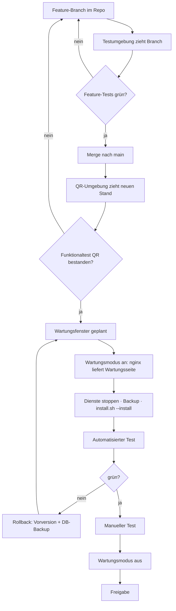

# Analyse der Bestellportal-Fremddoku gegen CMP

**Quellen:** `analyse/bestellportal_anon.md` (Bookstack-Export, 2819 Zeilen, 8 Kapitel),
`analyse/anforderungen.md`, `analyse/proto1.png`–`proto3.png`, `analyse/django.png`
**Analysiert am:** 2026-07-21 · **CMP-Stand:** analysiert gegen v1.3.2 (330 Tests), veröffentlicht mit v1.3.3
**Methodik:** Jede Aussage über CMP ist gegen den echten Code geprüft, nicht gegen unsere
eigene Doku und nicht aus dem Gedächtnis. Die Beleg-Spalten nennen Datei und Zeile.

---

## 0. Lesehinweis und Abgrenzung

Die Fremddoku beschreibt ein **API-First-System**: Django + **DRF** als reine REST-API,
JWT-Token, ein getrenntes JS-Frontend (React/Angular/Vue), `/api/v1/`-Versionierung,
Serializer als Validierungsschicht (Kapitel D, Zeilen 1533–1712).

**CMP ist der bewusste Gegenentwurf: rein SSR.** Django-Templates rendern serverseitig,
HTMX tauscht Fragmente, Session-Auth über allauth — kein DRF, kein JWT, kein JS-Frontend
(`CLAUDE.md`). Die Forderung in `analyse/anforderungen.md:4` („Dokumentation … muss auf
API First neu aufgebaut werden") betrifft das **Fremdsystem auf der Zielmaschine**, nicht CMP.

Interessant: Die Quelldoku selbst stellt beide Wege gegenüber (Zeilen 84–96) und beschreibt
SSR mit Django + HTMX als den Weg für eine „Frontend Standard App". Der **Prototyp**, der
dort dokumentiert ist (Zeilen 2240–2752), ist dann auch **SSR mit HTMX** — nicht DRF. Die
Konzeptkapitel und der real gebaute Prototyp widersprechen sich also bereits in der Quelle.
CMP steht damit näher am gebauten Prototyp als an der eigenen Konzeptdoku des Fremdsystems.

**Übersetzungsregel für diesen Report:** Wo die Doku eine API-First-Lösung fordert, steht
hier nicht „passt nicht", sondern die **SSR-Entsprechung**:

| Fremddoku (API-First) | CMP (SSR) |
|---|---|
| DRF-Serializer validiert Input | Django `forms.Form`/`ModelForm` (`cmp/apps/orders/forms.py`) |
| `POST /api/v1/orders/<id>/submit/` | POST auf `orders:submit` → Redirect + Message |
| JWT Access/Refresh, stateless | Session-Cookie via allauth, serverseitiger Session-State |
| `IsOwner`/`IsApprover`-Permissions | Mixins in `cmp/core/mixins.py` (`RequesterRequiredMixin`, `AdminRequiredMixin`, `SuperadminRequiredMixin`) |
| OpenAPI/Swagger-Doku | Kein API-Vertrag nötig — die Oberfläche *ist* der Vertrag; Doku in `cmp-docs/` |
| Frontend rendert JSON | Server rendert HTML, HTMX tauscht Fragmente |

---

## 1. Gap-Analyse CMP ↔ Fremddoku

### 1a. Funktionale Anforderungen (MUSS)

Legende: **✅ erfüllt** · **🟡 teilweise** · **❌ fehlt** · **➖ n.a.** (API-First-spezifisch)

#### Bestellung (FM_BE01–09)

| ID | Anforderung | CMP | Beleg |
|---|---|---|---|
| FM_BE01 | Bestellformular anzeigen | ✅ | `cmp/apps/orders/urls.py:11-12` (`create`, `create_form`), `cmp/templates/orders/form_view.html` |
| FM_BE02 | Bestellung speichern, löst Aufbau aus | 🟡 | Speichern ✅ `OrderService.create_order` (`cmp/apps/orders/services.py:12`) — **Auslösen des Aufbaus nicht verdrahtet**, siehe §1c „Bruchstelle" |
| FM_BE03 | Parameter automatisch befüllen/einschränken | ✅ | `cmp/apps/orders/forms.py` (dynamische Felder aus `template_parameters`), `cmp/apps/cmdb/models.py:24` `ContextRestriction` |
| FM_BE04 | Bestellungsübersicht | ✅ | `cmp/apps/orders/urls.py:9` `list`, `cmp/templates/orders/order_list.html` |
| FM_BE05 | Filter auf eigene Bestellungen | ✅ | `OrderService.list_user_orders` (`cmp/apps/orders/services.py:25`) |
| FM_BE06 | Status in der Übersicht | ✅ | `cmp/templates/orders/order_list.html:55` (``) |
| FM_BE07 | Detailansicht | ✅ | `cmp/apps/orders/urls.py:10` `detail` |
| FM_BE08 | Bestellung bearbeiten | 🟡 | Nur Positionen: `add_item`/`remove_item` (`urls.py:13-14`). **Keine Edit-View für die Order selbst** |
| FM_BE09 | Bestellung entfernen | ❌ | `grep -n 'delete' cmp/apps/orders/views.py` → kein Treffer; gelöscht wird nur ein `OrderItem` (`services.py:58`) |

#### Genehmigung (FM_GE01–04)

| ID | Anforderung | CMP | Beleg |
|---|---|---|---|
| FM_GE01 | Genehmigungspflichtige Bestellungen anzeigen | ✅ | `cmp/apps/approvals/urls.py:8` `queue`, `ApprovalService.list_pending_requests` (`services.py:96`) |
| FM_GE02 | Detailansicht um Approve/Reject erweitern | ✅ | `cmp/apps/approvals/urls.py:9,14`, `cmp/templates/approvals/approval_queue.html` |
| FM_GE03 | Genehmigen, danach Aufbau einleiten | 🟡 | Genehmigen ✅ `ApprovalService.approve` (`services.py:49`) — setzt Order auf `APPROVED` und **endet dort**. Kein Provisioning-Trigger |
| FM_GE04 | Ablehnen + Besteller informieren (Mail **und** in-App) | 🟡 | Ablehnen ✅ `ApprovalService.reject` (`services.py:75`) — **keine Benachrichtigung, keine Mail** |

#### Produkte und Parameter (FM_PP01–11)

| ID | Anforderung | CMP | Beleg |
|---|---|---|---|
| FM_PP01 | Produktübersicht | ✅ | `cmp/apps/catalog/urls.py:8` `list` |
| FM_PP02 | Produktdetails | ✅ | `cmp/apps/catalog/urls.py:9` `detail` |
| FM_PP03–05 | Produkt anlegen/bearbeiten/löschen (Admin) | ✅ | Django Admin (`cmp/apps/catalog/admin.py`) — bewusst als primäres Admin-Werkzeug (`CLAUDE.md`) |
| FM_PP06–10 | Parameter verwalten | 🟡 | Parameter sind **JSON im Template** (`ServiceTemplate.parameters = JSONField(default=list)`, `cmp/apps/catalog/models.py:20`), kein eigenes `ProductParameter`-Modell → keine eigene Verwaltungs-UI, Pflege nur im JSON-Feld |
| FM_PP11 | Parameter im Bestellformular anzeigen | ✅ | `cmp/apps/orders/forms.py` baut Felder zur Laufzeit aus `parameters` |

#### Benutzerverwaltung und Authentifizierung (FM_BA01–07)

| ID | Anforderung | CMP | Beleg |
|---|---|---|---|
| FM_BA01 | Anmeldung mit Authentifizierung | ✅ | allauth, `cmp/config/urls.py:6`; `ACCOUNT_SIGNUP_ENABLED = False` (`settings/base.py:99`) |
| FM_BA02–06 | Benutzer anzeigen/anlegen/bearbeiten/löschen | ✅ | Django Admin + `cmp/apps/accounts/admin.py`; Rolle als Feld (`accounts/models.py:9`) |
| FM_BA07 | **Anbindung Active Directory** | ❌ | `grep -in ldap requirements.txt` → **kein Treffer**. Kein `django-auth-ldap`, keine AD-Sync-Logik |

#### Allgemein (FM_AG01–04)

| ID | Anforderung | CMP | Beleg |
|---|---|---|---|
| FM_AG01 | Startseite mit Kacheln | ✅ | `cmp/apps/dashboard/urls.py:8` `home`, `cmp/templates/dashboard/dashboard.html` |
| FM_AG02 | **Anbindung OpenTofu** | ❌ | `cmp/apps/provisioning/clients.py` ist `GitLabStubClient` — In-Memory-Dict, `uuid4()` als Pipeline-ID. Kein `python-gitlab`, kein HTTP-Call |
| FM_AG03 | **E-Mail-Versand** | ❌ | `grep -rn 'send_mail\|EMAIL_BACKEND' cmp/` → **kein Treffer** |
| FM_AG04 | Systembenachrichtigungen | 🟡 | Modell + Service + UI vollständig da (`cmp/apps/notifications/`), aber **kein Workflow erzeugt eine** — siehe §1c |

#### KANN-Anforderungen (FK_*)

| ID | Anforderung | CMP | Beleg |
|---|---|---|---|
| FK_BE01 | Bestehende Bestellung als Vorlage | ❌ | Keine Kopier-/Vorlagen-Funktion in `orders/views.py` oder `services.py` |
| FK_BE02 | Massenbestellung | ✅ | `OrderItemGroup` mit `quantity` + `shared_parameters` (`cmp/apps/orders/models.py:32-45`) — deckt „gemeinsame vs. instanz-spezifische Parameter" exakt ab |
| FK_BE03 | Redundante Systeme (2 Standorte) | 🟡 | Datenseitig möglich über `AvailabilityRule.location` (`cmp/apps/cmdb/models.py:7`), kein Bestell-Komfort dafür |
| FK_AG01 | Personalisierung / Dark-Mode | 🟡 | DaisyUI-Theme „Lucent" vorhanden; kein Umschalter, keine Kachel-Konfiguration |

### 1b. Domänenmodell (Kapitel A der Quelldoku)

| Fremddoku | CMP | Bewertung |
|---|---|---|
| `User` mit Rollen | `accounts.User(AbstractUser)` + `role` (`cmp/apps/accounts/models.py:7-13`) | ✅ gleichwertig; Rolle als Feld statt AD-Gruppen-Mapping |
| `Product` | `catalog.ServiceTemplate` (`cmp/apps/catalog/models.py:14`) | ✅ mit `category`, `is_active`, **`version`** — Versionierung hat die Quelle nicht |
| `ProductParameter` (eigenes Objekt: Typ, Pflicht, Default, Validierung) | JSON-Liste `ServiceTemplate.parameters` | 🟡 **bewusster Unterschied.** Flexibler, aber nicht per Admin-UI/DB-Constraint prüfbar |
| `Order` (mit Produkt-FK + Parameter-JSON) | `orders.Order` **ohne** Produkt-FK; Produkt hängt an `OrderItem` | ✅ **besser** — mehrere Positionen je Bestellung, die Quelle kann nur eine |
| — | `OrderItemGroup` | ✅ Mehrwert gegenüber der Quelle (Massenbestellung) |
| `Approval` | `approvals.ApprovalRequest` + `ApprovalRule` (`condition` JSON, `approver_role`) | ✅ **weiter als die Quelle**: dort sind Mehrstufigkeit (Z. 1408–1410) und Produktregeln (Z. 1414–1416) ausdrücklich „noch offen" |
| `Automation/Provisioning` | `provisioning.DispatchLog` + `ProvisioningService` | 🟡 Struktur da, Client ist Stub |
| **Subscription** („≠ OrderItem, lebt länger als die Order", Z. 814–817) | `subscriptions.Subscription` (FK auf `OrderItem`, `valid_from`/`valid_until`, `status`) + `GroupSubscription` | ✅ Anforderung **strukturell erfüllt** |
| `AuditLog` (Kapitel E, Z. 1857) | `audit.AuditLog` + CSV-Export (`cmp/apps/audit/views.py:32`) | 🟡 Modell besser (Export!), Befüllung fehlt — siehe §1c |

**Statusmodell-Diff**

| Fremddoku | CMP (`cmp/core/domain/value_objects.py:5-14`) |
|---|---|
| DRAFT → SUBMITTED → PENDING_APPROVAL → APPROVED/REJECTED → PROVISIONING → COMPLETED/FAILED | DRAFT → **VALIDATED** → SUBMITTED → PENDING_APPROVAL → APPROVED/REJECTED → PROVISIONING → **DONE**/FAILED |

Zwei Abweichungen: ein zusätzlicher Zustand `VALIDATED` (Validierung vor dem Einreichen als
eigener Schritt) und `DONE` statt `COMPLETED`. Beides unkritisch. **Unser Plus:** die
Übergänge sind als Datenstruktur `TRANSITIONS` + `StatusMachine.validate_transition`
erzwungen (`value_objects.py:17-56`) — die Quelldoku beschreibt das Statusmodell nur
tabellarisch, ohne Übergangsprüfung.

**Rollen-Diff**

| Fremddoku (Z. 1177–1182) | CMP (`cmp/core/domain/enums.py:5-9`) |
|---|---|
| REQUESTER, **MODIFIER**, APPROVER, ADMIN | requester, approver, admin, **superadmin** |

`MODIFIER` (darf fremde Bestellungen ändern, aber nicht genehmigen — Matrix Z. 1236–1244)
fehlt bei uns; `superadmin` (nur bei uns, Zugriff auf `admin_rules`,
`cmp/apps/dashboard/admin_views.py:38`) fehlt dort. Beides ist eine bewusste Entscheidung
wert, kein Versehen — aber falls das Fremdsystem Referenz sein soll, ist `MODIFIER` die
einzige echte Lücke.

### 1c. Die Bruchstelle: der Workflow ist nicht verdrahtet

Der wichtigste Befund dieser Analyse — und er betrifft nicht die Fremddoku, sondern **CMP**.

Alle Bausteine der Kette „genehmigt → provisioniert → fertig → Subscription → Audit →
Benachrichtigung" existieren, sind getestet und funktionieren einzeln. **Aber niemand ruft
sie in der laufenden Anwendung auf.** Belege:

| Baustein | Definiert in | Aufgerufen von |
|---|---|---|
| `ApprovalService.needs_approval` / `create_approval_requests` | `cmp/apps/approvals/services.py:14,25` | **nur Tests** — in `cmp/` kein einziger Aufruf |
| `dispatch_provisioning` / `complete_provisioning` (Celery) | `cmp/apps/provisioning/tasks.py:7,13` | **niemandem** — `grep -rn 'tasks\.' cmp/apps` liefert außerhalb der Datei selbst nichts |
| `SubscriptionService.create_from_order` | `cmp/apps/subscriptions/services.py:14` | **nur Tests** (`tests/unit/test_subscription_service.py`, `tests/e2e/test_order_workflow.py:56`) |
| `AuditService.log` | `cmp/apps/audit/services.py:5` | **nur `seed.py`** (7×, Zeilen 377–407) |
| `NotificationService.create` / `Notification.objects.create` | `cmp/apps/notifications/services.py:7` | **nur `seed.py`** (6×) und Tests |

!!! danger "Nachtrag 2026-07-22 — die Kette bricht noch früher"
    Die erste Fassung dieses Abschnitts setzte bei `approve()` an. Beim Ausarbeiten des
    Arbeitspakets zeigte sich: **schon der Schritt davor fehlt.**

    `OrderService.submit_order` (`cmp/apps/orders/services.py:61-77`) setzt
    DRAFT → VALIDATED → SUBMITTED und endet. **Niemand ruft danach
    `create_approval_requests`** — es entsteht also gar kein `ApprovalRequest`.
    `ApprovalQueueView` (`cmp/apps/approvals/views.py:12`) filtert aber genau darauf.

    **Folge:** Eine über die Oberfläche eingereichte Bestellung bleibt dauerhaft in
    `SUBMITTED` und erscheint bei **keinem** Genehmiger. Die Approval-Queue zeigt
    ausschließlich die von `seed.py` erzeugten Requests (Zeilen 178, 349).
    `approve()` wird im laufenden System nie erreicht — der ursprünglich als
    „Endpunkt der Kette" beschriebene Bruch ist erst der zweite von sechs.

    Warum das beim ersten Durchgang durchrutschte: Die Prüfung folgte der Kette
    **rückwärts** von den ungenutzten Bausteinen aus, statt sie **vorwärts** vom
    Klick des Nutzers her durchzugehen. Die vollständige Liste der sechs Lücken
    steht in §5.

`ApprovalService.approve()` (`cmp/apps/approvals/services.py:49-72`) setzt den Order-Status
auf `APPROVED` und endet ebenfalls — erreichbar ist es derzeit aber nur über per Hand
oder von `seed.py` angelegte Requests.

Konsequenz für den Betrieb:

- Das **Audit-Log enthält ausschließlich Seed-Demodaten.** Eine echte Genehmigung in der
  Oberfläche erzeugt keinen Audit-Eintrag. Kapitel E der Fremddoku („unveränderbare Logs
  aller Bestellungen, Approvals, Provisioning", Z. 714) ist damit bei uns **nicht** erfüllt,
  obwohl Modell und Export-View das Gegenteil suggerieren.
- Die **Benachrichtigungs-Glocke** zeigt nur Seed-Einträge. FM_AG04 ist faktisch offen.
- Eine genehmigte Bestellung wird **nie** zu einer Subscription.

Das ist kein Bug in einem einzelnen Service, sondern eine fehlende Verdrahtung zwischen den
Schichten — TDD hat jeden Baustein isoliert grün bekommen, die Naht dazwischen hatte nie
einen Test. Der `tests/e2e/test_order_workflow.py` ruft die Schritte **selbst nacheinander
auf** und beweist deshalb genau diese Naht nicht.

**Empfehlung:** eigenes AP mit Vorrang vor AD/OpenTofu — die aufwendigen Fremdanbindungen
zahlen nicht ein, solange die interne Kette offen ist.

### 1d. Bewusst nicht übernommen

| Fremddoku | Warum bei CMP nicht |
|---|---|
| DRF, `/api/v1/`, Serializer, OpenAPI/Swagger | SSR-Architektur — Grundsatzentscheidung (`CLAUDE.md`) |
| JWT + Refresh-Token + Token-Blacklist (Kap. B, Z. 1137–1141) | Session-Auth; Blacklist wäre ohne JWT gegenstandslos |
| Stateless-API-HA über mehrere Instanzen (Z. 1317–1331) | Zielbild ist eine Single-VM-Installation (`cmp-docs/docs/betrieb/laufzeit-topologie.md`) |
| Prometheus/Grafana/Sentry/PagerDuty (Kap. E) | Kein Monitoring-Stack im air-gapped Single-VM-Zielbild |
| Container/K8s (Z. 721, 1880) | ADR-0001 entscheidet bewusst für native systemd-Installation; Container bleibt AP-11 (optional) |

---

## 2. Antworten auf `analyse/anforderungen.md`

### 2.1 Installer idempotent machen — inklusive Abräumzweig

**Ist:** `deploy/install.sh` (361 Z.) ist als idempotent **angelegt und dokumentiert**
(Zeile 23: „Wiederholt ausführbar (idempotent): ein zweiter Lauf aktualisiert die …").
Es gibt drei Aktionen — `--install`, `--check`, `--restart` — plus ein interaktives Menü
(Zeilen 329–348) und die Flags `--with-packages`, `--skip-nginx`. Die Bausteine in
`deploy/lib.sh` sind konsequent als `ensure`-Funktionen gebaut (`cmp_pg_ensure`,
`cmp_ensure_redis`, `cmp_render_web_unit`, …), also auf Wiederholbarkeit ausgelegt.

**Lücke:** **Es gibt keinen Abräumzweig.** `grep -n 'uninstall\|purge\|remove' deploy/install.sh`
liefert nichts. Für eine Testumgebung, die wiederholt sauber aufgesetzt werden soll, fehlt
genau die Gegenrichtung.

**Vorschlag:**

- `--uninstall` (Dienste stoppen + deaktivieren, Units löschen, nginx-Site entfernen,
  App-Verzeichnis löschen — **DB und `.env` bleiben**)
- `--purge` (zusätzlich DB-Rolle + Datenbank + `.env` + Logs) mit expliziter Rückfrage
- Beide über dieselben `lib.sh`-Bausteine, damit Install und Uninstall nicht auseinanderlaufen
- Menüpunkt „4) Entfernen" analog zu den bestehenden drei
- Trockenlauf `--dry-run` für beide, damit sich die Wirkung vorher zeigen lässt

Die Idempotenz selbst ist **nicht bewiesen**, nur behauptet — sie ist bisher nie auf echter
Hardware zweimal gelaufen (offener Punkt „VM-Verifikation" aus dem Handoff v1.3.0). Ein
zweiter Lauf gehört in dieselbe VM-Session.

### 2.2 Granulares Logging

**Ist: keins.** Zwei Belege:

```
grep -rn 'LOGGING' cmp/config/            → kein Treffer
grep -rn 'import logging|getLogger' cmp/  → kein Treffer
```

CMP hat **null** eigene Logging-Konfiguration und **keinen einzigen Logger-Aufruf**. Was
heute existiert, ist Djangos Default (Requests auf die Konsole) plus `self.stdout.write` in
den Management-Commands (`cmp/apps/accounts/management/commands/seed.py:31,36`) — das landet
im Journal des `install.sh`-Aufrufs, ist aber weder strukturiert noch je Domäne trennbar.

**Vorschlag** (an Kapitel E der Quelldoku angelehnt, Z. 1740–1768, aber ohne deren
JSON-/ELK-Annahme):

- `LOGGING`-Dict in `cmp/config/settings/base.py`, Level je Umgebung überschreibbar
- Benannte Logger je Domäne: `cmp.orders`, `cmp.approvals`, `cmp.provisioning`,
  `cmp.audit` — analog zu deren `order_logger`/`automation_logger`
- Handler: Konsole (→ journald, passt zur systemd-Installation) statt eigener Logdatei;
  eine Datei nur, wenn sie auch rotiert wird
- **Einzelschritte der Seeds** über `logger.info` statt `self.stdout.write`, damit sie
  im Journal landen — genau die Forderung aus `anforderungen.md:2`
- Wichtig: Logging ist **nicht** das Audit-Log. Das Audit-Log ist fachlich und in der DB
  (§1c); Logging ist technisch. Beide werden gebraucht, keins ersetzt das andere.

### 2.3 Dev- und Test-Umgebung per Schalter

**Ist: existiert bereits**, über getrennte Settings-Module in `cmp/config/settings/`:

| Modul | Aktiviert durch | Kern |
|---|---|---|
| `development.py` | `cmp/manage.py:7` (Default), `run.sh:188` | `DEBUG=True`, `ALLOWED_HOSTS=["*"]`, Celery eager |
| `testing.py` | `pytest.ini:2` | `DEBUG=False`, feste Test-DB, MD5-Hasher, Celery eager |
| `production.py` | `deploy/lib.sh:175,204` (systemd `Environment=`) | alles aus der Umgebung via `django-environ`, Security-Hardening |

Der „Schalter" ist also `DJANGO_SETTINGS_MODULE`. Was fehlt, ist weniger ein Schalter als
**Sichtbarkeit und eine Zwischenstufe**:

- Es gibt kein `staging`/`integration`-Profil (die Quelldoku kennt DEV/Integration/Prod,
  Z. 11). Für „QR-Umgebung" aus `anforderungen.md:23` bräuchte es eins — praktisch
  `production.py` mit abweichender `.env`, kein eigenes Modul.
- Die aktive Umgebung ist in der Oberfläche nicht erkennbar. Ein Umgebungs-Badge im Header
  (dev/test/prod) verhindert die klassische Verwechslung.
- `run.sh` kennt nur `serve` (immer development). Ein `run.sh serve --settings=…` wäre die
  kleine, ehrliche Ergänzung.

### 2.4 Installations-Protokoll

**Ist:** `install.sh` gibt live formatierte Statusmeldungen aus (`ok`/`info`/`warn`/`die`,
Zeilen 53–57) und zeigt am Ende ein Panel (`panel_zeigen`, Z. 107) — aber **nichts davon
wird persistiert.** Wer die Konsole schließt, hat kein Protokoll.

**Vorschlag:** am Ende von `aktion_installieren()` ein Protokoll nach
`/var/log/cmp/install-<zeitstempel>.log` **und** eine Kurzfassung nach
`/opt/cmp/INSTALL-REPORT.txt` schreiben, mit:

- CMP-Version (`BUNDLE_VERSION`, `install.sh:77`), Datum, Host, OS-Version
- Python-/Django-/PostgreSQL-Version
- Ports und Units (`cmp-web`, `cmp-celery`, nginx, Redis) mit Status
- TLS-Modus (`cmp_portal_proto`, `lib.sh:373`) und die daraus folgende Cookie-Einstellung
- DB-Name/-Rolle, Migrationsstand, Ergebnis des Seeds (Anzahl je Objekttyp)
- die real erzeugte URL, über die das Portal erreichbar ist
- explizit **keine** Secrets (kein `SECRET_KEY`, kein DB-Passwort)

### 2.5 HTMX-Fallstricke

Hier zuerst der Ist-Stand, weil er die Fallstricke am eigenen Code zeigt:

- HTMX ist **lokal** eingebunden (`cmp/static/js/htmx.min.js`, referenziert in
  `cmp/templates/base.html:9`) — die globale Kein-CDN-Regel ist eingehalten. ✅
- `django-htmx==1.27.0` mit aktiver Middleware (`settings/base.py:17,43`) → `request.htmx`.
- **HTMX wird real nur in 2 von 30 Templates genutzt:** `catalog/template_list.html` und
  `audit/audit_list.html`.

**Fallstrick 1 — Fragment vs. ganze Seite. In unserem Code aktiv falsch.**

`cmp/templates/audit/audit_list.html` feuert `hx-get` auf `audit:list` mit
`hx-target="#audit-table"` (Zeilen 15–29). Die zugehörige `AuditLogListView`
(`cmp/apps/audit/views.py:9`) hat aber **kein** `get_template_names()` mit htmx-Zweig —
`grep -rn 'get_template_names' cmp/apps/*/views.py` findet das nur in `catalog/views.py:25`.
Ein Audit-Filter liefert deshalb die **komplette Seite inklusive ``**
zurück und swappt sie in ein `<div>` der Seite selbst: verschachtelte Navigation, doppelte
Element-IDs, doppeltes `<html>`-Gerüst. Ein Audit-Partial existiert nicht
(`find … | grep audit` → nur `audit_list.html`).

Die richtige Lösung steht bereits daneben — `catalog/views.py:25-28` macht es korrekt:

```python
def get_template_names(self):
    if self.request.htmx:
        return ["catalog/partials/template_grid.html"]
    return [self.template_name]
```

**Fallstrick 2 — CSRF bei `hx-post`.** Django verlangt den CSRF-Token; HTMX schickt ihn nicht
von selbst. Entweder `hx-headers='{"X-CSRFToken": "{{ csrf_token }}"}'` am `<body>` setzen
oder das Formular normal mit `` rendern und `hx-post` auf das `<form>` legen.
Aktuell nicht akut, weil wir nur `hx-get` verwenden — aber das ändert sich mit dem ersten
HTMX-Formular.

**Fallstrick 3 — Fehlerantworten werden nicht geswappt.** HTMX ignoriert 4xx/5xx
standardmäßig: der Nutzer klickt, und **nichts passiert**. Braucht `htmx:responseError`
oder serverseitig 200 mit Fehler-Fragment.

**Fallstrick 4 — doppelte IDs nach dem Swap.** Wenn das Fragment die ID enthält, die auch
das Ziel trägt, entstehen je nach `hx-swap` zwei Elemente gleicher ID. Deshalb gilt unsere
Regel „`hx-target`/`hx-swap` immer explizit" (`.claude/rules/htmx.md`) — Default ist
`innerHTML`, und wer das nicht weiß, baut genau diesen Fehler.

**Fallstrick 5 — Historie/Back-Button.** Ohne `hx-push-url` ändert sich die URL nicht; der
Nutzer verliert seinen Filter beim Neuladen und der Zurück-Button springt aus der Seite
heraus. `audit_list.html:19,29` setzt `hx-push-url="true"` — der Filter landet also in der
URL, aber der zurückgelieferte Inhalt ist derzeit (Fallstrick 1) die ganze Seite.

**Fallstrick 6 — Autorisierung.** Ein HTMX-Endpoint ist ein normaler View und **muss dieselben
Mixins tragen** wie die Vollseite. Bei uns erfüllt (`RequesterRequiredMixin`,
`AdminRequiredMixin` in `cmp/core/mixins.py`), aber es ist der Fehler, der bei „das ist doch
nur ein Fragment" am leichtesten passiert.

**Fallstrick 7 — Events nach dem Swap.** Getauschtes HTML hat keine JS-Listener mehr. Für
Chart.js in `dashboard.html` relevant, sobald ein Chart-Bereich per HTMX getauscht wird →
`htmx:afterSwap` statt `DOMContentLoaded`.

### 2.6 Was über JS lösen — und wie beides absichern

**Faustregel:** HTMX für alles, was **Server-Zustand** braucht (Filtern, Nachladen,
Absenden, Statuswechsel). Vanilla-JS nur für rein **clientseitige Darstellung** ohne
Sicherheitsrelevanz: Chart-Rendering (haben wir, `chart.umd.min.js`), Auf-/Zuklappen,
Sortieren einer bereits geladenen Tabelle, Fokus-/Tastatur-Handling. Kein Framework.

**Absicherung — der eine Satz, der zählt: Autorisierung passiert ausschließlich serverseitig.**
Ein per JS ausgeblendeter Button ist keine Berechtigung; ein nicht gerendertes Template-Stück
ist erst dann sicher, wenn der zugehörige View die Rolle prüft. Konkret:

- Rollenprüfung in Views/Mixins, nicht nur im Template (`` ist Kosmetik)
- Objektbezug prüfen („gehört diese Bestellung dem Anfragenden?") — die Fremddoku fordert
  das als `IsOrderOwner` (Z. 1229), bei uns gehört es in die Views/Services
- Django-Autoescaping nicht mit `|safe` aushebeln; `details`-JSON aus dem Audit-Log ist
  Fremdinhalt und wird gerendert (`audit_list.html:57`)
- CSRF für jeden verändernden Request, auch aus HTMX
- **Lücke:** Es gibt **keine CSP** (`grep -rn 'CSP\|Content-Security' cmp/ deploy/` → kein
  Treffer). Da alle Assets lokal liegen, wäre eine strenge Policy fast kostenlos —
  `default-src 'self'`, kein `unsafe-inline` (dafür müssten die `<script>`-Blöcke in
  `base.html`, `dashboard.html`, `approval_queue.html` in Dateien wandern). Der nginx-Block
  in `deploy/lib.sh:334` (`cmp_render_nginx`) wäre der Ort.

### 2.7 `.env` vs. `uv` — die Frage vergleicht zwei verschiedene Dinge

Das sind **keine Alternativen**, sie lösen unterschiedliche Probleme:

| | `.env` | `uv` |
|---|---|---|
| Was | Datei mit `KEY=VALUE`, gelesen von `python-dotenv`/`django-environ` | Paket- und Venv-Manager (Rust, Ersatz für `pip`/`venv`/`pip-tools`) |
| Löst | **Konfiguration und Secrets** aus dem Code halten | **Abhängigkeiten** installieren, Versionen sperren (`uv.lock`) |
| Ersetzt | hartcodierte Settings | `pip install`, `python -m venv` |

Man kann beides gleichzeitig verwenden — das Fremdprojekt tut genau das (`uv run python
manage.py runserver`, Z. 2739, plus `.env` für Token, Z. 2774).

**Bei CMP:**

- **Konfiguration:** `django-environ` in `cmp/config/settings/production.py:14-35`. Eine
  `.env` neben `manage.py` wird gelesen, **falls vorhanden** — in Produktion liefert
  systemd die Variablen per `Environment=` (`deploy/lib.sh:175,204`). Das ist der bessere
  Weg: keine Datei mit Secrets im App-Verzeichnis.
- **Pakete:** `pip` + `requirements.txt` + **Offline-Wheelhouse** (`wheels/`, cp312).
  `uv` wird **nicht** verwendet und ist hier auch nicht sinnvoll: der Zielserver ist
  air-gapped, wir installieren aus mitgelieferten Wheels. `uv`s Stärke (schnelles Auflösen
  aus dem Netz) greift dort nicht, und ein zusätzliches Binary müsste selbst erst
  air-gapped verteilt werden.

Das Fremdprojekt beschreibt in Z. 2764–2768 exakt dieselbe Erkenntnis: ohne interne Registry
wird `pip download` + Ordner im Repo verwendet, „die Verwendung vom `uv.lock`-File … wäre
somit hinfällig". **Unser Wheelhouse-Ansatz ist genau das, nur schon gebaut.**

### 2.8 Was muss wie abgesichert werden

| Gegenstand | Fremddoku | CMP |
|---|---|---|
| GitLab-Token | Masked CI/CD-Variablen → Pipeline schreibt `.env` auf den Zielserver; PAM als Ausbaustufe (Z. 2795–2812) | **Noch nicht relevant** — Client ist Stub. Bei echter Anbindung: systemd `EnvironmentFile=` mit `0600`, nicht `.env` im App-Verzeichnis |
| `SECRET_KEY` | `.env`/CI-Variable (Z. 2814–2819) | `env("SECRET_KEY")` ohne Default → **Fehlstart statt unsicherem Betrieb** (`production.py:38`). Erzeugt von `cmp_secret_key` (`lib.sh:46`) |
| `DEBUG` | — | `DEBUG=(bool, False)` als Default (`production.py:20`); Regel „DEBUG=True in PRODUCTION ist FATAL" |
| Host-Header | — | `ALLOWED_HOSTS` + `CSRF_TRUSTED_ORIGINS` aus der Umgebung (`production.py:40,61`) — der dokumentierte Stolperstein „FQDN statt IP" |
| Transport | HTTPS only (Z. 1313) | TLS nur mit echtem Zertifikat; **ohne Zertifikat existiert kein 443-Listener**, dann HTTP mit bewusst abgeschalteten Secure-Cookies (`production.py:24-27`) |
| Session | JWT + Blacklist | Session-Cookie, `SESSION_COOKIE_SECURE`/`CSRF_COOKIE_SECURE` default an |
| Weitere Header | — | HSTS, `X_FRAME_OPTIONS=DENY`, `SECURE_CONTENT_TYPE_NOSNIFF` gesetzt (`production.py:63-68`); **CSP fehlt** (§2.6) |
| Rate Limiting | gefordert (Z. 1310) | ❌ nicht vorhanden — Login-Brute-Force ist ungebremst. Kandidat: `django-axes` oder nginx `limit_req` |

### 2.9 HA und Skalierung

Die Quelldoku zeichnet Load Balancer + mehrere Web/API-Server + Redis + n Worker
(Z. 2007–2039) und nennt HA im Kapitel 7 selbst „nicht initial" (Z. 727–728).

**CMP-Realität:** eine VM, alle Dienste lokal — dokumentiert in
`cmp-docs/docs/betrieb/laufzeit-topologie.md`. Was uns von deren Bild trennt:

| Voraussetzung | CMP |
|---|---|
| Stateless App | 🟡 Sessions liegen in der DB (Django-Default) — bei mehreren Instanzen funktioniert das, aber Redis wäre der bessere Session-Store |
| Externe DB/Redis | 🟡 möglich (`DATABASE_URL`, `CELERY_BROKER_URL` sind Umgebungsvariablen) — nur nie erprobt |
| Mehrere Worker | ✅ Celery skaliert horizontal, sobald der Broker extern ist |
| Load Balancer/TLS-Terminierung | ❌ nginx läuft lokal, `install.sh` kennt nur eine Maschine |
| Zustandslose Dateien | ✅ `STATIC_ROOT` + collectstatic; keine User-Uploads |

**Bewertung:** HA ist für das Zielbild (air-gapped Single-VM) kein offener Mangel, sondern
außerhalb des Scopes. Die Architektur verbaut es nicht — der ehrliche Satz für die Doku ist
„nicht gebaut, nicht erprobt, aber nicht verbaut", nicht „HA-fähig".

### 2.10 Mermaid für die Entwicklungs-/Release-Kette

`anforderungen.md:16-33` beschreibt die Kette Repo → Test → QR → Produktion mit
Wartungsfenster. Als Diagramm-Vorschlag (noch nicht in `cmp-docs/` eingebaut):



Zur Frage „Wie umschalten auf Wartung? Einfach nur Dienste deaktivieren?" aus
`anforderungen.md:27`: **Dienste zu stoppen reicht nicht** — dann liefert nginx `502 Bad
Gateway`, was für Nutzer wie ein Ausfall aussieht und Support-Anrufe erzeugt. Sauber ist eine
statische Wartungsseite, die nginx ausliefert, solange eine Marker-Datei existiert:

```nginx
location / {
    if (-f /opt/cmp/MAINTENANCE) { return 503; }
    proxy_pass http://127.0.0.1:8000;
}
error_page 503 /maintenance.html;
location = /maintenance.html { root /opt/cmp/static-maintenance; internal; }
```

`503` (statt `200`) ist dabei das fachlich richtige Signal: Monitoring und Suchmaschinen
verstehen „vorübergehend nicht verfügbar" statt „kaputt". Ein- und Ausschalten wäre dann
`touch`/`rm` der Marker-Datei — Kandidat für `install.sh --maintenance on|off`.

### 2.11 Doku-Lieferkette und die Lernziel-Punkte

Die restlichen Punkte aus `anforderungen.md` sind **Doku-Arbeitspakete**, keine
Code-Fragen. Der Ist-Stand bei uns und was daraus folgt:

**„Erst im \*-docs Format, danach sauber als MD für Bookstack" (Z. 5)**

Genau diese Kette haben wir bereits — nur mit einem anderen Ziel am Ende:
`cmp-docs/docs/*.md` → Zensical-Build → `cmp-docs/site/` → `run.sh docs-zip` →
HTML-ZIP. Für Bookstack fehlt nur ein **Export-Schritt**, kein neues Format: Bookstack
frisst Markdown direkt. Die Stolpersteine beim Rückweg sind absehbar und in der Quelldoku
sichtbar: Bookstack schreibt `<div id="…">`-Anker, `<p class="callout">`-Blöcke und
escapte Überschriften (`## 1\. Ziel`) — das ist alles im Export
`analyse/bestellportal_anon.md` zu besichtigen. Ein Konverter müsste unsere
Mermaid-Blöcke zu Bildern rendern (Bookstack rendert kein Mermaid) und relative
Bildpfade umschreiben. **Aufwand: überschaubar, aber ein eigenes AP** — und die
Richtung ist zu klären: soll Bookstack das Ziel für **CMP**-Doku sein oder nur für die
Fremdsystem-Doku?

**„Granulare Erklärungen sämtlicher Sourcen" (Z. 9)**

Bei uns nicht vorhanden und auch nicht sinnvoll als Fließtext je Datei — das driftet
beim ersten Refactoring auseinander (genau die Doku-Drift-Falle, die wir schon einmal
hatten). Tragfähiger: **Docstrings am Code** (haben wir bereits durchgängig, z.B.
`cmp/apps/subscriptions/services.py:14`) plus **eine Architektur-Erzählung je Schicht**
in `cmp-docs/docs/grundlagen/`. Was der Fremddoku-Prototyp macht — jede Datei einzeln
erklären (Z. 2266–2474) — ist als **Lehrmaterial** wertvoll, als Referenzdoku
unwartbar. Für Lernzwecke wäre die ehrliche Form ein Tutorial „Ein Request durch CMP",
das einen echten Pfad end-to-end verfolgt (Klick → URL → View → Service → Model →
Template), statt 20 Dateien isoliert zu beschreiben.

**„Wie wird ein neuer Service erstellt? Welche Kapselung? Welche Ports?" (Z. 11–13)**

Zwei Lesarten, und sie führen zu völlig verschiedenen Antworten:

- **Fachlich** („ein neues bestellbares Produkt"): bei uns **kein Code nötig** — ein
  neuer `ServiceTemplate`-Datensatz mit `parameters`-JSON, angelegt im Django Admin.
  Das ist eine echte Stärke unseres Modells und gehört als Anleitung dokumentiert.
- **Technisch** („eine neue Django-App"): `cmp/apps/<name>/` mit
  `models.py`/`services.py`/`views.py`/`urls.py`, Eintrag in `INSTALLED_APPS`
  (`settings/base.py:20-30`), `include()` in `cmp/config/urls.py`. Kapselungsregel:
  `core/` → `apps/`, nie umgekehrt (`CLAUDE.md`). **Ports entstehen dabei keine** — alle
  Apps laufen im selben Prozess. Ports sind ein Thema der Laufzeit-Topologie
  (`cmp-docs/docs/betrieb/laufzeit-topologie.md`), nicht der App-Struktur.

Die Frage vermischt Fachlichkeit und Deployment. Für die Doku sind es zwei Kapitel.

**„OpenTofu-Export und GitLab-Schnittstelle detailliert erklären" (Z. 14–15)**

**Können wir derzeit nicht ehrlich erklären** — bei uns existiert nur der Stub
(`cmp/apps/provisioning/clients.py`). Alles, was wir heute darüber schreiben würden,
wäre aus der Fremddoku abgeschrieben statt am eigenen Code geprüft. Die Quelldoku
liefert dafür die Vorlage (Z. 46–60: `curl` auf `/variables/PROD_ORDERS` + Pipeline-
Trigger; Z. 2413–2443: `python-gitlab`), und der Prototyp zeigt das reale Muster
inklusive seiner Fehler (§4). **Empfehlung:** dieses Kapitel erst schreiben, wenn der
echte Client gebaut ist (Priorität 7) — sonst dokumentieren wir eine Absicht als Zustand.

**„Generierende Tools mit ins Repo, inklusive Bedienungs-Doku" (Z. 37)**

Bei uns teilweise erfüllt: `tools/` und `scripts/` existieren, `run.sh` bündelt die
Einstiegspunkte (`serve`, `docs-zip`, `release`, `appimage-build`), und das
Offline-Wheelhouse (`wheels/`) liegt im Repo. Was fehlt, ist eine **Werkzeug-Übersicht**:
eine Seite, die jedes Werkzeug einmal nennt — wozu, wie aufgerufen, was es erzeugt.
Nach unserer Regel „Übersichten enumerieren jedes Item" wäre das ohnehin fällig.

---

## 3. `django.png` — was davon ist für CMP relevant?

Das Bild ist das Inhaltsverzeichnis des **W3Schools-Django-Tutorials** (in der Quelldoku als
Ressource verlinkt, Z. 2710). Spaltenweise bewertet:

| Spalte | Relevanz für CMP | Begründung |
|---|---|---|
| **Django** (Intro … Update Model) | 🟢 Grundlagen — aber wir sind darüber hinaus | Views/URLs/Templates/Models sind unsere Basis. Achtung: das Tutorial legt Logik **in die View**; bei uns gilt „Thin Views, Logik in Services" (`CLAUDE.md`) |
| **Display** (Prepare … Add Test) | 🟢 relevant | Template-Vererbung, 404-Behandlung. `base.html` + `` haben wir genau so |
| **Admin** (Admin … Delete) | 🟢 **sehr relevant** | Django Admin ist bei uns das **primäre Admin-Werkzeug**. `list_display` und Registrierung sind täglich genutztes Handwerkszeug |
| **Syntax** (Variables … Include) | 🟢 relevant | Template-Sprache. `` nutzen wir für `includes/status_badge.html` |
| **QuerySets** (QuerySet … Order By) | 🟢 **sehr relevant** | Filtern/Sortieren ist in jedem unserer Services. Ergänzung, die das Tutorial nicht lehrt: `select_related` gegen N+1 |
| **Static Files** (Add Static … WhiteNoise) | 🟡 teilweise | `` ✅. **WhiteNoise nutzen wir nicht** — nginx liefert `STATIC_ROOT` aus |
| **PostgreSQL** (Intro … Add Members) | 🔴 **irrelevant** | Die Spalte behandelt AWS RDS. Unsere DB ist lokal, per `install.sh` eingerichtet (`cmp_pg_ensure`, `lib.sh:222`) |
| **Deploy** (Elastic Beanstalk … Update) | 🔴 **irrelevant, sogar irreführend** | Komplett AWS Elastic Beanstalk. Unser Deployment ist AlmaLinux + systemd + nginx + Offline-Wheelhouse. Wer diese Spalte durcharbeitet, lernt nichts, was bei uns anwendbar wäre |

**Kurzfassung:** Die ersten fünf Spalten sind gutes Grundlagenmaterial für neue
Teammitglieder — mit dem Hinweis, dass wir bei der Architektur (Services statt Fat Views)
und beim Deployment bewusst anders arbeiten. Die letzten beiden Spalten sind für CMP wertlos.

### Snippets aus echtem CMP-Code

**QuerySets — mit `select_related`, das im Tutorial fehlt:**

```python
# cmp/apps/subscriptions/services.py:32 — vermeidet N+1 beim Rendern der Liste
Subscription.objects.filter(user_id=user_id).select_related("order_item__template")
```

**Filtern aus Request-Parametern (statt Logik in der View zu verstreuen):**

```python
# cmp/apps/audit/views.py:15 — Muster: QuerySet schrittweise verengen
qs = AuditLog.objects.select_related("user").all()
if action:
    qs = qs.filter(action__icontains=action)
```

**Statuswechsel gehört in die Domäne, nicht in die View:**

```python
# cmp/core/domain/value_objects.py:50 — ungültige Übergänge sind unmöglich
StatusMachine.validate_transition(order.status, OrderStatus.PROVISIONING)
```

**Static ohne CDN (globale Regel):**

```django
{# cmp/templates/base.html:9 — lokal ausgeliefert, offline-tauglich #}
<script src="" defer></script>
```

---

## 4. Bewertung des Prototyps (`proto1`–`proto3` + Kapitel „Dokumentation Prototyp")

**Was der Prototyp ist:** eine einzelne Django-App `order_portal` (proto1) mit W3.css und
HTMX, flacher Struktur (`models.py`, `views.py`, `forms.py`, `utils.py`, `signals.py`,
`tests.py`), Templates plus `partials/`-Ordner, und einem `tmp/order_records.json`.

### Übernehmenswert

| Idee | Warum | CMP-Bezug |
|---|---|---|
| **Kaskadierende Dropdowns per HTMX** (Standort → DNS → Proxy, Z. 2479–2482) | Genau FM_BE03, und der einzige Ort, wo HTMX im Prototyp echten Mehrwert liefert | Datenseite haben wir bereits: `ContextRestriction(parameter_key, context_field, allowed_values)` (`cmp/apps/cmdb/models.py:24`). Es fehlt nur die View, die das Fragment liefert |
| **`partials/`-Konvention** | Trennt Fragment-Templates sichtbar von Vollseiten | Bei uns nur `catalog/partials/`. Konsequent ausrollen würde Fallstrick §2.5.1 strukturell verhindern |
| **`blank_modal.html` zum Entfernen eines Modals** | Elegant: das „x" swappt ein leeres Fragment über das Modal | Direkt übernehmbar, kein JS nötig |
| **Modal aus der Liste heraus** (`hx-get` + `hx-swap="afterend"`, Z. 2554–2556) | Detailansicht ohne Seitenwechsel | Passt zu `orders/order_list.html` |

### Anti-Pattern — nicht übernehmen

| Fund | Beleg | Problem |
|---|---|---|
| **`signals.py` pusht synchron zu GitLab** | Z. 2346–2355: `@receiver(post_save, sender=Order)` ruft `save_to_cicd()` | Jedes Speichern blockiert auf einem **HTTP-Call zu GitLab**. Ist GitLab langsam/weg, hängt oder scheitert das Speichern der Bestellung. Bei uns gehört das in einen Celery-Task (`cmp/apps/provisioning/tasks.py`) — die Struktur dafür existiert bereits |
| **Absoluter Home-Pfad im Code** | Z. 2353: `open("/home/<ad-domain>/<user-id>/portal_prototype/…")` | Läuft auf keiner anderen Maschine. Gehört nach `settings`/`BASE_DIR` |
| **Vollständige Order-Tabelle bei jedem Save serialisieren** | Z. 2348: `Order.objects.all()` in jedem `post_save` | O(n) pro Speichervorgang; skaliert nicht |
| **`ssl_verify=False`** | Z. 2415 | Schaltet die TLS-Prüfung ab — Man-in-the-Middle-offen. Richtig wäre das interne CA-Zertifikat |
| **`fields = "__all__"` im ModelForm** | Z. 2309 | Jedes neue Modellfeld wird automatisch vom Nutzer beschreibbar — inklusive Feldern, die es nicht sein sollen. Felder explizit auflisten |
| **Besteller als Freitextfeld** | proto3: „Name des Bestellers" als `<input type=text>`; Modell: `user_name = CharField` (Z. 2321) | Der Besteller ist **nicht** vertrauenswürdige Eingabe, sondern `request.user`. So kann jeder im Namen jedes anderen bestellen. Bei uns: `Order.user = ForeignKey(AUTH_USER_MODEL)` (`cmp/apps/orders/models.py:11`) |
| **`{{ form.user_name.value }}` ohne Klammern** | Z. 2588 | `value` ist eine **Methode**; im Template ohne Aufruf-Syntax funktioniert das nur, weil Django Callables automatisch aufruft — fragil und verwirrend |
| **W3.css** | Z. 2501 | Bei uns DaisyUI + „Lucent"-Theme. Kein Grund zu wechseln |
| **Formularfelder von Hand ausgeschrieben statt Schleife** | Z. 2580: „Durch die Nutzung von HTMX kann leider nicht auf eine Schleife zurückgegriffen werden" | Das ist **so nicht richtig**: man kann über die Felder iterieren und die HTMX-Attribute aus dem Feld-Kontext setzen (Widget-`attrs` im Form). Unser `OrderParameterForm` (`cmp/apps/orders/forms.py`) setzt die CSS-Klassen bereits über `widget=…attrs`; derselbe Weg trägt `hx-*` |
| **Ein `tests.py` für alles** | proto1 | Bei uns getrennt nach `tests/unit`, `tests/integration`, `tests/e2e` (330 Tests) |

### Was der Prototyp besser macht als unser Ist-Stand

Fairerweise: **die kaskadierenden Dropdowns sind dort real gebaut**, bei uns nur die
Datenstruktur dafür. Und der Prototyp verdrahtet die Kette „Order gespeichert → landet in
GitLab" tatsächlich durch (wenn auch am falschen Ort) — genau die Verdrahtung, die uns
laut §1c fehlt.

---

## 5. Fazit und Empfehlung

### Was diese Analyse über CMP gezeigt hat

Der wichtigste Befund kam nicht aus der Fremddoku, sondern aus dem Abgleich mit ihr: **CMP
hat alle Bausteine, aber die Bestellkette ist nicht verdrahtet** (§1c). Eine über die
Oberfläche eingereichte Bestellung bleibt in `SUBMITTED` stehen und erreicht keinen
Genehmiger; Audit-Log und Benachrichtigungen enthalten ausschließlich Seed-Daten. Das ist
von außen unsichtbar, weil Seed-Daten die Oberfläche gefüllt aussehen lassen und 330 Tests
grün sind.

#### Die sechs fehlenden Aufrufe

| # | Fehlender Aufruf | Gehört ans Ende von | Folge heute |
|---|---|---|---|
| 1 | `create_approval_requests` — bzw. direkt `APPROVED`, wenn keine Regel greift | `OrderService.submit_order` | Order hängt in `SUBMITTED`, Queue bleibt leer |
| 2 | `dispatch_provisioning.delay(order_id)` | `ApprovalService.approve`, sobald alle Requests genehmigt sind | Nie `PROVISIONING` |
| 3 | Rückmeldung → `complete_dispatch` | Stub: sofort abschließen · echter Client: Polling (siehe Rang 7) | Nie `DONE`/`FAILED` |
| 4 | `SubscriptionService.create_from_order` | Übergang nach `DONE` | Genehmigte Bestellung wird nie zur Subscription |
| 5 | `AuditService.log` | **jedem** Statuswechsel | Audit-Log nur Seed-Daten |
| 6 | `NotificationService.create` | eingereicht → Genehmiger · entschieden → Besteller · fertig/fehlgeschlagen → Besteller | Glocke nur Seed-Daten |

Zwei Fallstricke bei der Umsetzung, die heute niemand sieht: Der Celery-Start gehört in
`transaction.on_commit(...)` — sonst läuft der Task vor dem Commit und findet die Order
nicht (in dev/test durch `CELERY_TASK_ALWAYS_EAGER` unsichtbar). Und der Übergang
`SUBMITTED → APPROVED` ohne Regel ist bereits erlaubt (`core/domain/value_objects.py:22`),
wird aber nirgends genutzt.

### Priorisierung

| Rang | AP | Thema | Warum diese Reihenfolge |
|---|---|---|---|
| **1** | **AP-13** | **Workflow verdrahten** — alle sechs Aufrufe oben, von `submit` bis Subscription | Ohne das zahlt keine andere Anbindung ein: das Portal nimmt heute Bestellungen entgegen, die nie jemand sieht. Braucht einen E2E-Test, der die Kette **durch die Views** anstößt statt Services selbst aufzurufen |
| **2** | **AP-14** | **Logging** (§2.2) | Keine Konfiguration, kein einziger Logger-Aufruf. Voraussetzung, um Punkt 1 im Betrieb überhaupt beobachten zu können |
| **3** | **AP-15** | **HTMX-Fallstrick im Audit-Log** (§2.5.1) | Aktiver Fehler, Fix ist ein Partial + 4 Zeilen `get_template_names` — Vorlage steht in `catalog/views.py:25` |
| **4** | **AP-16 + AP-17** | **Installer: Abräumzweig + Protokoll** (§2.1, §2.4) | Direkt angefordert; Voraussetzung für wiederholbare VM-Tests. Zusammen mit der offenen VM-Verifikation erledigen |
| **5** | **AP-18** | **E-Mail-Versand** (FM_AG03) | Echte Lücke gegenüber der Anforderung; klein, sobald Punkt 1 die Auslösepunkte liefert |
| **6** | **AP-19** | **CSP + Rate Limiting** (§2.6, §2.8) | Günstig, weil alle Assets lokal liegen |
| **7** | **AP-20** | **Echter GitLab-Client statt Stub** (FM_AG02) | Groß, extern abhängig (Token, Netzwerk, Projekt) — erst sinnvoll, wenn 1 steht |
| **8** | **AP-21** | **AD/LDAP** (FM_BA07) | Größte Fremdabhängigkeit; nur mit echter AD-Testumgebung sinnvoll |

### Bewusst außerhalb des Scopes

API-First/DRF, JWT, Swagger/OpenAPI, Prometheus/Grafana/Sentry, Kubernetes, HA über
mehrere Instanzen. Diese Punkte der Fremddoku gehören zu deren Architektur, nicht zu unserer.

### Wo CMP der Fremddoku voraus ist

- **Erzwungene Statusübergänge** (`StatusMachine`) statt nur einer Statustabelle
- **Mehrere Positionen je Bestellung** (`OrderItem`) und **Massenbestellung**
  (`OrderItemGroup`) — die Quelle kann ein Produkt je Order
- **Approval-Regeln als Daten** (`ApprovalRule.condition`) — dort ausdrücklich „noch offen"
- **Subscription-Lebenszyklus** getrennt von der Order — dort als Prinzip gefordert,
  im Prototyp nicht vorhanden
- **Template-Versionierung** (`ServiceTemplate.version`)
- **Air-gapped Offline-Installation** mit Wheelhouse — die Quelle ringt in Z. 2764–2768
  noch mit genau diesem Problem
- **Audit-CSV-Export** — sobald das Log echte Daten enthält

### Offene Punkte, die diese Analyse nicht klären konnte

- **Ob `install.sh` wirklich idempotent ist**, ist unbewiesen — nur so dokumentiert. Ein
  zweiter Lauf auf echter Hardware steht aus (offener Punkt seit v1.3.0).
- **Ob `MODIFIER` als Rolle gebraucht wird**, ist eine fachliche Entscheidung, keine
  technische.
- **Welche der beiden Architekturen das Fremdsystem am Ende baut** (Konzeptdoku sagt
  API-First/DRF, der Prototyp ist SSR+HTMX) — dieser Widerspruch steht in der Quelle selbst
  und ist dort zu klären.
