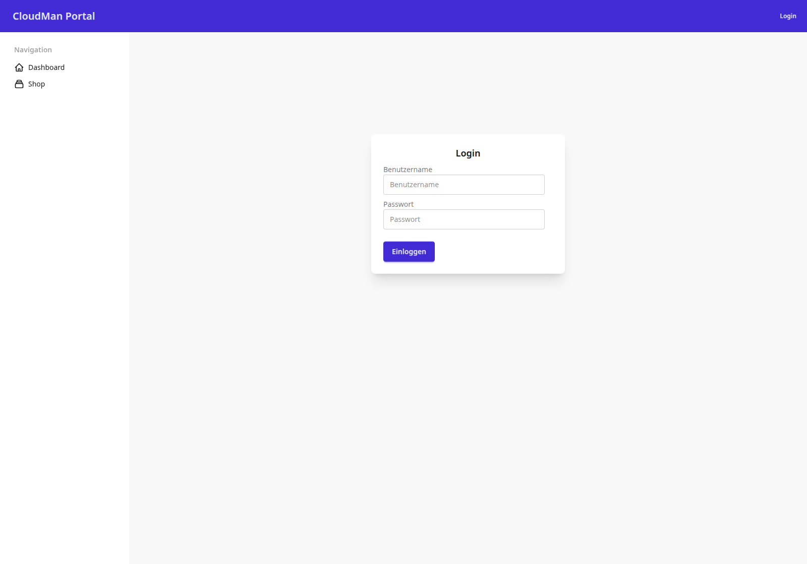

# Anmeldung

Dieses Kapitel zeigt die 13 wichtigsten Masken des CloudMan Portals als Galerie —
Screenshot, Zweck, sichtbare Rolle und die zugehörige URL/View-Klasse. Diese erste
Seite eröffnet die Galerie mit einem Überblick über alle Seiten des Kapitels und
zeigt danach die Anmeldemaske.

## 1. Ziel des Kapitels

Wer eine Maske des CMP nachschlagen will — was sie zeigt, wer sie sehen darf und
welcher Code dahintersteckt — findet hier für jede Maske eine eigene Seite. Die
Reihenfolge folgt dem typischen Weg durch das Portal: Anmeldung, Dashboard,
Katalog, Bestellung, Genehmigung, Verwaltung.

| # | Seite | Maske | Sichtbar für |
|---|---|---|---|
| 1 | [Anmeldung](01-anmeldung.md) | Login | alle (nicht angemeldet) |
| 2 | [Dashboard](02-dashboard.md) | Startseite nach Login | Requester, Approver, Admin, Superadmin |
| 3 | [Service-Katalog](03-service-katalog.md) | Shop-Übersicht | Requester, Approver, Admin, Superadmin |
| 4 | [Katalog-Detail](04-katalog-detail.md) | Parameter-Übersicht eines Templates | Requester, Approver, Admin, Superadmin |
| 5 | [Bestellformular](05-bestellformular.md) | All-in-One-Bestellmaske | Requester, Approver, Admin, Superadmin |
| 6 | [Bestellungen — Übersicht](06-bestellungen-uebersicht.md) | Bestellliste | Requester, Approver, Admin, Superadmin |
| 7 | [Bestelldetail](07-bestelldetail.md) | Einzelne Bestellung | Requester, Approver, Admin, Superadmin |
| 8 | [Benachrichtigungen](08-benachrichtigungen.md) | Notification-Center | Requester, Approver, Admin, Superadmin |
| 9 | [Abonnements](09-abonnements.md) | Aktive Subscriptions | Requester, Approver, Admin, Superadmin |
| 10 | [Profil](10-profil.md) | Benutzerprofil | Requester, Approver, Admin, Superadmin |
| 11 | [Genehmigungen](11-genehmigungen.md) | Genehmigungs-Queue | Approver, Admin, Superadmin |
| 12 | [Audit-Log](12-audit-log.md) | Revisionslog | Admin, Superadmin |
| 13 | [Django-Admin](13-django-admin.md) | Verwaltungsoberfläche | Admin, Superadmin (staff) |

Jede Rollenstufe schließt die niedrigeren Stufen ein: Ein Superadmin sieht auch
alle Requester- und Approver-Masken. Grundlage sind vier Mixins in
`cmp/core/mixins.py`, die jede View gegen `request.user.role` prüft — Details
je Maske auf der jeweiligen Seite unter „Rolle und Zugriff".

## 2. Hinweis zum Bilder-Import

Die Bilder in diesem Kapitel sind relativ eingebunden
(`../../docs/images/screenshots/Screenshot_NN_cmp.png`) und passen damit für die
lokale Vorschau aus `cmp-docs/bookstack/` heraus. Der Importweg der
Ziel-Bookstack-Instanz steht noch nicht fest (siehe Spec, Abschnitt „Offene
Punkte"). **Beim Import müssen die Bilddateien mit hochgeladen und alle
Bildpfade auf die von Bookstack vergebenen Bild-URLs umgeschrieben werden** —
unabhängig davon, ob der Import manuell, per API-Skript oder über die
eingebaute Import-Funktion erfolgt.

## 3. Screenshot

Session-basierte Anmeldung über django-allauth. Self-Service-Registrierung ist
deaktiviert (`ACCOUNT_SIGNUP_ENABLED = False`, `cmp/config/settings/base.py:99`)
— alle Benutzer werden vom Admin angelegt. Die Anmeldung erfolgt über
**Benutzername** und Passwort (`ACCOUNT_LOGIN_METHODS = {"username"}`,
`cmp/config/settings/base.py:97`), nicht per E-Mail. Das Formular auf dem
Screenshot ist ein projekteigenes Template
(`cmp/templates/account/login.html`), das die Standard-Login-View von allauth
überschreibt.

## 4. Rolle und Zugriff

Die Anmeldemaske ist die einzige Seite dieses Kapitels ohne Rollenprüfung —
sie ist für nicht angemeldete Besucher gedacht. Nach erfolgreichem Login leitet
`LOGIN_REDIRECT_URL = "/"` (`cmp/config/settings/base.py:100`) auf das
Dashboard weiter; ein Logout leitet auf `LOGOUT_REDIRECT_URL =
"/accounts/login/"` zurück (`cmp/config/settings/base.py:101`).

## 5. URL und View

| HTTP-Pfad | URL-Name | View-Klasse | Codestelle |
|---|---|---|---|
| `/accounts/login/` | `account_login` | `allauth.account.views.LoginView` (Alias `login`) | `venv/lib/python3.12/site-packages/allauth/account/views.py:80` (Klasse), `:149` (`login = LoginView.as_view()`) |

Eingebunden über `path("accounts/", include("allauth.urls"))`,
`cmp/config/urls.py:6`. Das Template `cmp/templates/account/login.html`
überschreibt allauths Standard-Template für dieselbe View.

## 6. Zusammenfassung

Die Galerie umfasst 13 Masken vom Login bis zum Django-Admin. Die Anmeldung
selbst läuft vollständig über django-allauth mit projekteigenem Template und
ohne Selbstregistrierung — Benutzerkonten entstehen ausschließlich über den
Admin oder das Stub-User-Seeding (`AccountService.seed_stub_users`,
`cmp/apps/accounts/services.py:23`).

> Quelle: cmp-docs/docs/images/screenshots/Screenshot_01_cmp.png, cmp/config/urls.py, cmp/config/settings/base.py, cmp/templates/account/login.html, venv/lib/python3.12/site-packages/allauth/account/views.py, cmp/apps/accounts/services.py — am Code geprüft 2026-07-22
