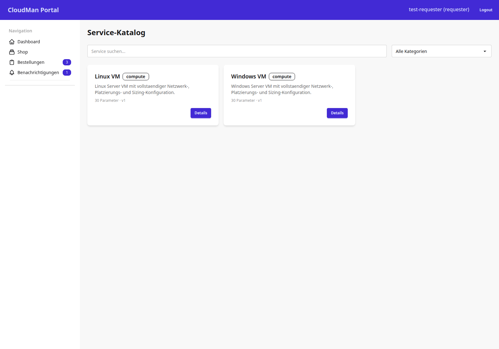

# Service-Katalog (Shop)

Der Service-Katalog listet alle bestellbaren Service-Templates als Karten und
ist der Einstiegspunkt für jede neue Bestellung.

## 1. Ziel der Seite

Requester sollen hier einen Service finden — per Volltextsuche oder
Kategorie-Filter — und von der Karte direkt zur Detailseite gelangen, um ihn zu
bestellen.

## 2. Screenshot

Ein Suchfeld und ein Kategorie-Filter grenzen die Auswahl live ein. Jede Karte
zeigt Kategorie, Kurzbeschreibung, Parameter-Anzahl und Version. Der
**Details**-Button führt zur Katalog-Detailseite (siehe
[Katalog-Detail](04-katalog-detail.md)).

## 3. Rolle und Zugriff

Geschützt durch `RequesterRequiredMixin` (`cmp/core/mixins.py:61`) — alle vier
Rollen dürfen den Katalog sehen. Die Liste selbst kennt keine Rolleneinschränkung
je Template; welche Templates an welchem Standort/Mandant bestellbar sind,
regeln `AvailabilityRule`-Einträge in der `cmdb`-App, nicht diese View.

Bei HTMX-Requests liefert die View nur das Karten-Grid als Partial zurück
(`get_template_names`, `cmp/apps/catalog/views.py:25`) — für die Live-Suche/
den Filter ohne vollständigen Seiten-Reload.

## 4. URL und View

| HTTP-Pfad | URL-Name | View-Klasse | Codestelle |
|---|---|---|---|
| `/catalog/` | `catalog:list` | `TemplateListView` | `cmp/apps/catalog/views.py:13` |

Eingebunden über `path("catalog/", include("apps.catalog.urls"))`,
`cmp/config/urls.py:8`, mit `path("", views.TemplateListView.as_view(), name="list")`
in `cmp/apps/catalog/urls.py:8`.

## 5. Zusammenfassung

Suche und Filter laufen über Query-Parameter (`q`, `category`) und
`CatalogService.search_templates` bzw. `list_active_templates`
(`cmp/apps/catalog/views.py:19-23`) — die eigentliche Such-/Filterlogik liegt
im Service, nicht in der View.

> Quelle: cmp-docs/docs/images/screenshots/Screenshot_03_cmp.png, cmp/apps/catalog/views.py, cmp/apps/catalog/urls.py, cmp/core/mixins.py — am Code geprüft 2026-07-22
