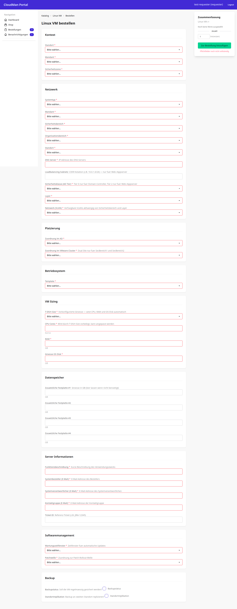

# Bestellformular — Linux VM bestellen

Das All-in-One-Bestellformular fasst Kontext, alle Template-Parameter und die
Bestellmenge auf einer einzigen Seite zusammen, mit einer live mitlaufenden
Zusammenfassung.

## 1. Ziel der Seite

Ein Requester soll einen Service in einem Durchgang bestellen können, ohne
durch mehrere Formularschritte zu klicken. Die Parameter sind nach Abschnitten
gruppiert (Kontext, Netzwerk, Platzierung, Betriebssystem, VM Sizing,
Datenspeicher, Server-Informationen, Softwaremanagement, Backup), rechts läuft
eine Zusammenfassung der gewählten Werte mit. Oben rechts wechselt ein
„Formular / Wizard"-Umschalter zur schrittweisen Variante desselben
Bestellvorgangs (`OrderCreateView`, `cmp/apps/orders/views.py:81`) — diese
Seite dokumentiert die Formular-Variante, die auf dem Screenshot aktiv ist.

## 2. Screenshot — Leerer Zustand

Pflichtfelder sind rot umrandet, die Zusammenfassung rechts ist leer
(„Noch keine Werte ausgewählt").

## 3. Screenshot — Ausgefüllter Zustand

Rote Rahmen verschwinden, sobald ein Pflichtfeld einen Wert hat; die
Zusammenfassung rechts füllt sich live mit jeder Eingabe. Validierung erfolgt
zweistufig: zuerst das Django-Form (Feldtypen, Pflichtangaben), danach der
Service-Layer (`TemplateValidator` gegen das Parameter-Schema des Templates).

## 4. Rolle und Zugriff

Geschützt durch `RequesterRequiredMixin` (`cmp/core/mixins.py:61`) — alle vier
Rollen dürfen bestellen. Es gibt keine weitere Rollenprüfung innerhalb der
View; ob ein Template an Standort/Mandant überhaupt verfügbar ist, regeln
`AvailabilityRule`-Einträge außerhalb dieser Seite.

## 5. URL und View

| HTTP-Pfad | URL-Name | View-Klasse | Codestelle |
|---|---|---|---|
| `/orders/create/<int:template_pk>/form/` | `orders:create_form` | `OrderFormView` | `cmp/apps/orders/views.py:292` |
| `/orders/create/<int:template_pk>/` | `orders:create` | `OrderCreateView` (Wizard-Alternative) | `cmp/apps/orders/views.py:81` |

Beide eingebunden über `path("orders/", include("apps.orders.urls"))`,
`cmp/config/urls.py:9`; die konkreten Pfade stehen in
`cmp/apps/orders/urls.py:11-12`.

## 6. Zusammenfassung

`OrderFormView` rendert `FullOrderForm` mit allen Template-Parametern auf
einmal (`cmp/apps/orders/views.py:314-324`) und legt bei erfolgreicher
Validierung in einem Schritt `Order` und `OrderItem` an
(`OrderService.create_order` / `add_item`, `cmp/apps/orders/views.py:351-359`).
Der Wizard (`OrderCreateView`) deckt denselben Ablauf schrittweise über
Session-State ab — beide View-Klassen teilen sich Modelle und Service-Layer.

> Quelle: cmp-docs/docs/images/screenshots/Screenshot_05_cmp.png, cmp-docs/docs/images/screenshots/Screenshot_05b_cmp.png, cmp/apps/orders/views.py, cmp/apps/orders/urls.py, cmp/core/mixins.py — am Code geprüft 2026-07-22
