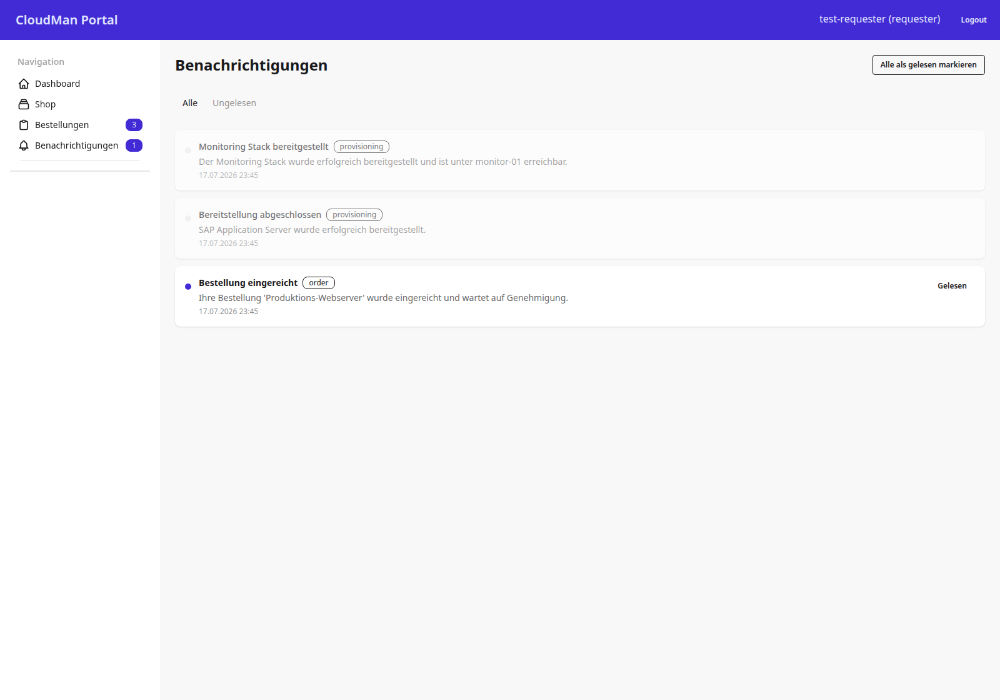

# Benachrichtigungen

Das Benachrichtigungs-Center bündelt System-Events des angemeldeten Benutzers
mit Typ-Badge und Lesestatus.

## 1. Ziel der Seite

Ein Benutzer soll auf einen Blick sehen, was seit dem letzten Besuch passiert
ist (Bereitstellung abgeschlossen, Bestellung eingereicht …), einzelne
Einträge oder alle auf einmal als gelesen markieren können.

## 2. Screenshot

Tabs trennen „Alle" von „Ungelesen". Jede Karte zeigt Typ-Badge, Titel, Text
und Zeitstempel; ungelesene Einträge tragen zusätzlich einen Punkt-Indikator.
Die Liste aktualisiert sich beim Seitenaufruf; eine Live-Auslieferung über
Django Channels (WebSocket) ist als AP-12 geplant, aber noch nicht gebaut.

## 3. Rolle und Zugriff

Geschützt durch `RequesterRequiredMixin` (`cmp/core/mixins.py:61`) — alle vier
Rollen sehen ihre eigenen Benachrichtigungen. Die Queryset-Filterung erfolgt
strikt auf den angemeldeten Benutzer:
`Notification.objects.filter(user=self.request.user)`
(`cmp/apps/notifications/views.py:17`).

## 4. URL und View

| HTTP-Pfad | URL-Name | View-Klasse | Codestelle |
|---|---|---|---|
| `/notifications/` | `notifications:list` | `NotificationListView` | `cmp/apps/notifications/views.py:11` |
| `/notifications/mark-read/<int:pk>/` | `notifications:mark_read` | `NotificationMarkReadView` | `cmp/apps/notifications/views.py:31` |
| `/notifications/mark-all-read/` | `notifications:mark_all_read` | `NotificationMarkAllReadView` | `cmp/apps/notifications/views.py:37` |

Eingebunden über `path("notifications/", include("apps.notifications.urls"))`,
`cmp/config/urls.py:11`.

## 5. Zusammenfassung

Die beiden „Mark read"-Views sind reine POST-Endpunkte ohne eigenes Template —
sie delegieren an `NotificationService` und leiten danach auf die Liste
zurück (`cmp/apps/notifications/views.py:33`, `:39`).

> Quelle: cmp-docs/docs/images/screenshots/Screenshot_08_cmp.png, cmp/apps/notifications/views.py, cmp/apps/notifications/urls.py, cmp/core/mixins.py — am Code geprüft 2026-07-22
