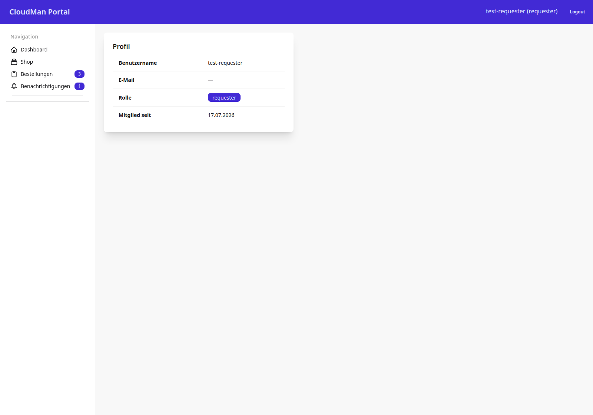

# Profil

Die Profilseite zeigt die Stammdaten des angemeldeten Benutzers in einer
einzelnen Karte.

## 1. Ziel der Seite

Ein Benutzer soll seinen Benutzernamen, seine E-Mail, seine Rolle und sein
Beitrittsdatum einsehen können — reine Anzeige, keine Bearbeitung.

## 2. Screenshot

Die Karte zeigt Benutzername, E-Mail (im Screenshot leer, da für Stub-Benutzer
keine E-Mail hinterlegt ist), Rolle als Badge und das Beitrittsdatum
(`date_joined`).

## 3. Rolle und Zugriff

Geschützt durch `RequesterRequiredMixin` (`cmp/core/mixins.py:61`) — alle vier
Rollen sehen ihr eigenes Profil. Die View liest ausschließlich
`request.user` über den Template-Kontext von `TemplateView`; es gibt keine
Bearbeitungsfunktion — Benutzer und Rollen werden ausschließlich über den
Django-Admin gepflegt (siehe [Django-Admin](13-django-admin.md)).

## 4. URL und View

| HTTP-Pfad | URL-Name | View-Klasse | Codestelle |
|---|---|---|---|
| `/accounts/profile/` | `accounts:profile` | `ProfileView` | `cmp/apps/accounts/views.py:5` |

Eingebunden über `path("accounts/", include("apps.accounts.urls"))`,
`cmp/config/urls.py:7`, mit `path("profile/", views.ProfileView.as_view(), name="profile")`
in `cmp/apps/accounts/urls.py:6`.

## 5. Zusammenfassung

`ProfileView` ist die einfachste View des gesamten Kapitels: eine reine
`TemplateView` ohne eigene `get_context_data` — das Template greift direkt auf
`request.user` zu.

> Quelle: cmp-docs/docs/images/screenshots/Screenshot_10_cmp.png, cmp/apps/accounts/views.py, cmp/apps/accounts/urls.py, cmp/core/mixins.py — am Code geprüft 2026-07-22
