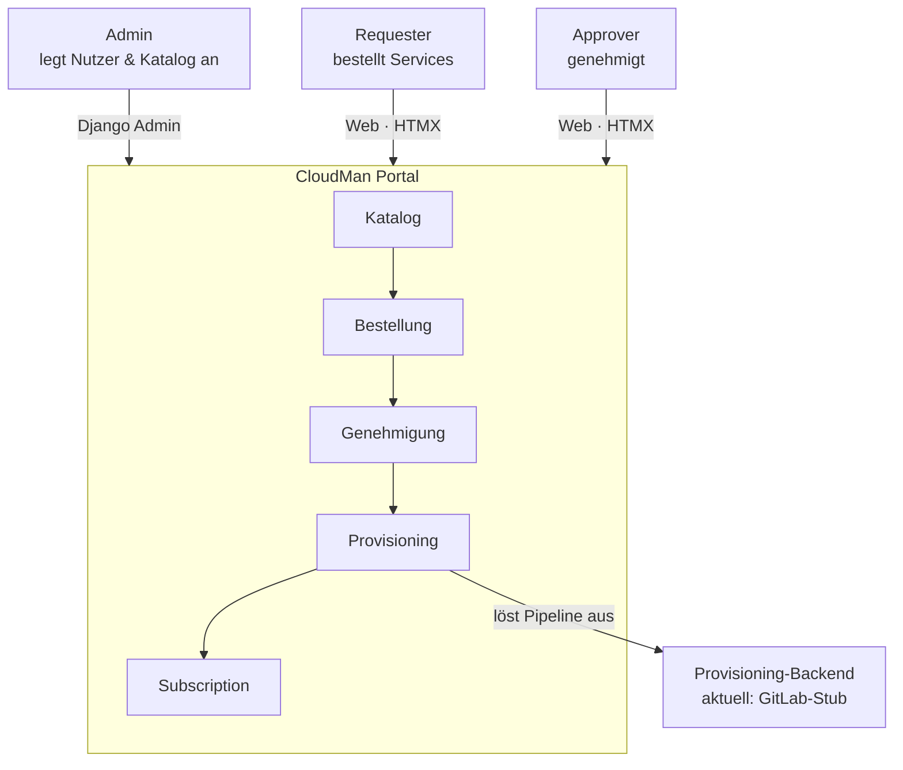

# 01 — Das große Bild

> **In diesem Kapitel:** Bevor wir in Details wie Models, Services oder Code
> einsteigen, brauchst du ein Bild im Kopf: Wozu gibt es das CloudMan Portal
> überhaupt, wer benutzt es, und was passiert grob, wenn jemand etwas bestellt?
>
> **Das lernst du:**
> - Welche drei menschlichen Rollen im großen Bild vorkommen
> - Die Kette Katalog → Bestellung → Genehmigung → Provisioning → Subscription
> - Dass die eigentliche Bereitstellung heute simuliert ist — und warum das okay ist
>
> **Voraussetzung:** [00 — Willkommen](00-willkommen.md)

---

## Wozu gibt es CMP?

Stell dir vor, du brauchst als Entwickler eine neue virtuelle Maschine. Ohne
ein Portal wie CMP würdest du eine E-Mail schreiben, jemand aus dem Ops-Team
liest sie irgendwann, klickt sich durch ein internes Tool, meldet sich zurück —
und das dauert Tage.

Das **CloudMan Portal (CMP)** macht daraus einen **Self-Service**: Du suchst dir
im Katalog aus, was du brauchst, bestellst es über eine Weboberfläche, und der
Rest läuft automatisiert. Genehmigungen (falls nötig) und die technische
Bereitstellung passieren im Hintergrund, ohne dass jemand von Hand etwas
umsetzen muss.

💡 **Merke:** CMP ist ein **Self-Service-Portal für IT-Provisioning** — der
Mensch bestellt, das System setzt um.

---

## Die drei Rollen im großen Bild

Für den Überblick reichen drei menschliche Rollen (Details dazu in
[Kapitel 04](04-rollen-und-rechte.md)):

- **Admin** — legt über das Django-Admin Nutzer an und pflegt den Katalog
  (welche Services überhaupt bestellbar sind).
- **Requester** — bestellt Services über die Weboberfläche. Das ist die Rolle,
  die die meisten Mitarbeitenden im Alltag haben.
- **Approver** — genehmigt Bestellungen, die eine Freigabe brauchen (z. B. weil
  sie teuer oder besonders kritisch sind).

Admin arbeitet dabei über das **Django-Admin** — ein eigenes, technisches
Interface. Requester und Approver arbeiten über die **normale Web-Oberfläche**
des Portals, die mit HTMX und DaisyUI gebaut ist und sich anfühlt wie eine ganz
gewöhnliche Website, nicht wie eine Single-Page-App.

---

## Die Kette: von der Idee zum laufenden Service

Jede Bestellung durchläuft dieselbe Kette von Stationen:

Lies das Diagramm so: Oben stehen die drei Menschen und wie sie mit dem Portal
sprechen — Admin über das Django-Admin, Requester und Approver über die
Web-Oberfläche. In der Mitte läuft die eigentliche Wertschöpfungskette einer
Bestellung von links nach rechts:

1. **Katalog** — die Liste dessen, was überhaupt bestellbar ist (z. B. „Linux-VM
   klein", „Datenbank-Instanz"). Der Admin pflegt diesen Katalog.
2. **Bestellung** — ein Requester wählt einen Katalog-Eintrag und schickt eine
   konkrete Bestellung ab.
3. **Genehmigung** — je nach Regelwerk muss ein Approver zustimmen, bevor es
   weitergeht. Nicht jede Bestellung braucht das — manche laufen direkt durch.
4. **Provisioning** — die eigentliche technische Bereitstellung. Das passiert
   automatisch und **asynchron** im Hintergrund (über Celery), damit die
   Weboberfläche nicht blockiert, während im Hintergrund gearbeitet wird.
5. **Subscription** — am Ende steht ein aktives Abonnement (kurz „Abo"): der
   Service läuft und gehört dem Requester.

Ganz rechts im Diagramm siehst du, dass Provisioning eine externe Pipeline
„auslöst". Das ist der Punkt, an dem CMP an die eigentliche Infrastruktur
übergibt.

> 🔍 **Im Code nachsehen:** Für die genauen Begriffe und wie sie als Django-Models
> zusammenhängen, sieh dir [Kapitel 03 — Die Fachdomäne](03-fachdomaene.md) an.
> Wie eine einzelne Bestellung durch ihre Zustände wandert, zeigt
> [Kapitel 05 — Der Bestell-Lebenszyklus](05-bestell-lebenszyklus.md).

---

## Ehrlich gesagt: Das Provisioning-Backend ist heute ein Stub

⚠️ **Achtung:** Das „Provisioning-Backend" im Diagramm ist aktuell **kein**
echtes System, das echte Server aufsetzt. Es ist ein **Stub** —
`GitLabStubClient` — der eine GitLab-Pipeline nur *simuliert*: Er tut so, als
würde er eine Pipeline anstoßen und deren Status abfragen, liefert aber
vordefinierte Ergebnisse zurück.

Das ist bewusst so und kein Versehen. CMP ist so gebaut, dass die eigentliche
Anbindung an ein reales Provisioning-System später eingesteckt werden kann,
ohne dass sich am restlichen Ablauf (Bestellung, Genehmigung, Statuslogik)
etwas ändert. Die echte Anbindung ist heute schlicht noch offen.

💡 **Merke:** Wenn du im Portal eine Bestellung durchspielst und am Ende eine
Subscription siehst — die „Bereitstellung" dahinter war simuliert, nicht real.

---

## 🔍 Im Code nachsehen

| Was | Wo |
|-----|-----|
| Der simulierte Provisioning-Client | `cmp/apps/provisioning/clients.py` (`GitLabStubClient`) |
| Die Provisioning-Logik, die den Client aufruft | `cmp/apps/provisioning/services.py` |
| Die Hintergrund-Tasks (Celery) | `cmp/apps/provisioning/tasks.py` |

---

## Selbstcheck

Bevor du weiterliest, kannst du diese Fragen beantworten?

1. Welche drei menschlichen Rollen kommen im großen Bild vor, und wie
   unterscheidet sich der Zugang von Admin gegenüber Requester/Approver?
2. Nenne die fünf Stationen der Kette von der Bestellung bis zur aktiven Subscription.
3. Ist das aktuelle Provisioning-Backend real oder simuliert — und warum ist
   das für den Moment in Ordnung?

Antworten anzeigen

1. Admin, Requester, Approver. Admin arbeitet über das Django-Admin, Requester
   und Approver über die normale Web-Oberfläche (HTMX).
2. Katalog → Bestellung → Genehmigung → Provisioning → Subscription.
3. Simuliert, über `GitLabStubClient`. Das ist in Ordnung, weil CMP so gebaut
   ist, dass die echte Anbindung später eingesteckt werden kann, ohne den
   restlichen Ablauf zu ändern.

---

⟵ [00 — Willkommen](00-willkommen.md) · [📖 Übersicht](README.md) · [02 — Ziele & Anforderungen](02-ziele-und-anforderungen.md) ⟶
