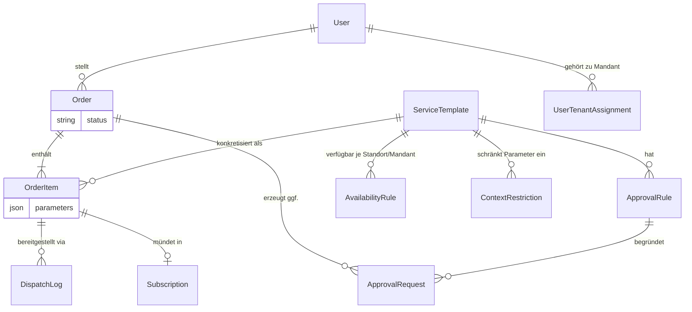

# 02 — Die Fachdomäne

> **In diesem Kapitel:** Bevor du eine Zeile Code anfasst, brauchst du die
> Begriffe, mit denen CMP „denkt". Katalog, Bestellung, Genehmigung,
> Bereitstellung, Abo — das sind keine Django-Apps, das sind Konzepte aus der
> echten IT-Provisionierung, die der Code nur abbildet.
>
> **Das lernst du:**
> - Was ein `ServiceTemplate`, eine `Order`, ein `OrderItem` etc. fachlich bedeuten
> - Wie diese Entitäten in einer Kette zusammenhängen — vom Katalog bis zum Abo
> - Warum es `OrderItemGroup` gibt, wenn es doch schon `OrderItem` gibt
> - Wie „Kontext" (Standort, Mandant) über die App `cmdb` steuert, wer was bestellen darf
> - Wo im Code du diese Modelle findest
>
> **Voraussetzung:** [01 — Das große Bild](01-das-grosse-bild.md)

---

## Warum überhaupt eigene Begriffe?

CMP ist ein Self-Service-Portal für IT-Ressourcen. Ein Nutzer will „eine
Linux-VM" — aber bis daraus eine laufende, abgerechnete Ressource wird,
durchläuft diese Anfrage mehrere fachliche Stationen: erst steht sie im
Katalog als Vorlage, dann wird sie bestellt, vielleicht muss sie genehmigt
werden, dann wird sie technisch bereitgestellt, und am Ende läuft ein Abo
darauf.

Jede dieser Stationen hat im Code ein eigenes Modell, und jedes Modell lebt
in einer eigenen App. Wenn du diese sechs Begriffe sitzen hast, verstehst du
den Rest des Portals fast von selbst.

💡 **Merke:** Jede App hat *eine* fachliche Verantwortung. `catalog` weiß, was
bestellbar ist. `orders` weiß, was bestellt wurde. `approvals` weiß, ob es
genehmigt werden muss. `provisioning` weiß, ob es technisch geklappt hat.
`subscriptions` weiß, was gerade aktiv läuft.

---

## Die Entitäten im Detail

### ServiceTemplate (App `catalog`)

Ein `ServiceTemplate` ist die **bestellbare Vorlage** — z. B. „Linux-VM" oder
„Windows-VM". Es trägt eine `category` (z. B. `compute`) und ein `parameters`-Schema: eine
Liste, die beschreibt, welche Eingaben ein Nutzer machen muss (CPU, RAM,
Betriebssystem …). Auswahl-Felder sind vom Typ `enum` — z. B. das Betriebssystem
mit Optionen wie `ubuntu2204` oder `win2022`.

Im `catalog`-Modul gibt es dafür ein gemeinsames Basis-Schema namens
`SHARED_PARAMS` — die Templates ergänzen es um ihre spezifischen Parameter. Die
Seed-Daten des Portals bringen bereits zwei fertige Templates mit: eine Linux-
und eine Windows-VM.

💡 **Merke:** Ein bestellbarer Service ist bei CMP **Daten, kein Code**. Eine neue
Bestelloption anzulegen heißt: ein neuer `ServiceTemplate`-Datensatz mit einem
`parameters`-Schema — keine neue View, kein neues Formularfeld, keine Migration.
Das Katalog-System liest die Vorlage zur Laufzeit und baut das Bestellformular daraus.

### Order (App `orders`)

Eine `Order` ist die **zentrale Bestellung** eines Nutzers (`order.user`). Sie
trägt genau ein Feld, das über ihren gesamten Lebensweg Auskunft gibt:
`status`. Wie dieser Status sich Schritt für Schritt verändert, ist das Thema
des kompletten nächsten Kapitels.

### OrderItem (App `orders`)

Ein `OrderItem` ist **eine konkrete Position** innerhalb einer Order — es
verweist auf genau ein `ServiceTemplate` und trägt die tatsächlichen
Eingaben als `parameters` (JSON), also z. B.
`{"cpu_cores": 8, "ram_gb": 16, "os_template": "ubuntu2204"}` für eine
bestimmte VM.

### OrderItemGroup (App `orders`)

Manchmal will jemand nicht *eine* VM, sondern zehn identische. Dafür gibt es
`OrderItemGroup`: eine Gruppe von `OrderItem`s, die sich `shared_parameters`
teilen, plus eine `quantity`. Ohne Gruppe müsstest du zehn identische Items
einzeln pflegen — mit Gruppe genügt „dieses Template, zehnmal, mit diesen
gemeinsamen Parametern".

### ApprovalRule (App `approvals`)

Eine `ApprovalRule` hängt an einem `ServiceTemplate` und legt fest, **wann**
eine Bestellung dieses Templates genehmigt werden muss (`condition`, z. B. ab
einer bestimmten VM-Größe) und **wer** das darf: die `approver_role`.

### ApprovalRequest (App `approvals`)

Eine `ApprovalRequest` ist die **konkrete Genehmigungsanfrage** zu einer
Order — angelegt, weil eine `ApprovalRule` gegriffen hat. Sie trägt einen
`status` (Konventionswerte wie `pending`, `approved`, `rejected`) und
protokolliert, wer wann entschieden hat.

### DispatchLog (App `provisioning`)

Ein `DispatchLog` ist **ein Bereitstellungs-Lauf** für genau ein `OrderItem`
— also der technische Vorgang, der aus „VM bestellt" ein „VM existiert"
macht. Er trägt eine `pipeline_id` (welcher Provisioning-Prozess das war),
einen `payload` (die an die Pipeline übergebenen Daten) und einen `status`
(Konventionswerte wie `running`, `success`, `failed`).

### Subscription / GroupSubscription (App `subscriptions`)

Eine `Subscription` ist das **aktive Abo** auf ein erfolgreich
bereitgestelltes `OrderItem` — das, was am Ende tatsächlich läuft und genutzt
wird. `GroupSubscription` ist das Pendant für eine ganze `OrderItemGroup`.
Auch hier: ein `status` (Konventionswerte wie `active`, `cancelled`).

Wichtig ist die Trennung: Ein Abo ist ein **eigenes Modell** mit eigenem `status`
und einer eigenen Gültigkeit (`valid_from` / `valid_until`) — nicht bloß ein Feld
an der Bestellung. Der Grundgedanke: **Ein Abo lebt länger als die Bestellung.**
Die Bestellung ist irgendwann `done`, das Abo läuft weiter. Spätere Änderungen an
einer laufenden Ressource werden darum als **neue Bestellungen** modelliert — so
bleibt der Audit-Trail (wer hat wann was geändert) lückenlos.

> 🔍 **Im Code nachsehen:** Öffne `cmp/apps/orders/models.py` und
> `cmp/apps/subscriptions/models.py` nebeneinander — du siehst, wie
> `Subscription.order_item` exakt auf das `OrderItem` zurückzeigt, aus dem sie
> entstanden ist.

---

## Wie die Entitäten zusammenhängen

Ein `User` stellt eine `Order`. Die `Order` enthält ein oder mehrere
`OrderItem`s, jedes davon konkretisiert ein `ServiceTemplate` aus dem Katalog
— optional gebündelt über eine `OrderItemGroup`. Hängt am Template eine
`ApprovalRule`, erzeugt die Order eine oder mehrere `ApprovalRequest`s. Ist
alles genehmigt (oder war keine Genehmigung nötig), wird jedes `OrderItem`
über einen `DispatchLog` technisch bereitgestellt — und mündet im Erfolgsfall
in eine `Subscription`.

⚠️ **Achtung:** Das Diagramm zeigt die *Struktur* — nicht die *Reihenfolge*.
Wann genau eine Order von „bestellt" zu „genehmigt" zu „bereitgestellt"
wandert, steht in ihrem `status`-Feld. Den kompletten Statusfluss lernst du im
nächsten Kapitel: [05 — Der Bestell-Lebenszyklus](05-bestell-lebenszyklus.md).

---

## Kontext: Wo darf was bestellt werden? (App `cmdb`)

Nicht jede Vorlage ist überall und für jeden bestellbar. Solche Regeln lebt die
App `cmdb` (Configuration Management DB). „Kontext" heißt in CMP dabei:
**Standort, Mandant und Sicherheitszone** — also *wo* und *für wen* etwas
bereitgestellt wird. Drei Modelle bilden das ab:

| Modell | Wofür |
|--------|-------|
| `AvailabilityRule` | Ist ein `ServiceTemplate` an einem `location`/`tenant` verfügbar? (`is_available`) — z. B. „Windows-VM am Standort Leipzig gesperrt". |
| `ContextRestriction` | Schränkt die **erlaubten Werte eines Parameters** je Kontext ein (`parameter_key`, `context_field`, `allowed_values`) — z. B. „an Standort A nur diese drei Netzwerke". |
| `UserTenantAssignment` | Welchem **Mandanten** ein Nutzer zugeordnet ist (`user` + `tenant`, je Paar nur einmal). |

Abgefragt werden diese Regeln über den **`ContextService`**
(`cmp/apps/cmdb/services.py`) — mit Methoden wie `is_template_available()`,
`get_available_templates()`, `get_parameter_restrictions()` und
`get_user_tenants()`.

> ⚠️ **Achtung — „Mandant" hat zwei Bedeutungen:** Er kann ein *Parameterwert*
> einer Bestellung sein *und* die *Mandantenzuordnung* eines Nutzers
> (`UserTenantAssignment`). Gleicher Begriff, verschiedene Felder — nicht verwechseln.

> 🔍 **Im Code nachsehen:** In der Entwicklung liest CMP diese Kontextdaten nicht
> aus einer echten CMDB, sondern aus einem **Stub** (`CmdbStubClient`,
> Beispieldaten unter `cmp/stubs/cmdb/`). Was ein „Stub" ist, klärt
> [Kapitel 07](07-async-und-provisioning.md).

---

## Vertiefung für Entwickler

<b>Status-Felder — nur eines ist wirklich eine Enum ⚑ Befund</b>

Von allen `status`-Feldern in dieser Kette ist genau **eines** auf DB-Ebene
erzwungen: `Order.status` nutzt `choices=OrderStatus.choices` — eine echte
`TextChoices`-Enum aus `core/domain/value_objects.py`. Nur Werte aus dieser
Enum sind über `choices` als gültig markiert.

`ApprovalRequest.status`, `DispatchLog.status` und `Subscription.status` (auch
`GroupSubscription.status`) sind dagegen **freie** `CharField`s mit
Default-Strings (`"pending"`, `"pending"` bzw. `"active"`) — ohne `choices`,
ohne Constraint. Die Werte, die der Code tatsächlich hineinschreibt (z. B.
`"running"` / `"success"` / `"failed"` bei `DispatchLog`, `"approved"` /
`"rejected"` bei `ApprovalRequest`), sind reine Konvention im Python-Code, nicht
im Datenbankschema.

Für dich als Entwickler heißt das: Die Datenbank verhindert nicht, dass
irgendwo `status="aproved"` (Tippfehler) landet. Das würde einfach
gespeichert — und stille Logikfehler nach sich ziehen (z. B. ein Filter wie
`.filter(status="approved")`, der den falsch geschriebenen Datensatz nie
findet), statt dass die DB einen Fehler wirft.

---

## 🔍 Im Code nachsehen

| Was | Wo |
|-----|-----|
| `ServiceTemplate`, `TemplateCategory`, `SHARED_PARAMS` | `cmp/apps/catalog/models.py`, `cmp/apps/catalog/services.py` |
| `Order`, `OrderItem`, `OrderItemGroup` | `cmp/apps/orders/models.py` |
| `ApprovalRule`, `ApprovalRequest` | `cmp/apps/approvals/models.py` |
| `DispatchLog` | `cmp/apps/provisioning/models.py` |
| `Subscription`, `GroupSubscription` | `cmp/apps/subscriptions/models.py` |
| `AvailabilityRule`, `ContextRestriction`, `UserTenantAssignment`, `ContextService` | `cmp/apps/cmdb/models.py`, `cmp/apps/cmdb/services.py` |
| Die echte Enum `OrderStatus` | `cmp/core/domain/value_objects.py` |

---

## Selbstcheck

Bevor du weiterliest, kannst du diese Fragen beantworten?

1. Was ist der fachliche Unterschied zwischen einem `ServiceTemplate` und
   einem `OrderItem`?
2. Wozu dient `OrderItemGroup`, wenn es doch schon `OrderItem` gibt?
3. Welches der besprochenen `status`-Felder ist auf DB-Ebene wirklich als
   Enum erzwungen — und welche drei sind es *nicht*?
4. Wozu dient eine `AvailabilityRule` in der App `cmdb`?

Antworten anzeigen

1. `ServiceTemplate` ist die abstrakte, bestellbare Vorlage im Katalog (z. B.
   „Linux-VM"). `OrderItem` ist die konkrete Position in einer Bestellung mit
   den tatsächlichen Parametern eines Nutzers.
2. Für identische Mehrfachbestellungen (z. B. zehn gleiche VMs): Statt zehn
   `OrderItem`s einzeln zu pflegen, bündelt eine `OrderItemGroup` sie mit
   `quantity` und gemeinsamen `shared_parameters`.
3. Nur `Order.status` (echte `TextChoices`-Enum `OrderStatus`).
   `ApprovalRequest.status`, `DispatchLog.status` und `Subscription.status`
   sind freie `CharField`s ohne `choices`-Constraint.
4. Sie legt fest, ob ein `ServiceTemplate` an einem bestimmten Standort/Mandanten
   bestellbar ist (`is_available`) — so lässt sich eine Vorlage kontextabhängig
   sperren oder freigeben.

---

⟵ [02 — Ziele & Anforderungen](02-ziele-und-anforderungen.md) · [📖 Übersicht](README.md) · [04 — Rollen & Rechte](04-rollen-und-rechte.md) ⟶
