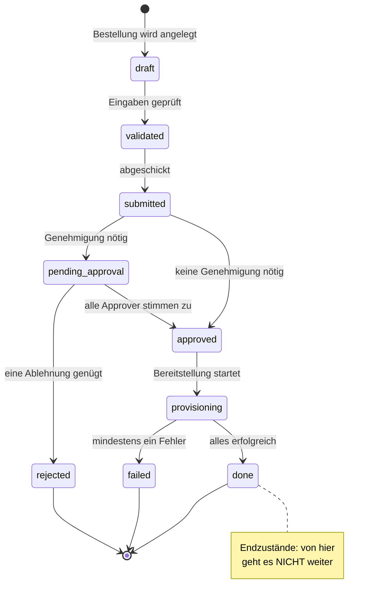

# 04 — Der Bestell-Lebenszyklus

> **In diesem Kapitel:** Eine Bestellung im CMP ist nie einfach nur „da" — sie
> durchläuft feste **Zustände**, von der ersten Eingabe bis zur fertigen
> Bereitstellung. Dieses Kapitel zeigt dir den kompletten Lebensweg.
>
> **Das lernst du:**
> - Welche Zustände eine Bestellung (`Order`) haben kann
> - In welcher Reihenfolge sie erlaubt sind — und welche Sprünge *verboten* sind
> - Wer bzw. welcher Code jeden Übergang auslöst
> - Warum es dafür genau **eine** zentrale Stelle im Code gibt
>
> **Voraussetzung:** [03 — Die Fachdomäne](03-fachdomaene.md) (die Begriffe
> Bestellung, Genehmigung, Provisioning solltest du kennen).

---

## Warum überhaupt Zustände?

Stell dir eine Bestellung wie ein Paket bei einem Versanddienst vor. Es ist mal
*„angenommen"*, mal *„in Zustellung"*, mal *„zugestellt"*. Du kannst am Status
ablesen, wo es gerade steht — und bestimmte Dinge sind nur in bestimmten Zuständen
möglich (ein bereits zugestelltes Paket kann nicht nochmal „in Zustellung" gehen).

Genauso ist es bei einer CMP-Bestellung. Der gesamte Ablauf steckt in **einem
einzigen Feld**: `Order.status`. Kein Wirrwarr aus zehn Ja/Nein-Flags — ein Wort
sagt dir immer, wo die Bestellung steht.

💡 **Merke:** Der Status ist die *Wahrheit* über eine Bestellung. Willst du
wissen, was mit ihr los ist, schau auf `order.status`.

---

## Die Zustände auf einen Blick

Das folgende Diagramm zeigt **alle** Zustände und **alle erlaubten** Übergänge.
Jeder Pfeil ist ein erlaubter Schritt — alles, was *nicht* eingezeichnet ist, ist
verboten und wird vom Code aktiv abgelehnt.



---

## Was jeder Zustand bedeutet

| Zustand | Klartext |
|---------|----------|
| `draft` | Angelegt, aber noch nicht geprüft. Die „Einkaufswagen"-Phase. |
| `validated` | Die Eingaben (z. B. VM-Parameter) wurden gegen das Katalog-Schema geprüft und sind gültig. |
| `submitted` | Der Nutzer hat abgeschickt. Jetzt entscheidet sich: braucht es eine Genehmigung? |
| `pending_approval` | Wartet auf die Zustimmung eines oder mehrerer Approver. |
| `approved` | Freigegeben — bereit zur Bereitstellung. (Entweder direkt aus `submitted`, wenn keine Regel greift, oder nach der Genehmigung.) |
| `rejected` | Ein Approver hat abgelehnt. **Endstation.** |
| `provisioning` | Die eigentliche Bereitstellung läuft im Hintergrund (Celery, siehe [Kapitel 07](07-async-und-provisioning.md)). |
| `done` | Alles bereitgestellt, Abo(s) erzeugt. **Endstation, Erfolg.** |
| `failed` | Bei der Bereitstellung ging etwas schief. **Endstation, Fehler.** |

Die drei **Endzustände** (`done`, `failed`, `rejected`) sind terminal: von dort
gibt es keinen Weg zurück. Im Code heißen sie `TERMINAL_STATES`.

---

## Wer löst welchen Übergang aus?

Zustände ändern sich nicht von selbst — jeder Übergang wird von einer konkreten
**Service-Methode** ausgelöst. Das ist die Brücke zwischen „Fachlogik" und Code:

| Übergang | Ausgelöst durch |
|----------|-----------------|
| `draft → validated → submitted` | `OrderService.submit_order()` — prüft die Eingaben und schickt ab |
| `submitted → approved` *(keine Regel)* | `OrderService.submit_order()` — wenn keine Genehmigung nötig ist |
| `submitted → pending_approval` | `ApprovalService.create_approval_requests()` — legt die offenen Genehmigungen an |
| `pending_approval → approved` | `ApprovalService.approve()` — sobald **alle** Approver zugestimmt haben |
| `pending_approval → rejected` | `ApprovalService.reject()` — sofort bei der **ersten** Ablehnung |
| `approved → provisioning` | `ProvisioningService.dispatch_order()` — startet die Bereitstellung |
| `provisioning → done / failed` | `ProvisioningService.complete_dispatch()` — je nach Ergebnis |

⚠️ **Achtung:** Ein Übergang wie `draft → done` oder `rejected → approved` ist
**nicht** erlaubt. Wenn Code so etwas versucht, wirft das System einen Fehler
(`ValueError: Invalid transition`). Das ist Absicht — es schützt davor, dass eine
Bestellung in einen unsinnigen Zustand rutscht.

---

## Die eine goldene Regel: `transitions.py`

Es gibt im ganzen Projekt **genau eine** Stelle, an der `order.status` verändert
werden darf: die Funktion `transition()` in
[`cmp/apps/orders/transitions.py`](../../cmp/apps/orders/transitions.py).

Diese Funktion macht drei Dinge in einem Rutsch:

1. **Prüfen** — ist der gewünschte Übergang laut Diagramm erlaubt?
   (Über `StatusMachine.validate_transition()`.)
2. **Setzen & speichern** — `order.status = ...` und `order.save()`.
3. **Protokollieren** — schreibt einen Eintrag ins **Audit-Log**
   (z. B. `order.approved`), damit später nachvollziehbar ist, wer wann was getan hat.

```python
def transition(order, to_status, actor, **details):
    """Validate + apply a status change and record it in the audit log."""
    from_status = str(order.status)
    StatusMachine.validate_transition(order.status, to_status)  # 1. prüfen
    order.status = to_status
    order.save()                                                # 2. setzen
    AuditService.log(actor, f"order.{to_status}", "order",      # 3. protokollieren
                     order.pk, details={"from": from_status, **details})
```

💡 **Merke:** Nie `order.status = "approved"` irgendwo direkt schreiben. **Immer**
über `transition()`. Nur so bleiben Prüfung und Audit-Log garantiert dabei.

> **Kleines Detail am Rande:** `transition()` verschickt *keine*
> Benachrichtigungen. Das ist bewusst so — wer benachrichtigt werden muss, hängt
> vom Übergang ab und bleibt darum in den jeweiligen Services. Mehr dazu in
> [Kapitel 07](07-async-und-provisioning.md).

---

## Ein Durchlauf als Geschichte

Nehmen wir eine Bestellung für eine Linux-VM, die eine Genehmigung braucht:

1. Anna (Rolle *requester*) legt die Bestellung an → **`draft`**
2. Sie schickt sie ab; die Parameter sind gültig → **`validated`** → **`submitted`**
3. Für teure VMs gilt eine Genehmigungsregel → **`pending_approval`**,
   Ben (Rolle *approver*) wird benachrichtigt
4. Ben stimmt zu → **`approved`**; im Hintergrund startet die Bereitstellung
5. Die (simulierte) Pipeline läuft durch → **`provisioning`** → **`done`**
6. Anna hat jetzt ein aktives **Abo** für ihre VM 🎉

Hätte Ben abgelehnt, wäre die Bestellung bei Schritt 4 auf **`rejected`** gegangen —
Endstation, keine Bereitstellung.

---

## Vertiefung für Entwickler

Alles bis hier reicht, um das Portal zu *verstehen*. Wer den Code *ändert*, sollte
zusätzlich Contracts, Nebenläufigkeit und Idempotenz kennen. Die Punkte sind am Code
(Stand v1.5.0) geprüft — die mit **⚑ Befund** markierten sind echte offene Stellen,
keine erfundenen Beispiele.

<details>
<summary><b>Contract — Invariante &amp; Exceptions der Statusmaschine</b></summary>

**Invariante:** `order.status` wird ausschließlich über `transition()` verändert. Damit
gilt projektweit: jeder Wechsel ist gegen `TRANSITIONS` validiert *und* im Audit-Log
verzeichnet. Die drei `TERMINAL_STATES` sind Senken — aus ihnen führt kein Übergang.

**Fehler-Contract von `approve()`** — alle aus `core.exceptions` (Basis `ServiceError`
mit `message` + `details`):

| Situation | Exception |
|-----------|-----------|
| Request-ID existiert nicht | `NotFoundError` |
| Request bereits entschieden (`status != "pending"`) | `ConflictError` |
| Approver-Rolle zu niedrig für `rule.approver_role` | `ForbiddenError` |

**Detail:** System-Übergänge (Provisioning) rufen `transition(order, …, actor=None)` —
im Audit-Log steht dann kein Akteur. Und `dispatch_order()` zeigt das saubere Guard-Muster:

```python
if order.status != OrderStatus.APPROVED:
    raise ConflictError(f"Cannot dispatch order in status '{order.status}'.")
```
</details>

<details>
<summary><b>Concurrency — Die Approval-Race ⚑ Befund</b></summary>

`approve()` nimmt **keinen** Lock (`select_for_update`). Der Guard gegen Doppel-Entscheidung
*desselben* Requests (`req.status != "pending"` → `ConflictError`) ist ein klassisches TOCTOU:
gelesen und geschrieben ohne Sperre.

Kritischer ist die **Aggregatprüfung** „kein `pending` und kein `rejected` mehr → Order auf
`APPROVED`":

```python
all_reqs = ApprovalRequest.objects.filter(order=order)     # kein Lock
if (not all_reqs.filter(status="pending").exists()
        and not all_reqs.filter(status="rejected").exists()):
    transition(order, OrderStatus.APPROVED, approver)      # bei Race 2×
    transaction.on_commit(lambda: dispatch_provisioning.delay(order.pk))
```

Genehmigen zwei Approver die letzten offenen Requests *gleichzeitig*, können beide „nichts
mehr offen" sehen. Folge: `transition(→APPROVED)` läuft doppelt — der zweite Aufruf wirft
`ValueError` (`APPROVED → APPROVED` ist verboten) — und/oder `dispatch_provisioning` wird
zweimal eingeplant.

**Wo der Fix sitzt:** `select_for_update()` auf `order` zu Beginn von `approve()`, oder ein
Idempotenzschlüssel/Unique-Constraint auf dem Dispatch. **Positiv:** das `on_commit` ist
korrekt — der Task feuert erst nach dem DB-Commit, nie gegen halb geschriebene Daten.
</details>

<details>
<summary><b>Idempotenz — Celery liefert „at least once" ⚑ Befund</b></summary>

Celery garantiert *at least once*: `complete_dispatch()` kann für denselben `DispatchLog`
zweimal ankommen (Redelivery nach Worker-Neustart, Timeout …). Die Methode hat **keinen**
Idempotenz-Guard — sie setzt `log.status` unbedingt und prüft dann das Aggregat.

Ist die Order beim zweiten Lauf schon `done`/`failed` (terminal), wirft der erneute
`transition()` einen `ValueError`; `SubscriptionService.create_from_order()` könnte ein
zweites Abo anlegen, falls es nicht selbst idempotent ist.

**Was fehlt** (in `dispatch_order()` aber vorhanden): ein Status-Guard am Anfang — früh-return,
wenn `log` bereits terminal ist. Im Stub-Betrieb unsichtbar, beim echten Backend (AP-20,
echtes Polling) sofort relevant.
</details>

<details>
<summary><b>Kompensation — Partielles Provisioning hat kein Rollback ⚑ Befund</b></summary>

Eine Order mit N Items erzeugt N `DispatchLog`s. Sobald *einer* auf `failed` geht, wandert die
**ganze** Order auf `failed` — die bereits erfolgreichen Bereitstellungen werden aber **nicht**
zurückgerollt oder de-provisioniert. Es gibt keine Saga/Kompensation.

Zudem ist `failed` terminal: das Zustandsdiagramm kennt **keinen** Retry-Pfad. Ein neuer
Versuch = neue Bestellung. Wiederhol- und Aufräumlogik müsste erst gebaut werden.
</details>

---

## 🔍 Im Code nachsehen

| Was | Wo |
|-----|-----|
| Die Zustände + erlaubte Übergänge (`OrderStatus`, `TRANSITIONS`) | `cmp/core/domain/value_objects.py` |
| Die zentrale Wechsel-Funktion | `cmp/apps/orders/transitions.py` |
| Die auslösenden Methoden | `cmp/apps/orders/services.py`, `cmp/apps/approvals/services.py`, `cmp/apps/provisioning/services.py` |

Öffne `value_objects.py` und vergleiche die `TRANSITIONS`-Tabelle mit dem Diagramm
oben — sie sagen exakt dasselbe. Das Diagramm ist nur die freundlichere Ansicht. 😉

---

## Selbstcheck

Bevor du weiterliest, kannst du diese Fragen beantworten?

1. Eine Bestellung steht auf `submitted`. Welche zwei Zustände kann sie als
   Nächstes erreichen — und wovon hängt es ab?
2. Warum darf man `order.status` nicht direkt setzen?
3. Welche drei Zustände sind Endstationen?

<details>
<summary>Antworten anzeigen</summary>

1. `approved` (wenn keine Genehmigungsregel greift) oder `pending_approval`
   (wenn eine greift).
2. Weil sonst die Übergangsprüfung *und* der Audit-Log-Eintrag umgangen würden.
   `transition()` garantiert beides.
3. `done`, `failed`, `rejected` (die `TERMINAL_STATES`).
</details>

---

⟵ [04 — Rollen & Rechte](04-rollen-und-rechte.md) · [📖 Übersicht](README.md) · [06 — Architektur](06-architektur.md) ⟶
