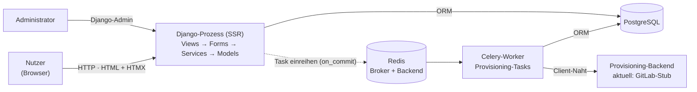
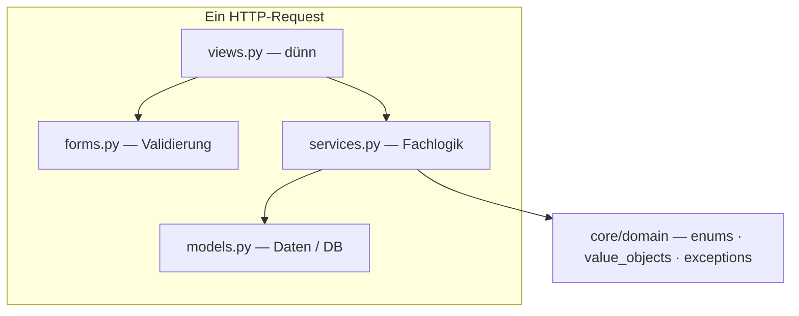

# 05 — Architektur

> **In diesem Kapitel:** Bisher ging es um die Fachdomäne — was eine Bestellung
> ist und welche Zustände sie durchläuft. Jetzt schauen wir uns an, **wie der
> Code selbst aufgebaut ist**: welche Schichten es gibt, welche der 10 Apps
> wofür zuständig ist, und welche Regel dafür sorgt, dass das Projekt nicht mit
> der Zeit zu einem unentwirrbaren Klumpen wird.
>
> **Das lernst du:**
> - Die Schichten Views → Forms/Services → Models und wer worauf zugreifen darf
> - Wofür die 10 Apps unter `apps/` jeweils da sind
> - Was `core/` ist und warum es nie von `apps/` importieren darf
> - Warum Services als Klassen mit statischen Methoden geschrieben sind
>
> **Voraussetzung:** [05 — Der Bestell-Lebenszyklus](05-bestell-lebenszyklus.md)
> (du solltest `transitions.py` und die Service-Namen aus der Übergangstabelle
> schon mal gesehen haben).

---

## Das große Ganze: die Bausteine im Überblick

Bevor es in Schichten und einzelne Apps geht, lohnt sich ein Schritt zurück:
Aus welchen **Bausteinen** besteht CMP überhaupt, und wie spielen sie
zusammen?



Der **Django-Prozess** rendert die Oberfläche serverseitig (SSR) und liefert
über HTMX punktuelle Updates, statt bei jeder Interaktion die ganze Seite neu
zu laden. **PostgreSQL** hält alle Daten — Bestellungen, Genehmigungen, Abos
usw. **Redis** dient als Broker *und* Result-Backend für **Celery**: Länger
laufende Provisioning-Tasks werden nicht im Request selbst abgearbeitet,
sondern eingereiht und von einem **Celery-Worker** im Hintergrund erledigt
(mehr dazu in [Kapitel 07](07-async-und-provisioning.md)). Das
**Provisioning-Backend** ist die Naht zum externen System — heute ein
GitLab-Stub, später ein echtes Backend. Der **Administrator** greift nicht
über eigene Views ein, sondern über den **Django-Admin**, der direkt gegen
dieselbe Datenbank arbeitet.

> 🔍 **Im Code nachsehen:** Dieses Diagramm zeigt die **logische**
> Architektur — welche Bausteine es gibt und wie sie fachlich
> zusammenhängen. Die **physische** Deployment-Topologie (nginx, gunicorn,
> systemd-Units, wie die Prozesse tatsächlich auf einem Server verteilt sind)
> ist ein eigenes Thema und steht in
> [12 — Wie es in Produktion läuft](12-wie-es-in-produktion-laeuft.md).

---

## Thin Views — die Grundregel

CMP folgt einem einzigen Leitprinzip, das an vielen Stellen im Projekt
wieder auftaucht: **Thin Views.** Eine View soll so wenig Fachlogik wie
möglich enthalten. Sie nimmt den Request entgegen, lässt validieren,
delegiert an einen Service und rendert das Ergebnis. Mehr nicht.

```
views.py → services.py → models.py
views.py → forms.py (Validierung)
```

- **`views.py`** ist dünn. Sie prüft nicht selbst, ob z. B. eine Bestellung
  genehmigt werden darf — das übernimmt ein Service.
- **`forms.py`** validiert Eingaben. Rohes `request.POST` wird nirgends direkt
  an einen Service oder ein Model durchgereicht.
- **`services.py`** enthält die eigentliche Fachlogik und ist die einzige
  Stelle, die auf Models schreibend zugreift.
- **`models.py`** hält nur Daten und Datenbankstruktur — keine
  Geschäftsregeln.

💡 **Merke:** Wenn du beim Schreiben einer View merkst, dass du eine
`if`-Kette mit Fachlogik baust ("wenn Status X und Rolle Y, dann..."), gehört
das vermutlich in einen Service, nicht in die View.

---

## Der gemeinsame Kern: `core/`

Neben den 10 Fach-Apps gibt es `cmp/core/` — geteilte Bausteine, die von
mehreren Apps gebraucht werden, aber selbst zu keiner einzelnen Fach-App
gehören:

| Bereich | Inhalt |
|---------|--------|
| `core/domain/enums.py` | Enums wie `OrderStatus`, Rollen etc. |
| `core/domain/value_objects.py` | Value Objects, u. a. `StatusMachine` mit der `TRANSITIONS`-Tabelle |
| `core/domain/validators.py` | Wiederverwendbare Validierungslogik |
| `core/exceptions.py` | Fehlerhierarchie: `ServiceError` als Basis, davon abgeleitet `ValidationError`, `NotFoundError`, `ConflictError`, `ForbiddenError` |
| `core/mixins.py` | Gemeinsame Mixins (z. B. für Views oder Models) |
| `core/context_processors.py` | Werte, die in **jedem** Template verfügbar sind, u. a. `badge_counts` (Zähler für Benachrichtigungen, offene Genehmigungen, offene Bestellungen) |
| `core/templatetags/` | Eigene Template-Tags |

`core/` ist bewusst fachlich neutral gehalten — es kennt Enums, Fehlerklassen
und Hilfsfunktionen, aber keine einzelne Fach-App im Detail.

---

## Wie die Schichten zusammenspielen



Die View ruft Forms zur Validierung und Services für die Fachlogik auf.
Die Services greifen auf Models zu und nutzen dabei die gemeinsamen Bausteine
aus `core/domain` — etwa die `StatusMachine` oder eine der `ServiceError`-
Exceptions.

> ⚠️ **Achtung:** Die Abhängigkeit läuft **nur in eine Richtung**:
> `apps/ → core/` ist erlaubt, **`core/ → apps/` ist verboten**. `core/` darf
> also niemals etwas aus einer Fach-App importieren. Ein gutes Beispiel dafür,
> was das in der Praxis bedeutet, ist `cmp/apps/orders/transitions.py` — die
> zentrale Funktion für Statuswechsel wohnt bewusst in `apps/orders/` und
> **nicht** in `core/domain/`, weil sie `AuditService` aus `apps/audit/`
> aufruft. Würde sie in `core/` liegen, hätte `core/` eine Abhängigkeit auf
> `apps/` — und genau das ist die Regel, die nie gebrochen werden darf.

---

## Die vollständige Abhängigkeitsmatrix

Die Regel `core/ → apps/` ist nur eine von mehreren festen Import-Richtungen im
Projekt. Zusammengefasst:

| Von | Nach | Erlaubt? |
|-----|------|----------|
| `views.py` | `services.py` | ✓ |
| `views.py` | `models.py` (lesen) | ✓ |
| `views.py` | `models.py` (schreiben) | ✗ |
| `services.py` | `models.py` | ✓ |
| `core/` | `apps/` | ✗ |
| `core/domain/` | Django | ✗ (nur `TextChoices` erlaubt) |

Die ersten drei Zeilen kennst du schon aus der Thin-Views-Regel: Eine View darf
sich ein Model zum Anzeigen holen (z. B. `get_object()` in einer `DetailView`),
aber niemals selbst `.save()` oder `.objects.create()` aufrufen — das bleibt
Aufgabe der Services.

Die letzte Zeile ist neu und etwas subtiler: `core/domain/` (also
`enums.py`, `value_objects.py`, `validators.py`) darf so gut wie nichts aus
Django importieren. Die einzige Ausnahme ist `models.TextChoices` — die
Basisklasse, von der `OrderStatus` und `UserRole` erben. Schau dir den
Kopfkommentar von `core/domain/enums.py` an: *„Domain enums — no Django
dependencies except TextChoices."* Und `core/domain/validators.py` kommt sogar
komplett ohne Django-Import aus.

Der Grund ist derselbe wie bei der `core/ ⇏ apps/`-Regel, nur eine Ebene
tiefer: Der fachliche Kern (`core/domain/`) soll sich isoliert testen lassen —
ohne Datenbank, ohne Request-Zyklus, ohne Django-Testrunner. Ein
`StatusMachine.validate_transition(...)`-Aufruf lässt sich so mit einem
einfachen `pytest`-Test prüfen, der nichts weiter braucht als die beiden
Status-Werte. Je mehr Django-Abhängigkeiten sich in `core/domain/` einschleichen
würden, desto mehr würde dieser Vorteil verloren gehen.

---

## Die 10 Fach-Apps

Jede Fach-App unter `cmp/apps/` hat eine klar abgegrenzte Zuständigkeit:

| App | Zweck |
|-----|-------|
| `accounts` | Custom User-Model und Rollen (requester, approver, admin, superadmin) |
| `dashboard` | Startseite mit Statistiken — die Root-URL des Portals |
| `catalog` | Service-Katalog, aus dem bestellt werden kann |
| `orders` | Die Bestellkette inkl. `transitions.py` (Statusmaschine, siehe [Kapitel 05](05-bestell-lebenszyklus.md)) |
| `cmdb` | Verfügbarkeits- und Kontextregeln, Mandantenzuordnung — hat keine eigenen Views |
| `provisioning` | Asynchrone Bereitstellung über Celery — hat ebenfalls keine eigenen Views |
| `approvals` | Genehmigungen für Bestellungen |
| `audit` | Das Audit-Log (siehe `AuditService` aus Kapitel 05) |
| `notifications` | In-App-Benachrichtigungen |
| `subscriptions` | Abos, die aus abgeschlossenen Bestellungen entstehen |

🔍 Zwei Apps fallen aus dem Muster: `cmdb` und `provisioning` haben **keine
Views** — sie liefern reine Fachlogik bzw. laufen im Hintergrund und werden
von anderen Apps über ihre Services angesprochen.

---

## Services als Klassen mit statischen Methoden

Alle zehn Services im Projekt — `OrderService`, `ApprovalService`,
`ProvisioningService`, `CatalogService`, `AccountService`,
`NotificationService`, `AuditService`, `SubscriptionService`,
`DashboardService` und `ContextService` (aus der `cmdb`-App) — folgen demselben
Muster: eine Klasse ohne eigenen Zustand, deren Methoden statisch (bzw. als
`@staticmethod`) definiert sind.

```python
class OrderService:
    @staticmethod
    def submit_order(order, actor):
        ...
```

Es wird also nirgends `OrderService()` instanziiert — die Klasse dient nur
als **Namensraum**, der zusammengehörige Fachlogik bündelt.

💡 **Merke — das `_for_user`-Muster:** Mehrere Services bieten pro Ressource
**zwei** Getter an: eine ungeprüfte Variante (z. B. `OrderService.get_order()`)
und eine view-sichere Variante (`OrderService.get_order_for_user()`), die
zusätzlich prüft, ob der übergebene `user` die Ressource überhaupt sehen darf
— fremde Bestellungen bleiben für `requester`-Rollen genauso unsichtbar wie
nicht existierende. Views rufen grundsätzlich die `_for_user`-Variante auf.
Das ist ein weiteres Beispiel dafür, dass Sicherheit in den Service-Layer
gehört, nicht in die View — Details dazu findest du in
[Kapitel 04](04-rollen-und-rechte.md).

---

## Einstellungen: `config/settings/`

Die Django-Settings sind pro Umgebung aufgeteilt, alle unter
`cmp/config/settings/`:

| Datei | Zweck |
|-------|-------|
| `base.py` | Gemeinsame Basis-Einstellungen für alle Umgebungen |
| `development.py` | Lokale Entwicklung |
| `testing.py` | Einstellungen für Testläufe (u. a. `CELERY_TASK_ALWAYS_EAGER`) |
| `production.py` | Produktivbetrieb |

Da `cmp/` die Import-Wurzel des Projekts ist, heißen die vollen Pfade
entsprechend `config.settings.*`, `apps.*` und `core.*` — kein zusätzliches
Präfix, kein verschachteltes Projektverzeichnis.

---

## Vertiefung für Entwickler

<details>
<summary><b>Warum die Abhängigkeitsregel core/ ⇏ apps/</b></summary>

Die Regel `apps/ → core/`, niemals umgekehrt, ist kein Stilanliegen, sondern
verhindert ein ganz konkretes technisches Problem: **Importzyklen.** Würde
`core/` etwas aus `apps/` importieren, während `apps/` gleichzeitig `core/`
importiert (was praktisch überall passiert, z. B. für `ServiceError` oder
`OrderStatus`), entstünde ein Kreis, den Python beim Modul-Import nicht mehr
auflösen kann.

Das Beispiel aus `cmp/apps/orders/transitions.py` macht das greifbar. Die
Datei validiert Übergänge, setzt `order.status` und schreibt einen
Audit-Log-Eintrag — das Loggen übernimmt `AuditService` aus `apps/audit/`.
Läge `transition()` in `core/domain/`, müsste `core/` auf `apps/audit/`
zeigen. Gleichzeitig braucht so gut wie jede App etwas aus `core/domain/`
(Enums, die `StatusMachine`, die Exception-Hierarchie) — der Zyklus wäre
programmiert.

Die Lösung: `transition()` wohnt in `apps/orders/`, obwohl sie inhaltlich wie
ein Stück "Kern-Logik" wirkt. Sie darf das, weil `apps/ → apps/` (zwischen
Fach-Apps) und `apps/ → core/` erlaubt sind — nur nicht der Weg zurück.
`core/` bleibt dadurch komplett frei von Wissen über einzelne Fach-Apps: Es
kennt Enums, Value Objects und Fehlerklassen, aber nie ein konkretes Model
oder einen konkreten Service aus `apps/`. Das hält `core/` unabhängig
testbar und macht es sicher, `core/` überall zu importieren, ohne sich um
Zyklen sorgen zu müssen.

</details>

<details>
<summary><b>Services als statische Methoden — Konsequenzen</b></summary>

Dass Services keine Instanzen sind, sondern reine Methoden-Namensräume, hat
mehrere praktische Folgen:

- **Kein versteckter Zustand.** Ein Service kann zwischen zwei Aufrufen
  nichts "vergessen" oder "sich merken" — jeder Aufruf bekommt alles, was er
  braucht, explizit als Argument (`order`, `actor`, `details`). Das macht das
  Verhalten vorhersagbar, unabhängig davon, in welcher Reihenfolge Methoden
  aufgerufen werden.
- **Testbarkeit.** Da nichts instanziiert werden muss, lässt sich eine
  Service-Methode direkt mit passenden Objekten (z. B. via `factory_boy`
  erzeugten Models) aufrufen — kein Setup einer Service-Instanz, keine
  Mock-Konstruktoren.
- **Services rufen einander direkt auf.** Wie in `transitions.py` zu sehen
  (`AuditService.log(...)`), ruft ein Service einen anderen einfach über
  dessen Klassenname und Methode auf — es gibt keine Dependency-Injection
  oder Registry dazwischen. Das hält den Aufrufweg nachvollziehbar: Ein Blick
  in die Methode zeigt exakt, welche anderen Services beteiligt sind.

Der Preis dieser Einfachheit: Da es keine Instanzen gibt, lässt sich ein
Service nicht "konfigurieren" (z. B. mit unterschiedlichen Abhängigkeiten pro
Umgebung) — jede Variation muss über Parameter oder Settings laufen, nicht
über Konstruktor-Argumente.

</details>

<details>
<summary><b>Die Exception-Hierarchie und ihre HTTP-Semantik</b></summary>

Alle vier fachlichen Exceptions aus `cmp/core/exceptions.py` erben von einer
gemeinsamen Basis, `ServiceError` (`message` + optionale `details`-Liste). Jede
der vier steht semantisch für einen bekannten HTTP-Status:

| Exception | HTTP-Semantik | Situation |
|-----------|----------------|-----------|
| `ValidationError` | 400 (Bad Request) | Eingabedaten sind ungültig |
| `NotFoundError` | 404 (Not Found) | Ressource existiert nicht (oder ist für den Nutzer nicht sichtbar) |
| `ConflictError` | 409 (Conflict) | Operation passt nicht zum aktuellen Zustand |
| `ForbiddenError` | 403 (Forbidden) | Nutzer hat nicht die nötige Rolle/Berechtigung |

⚠️ **Wichtig für CMP:** Das Portal ist kein API-Projekt — es gibt keine
zentrale Stelle, die diese Exceptions automatisch in echte HTTP-Statuscodes
übersetzt. Tatsächlich umgesetzt ist nur der `NotFoundError`-Fall: An mehreren
`get_object()`-Stellen (z. B. `OrderDetailView`, `SubscriptionDetailView`)
fängt die View `NotFoundError` ab und wirft `Http404` — der Browser bekommt
also wirklich einen 404. Die anderen drei Exceptions werden dagegen in den
Views abgefangen und per `messages.error(request, e.message)` +
`redirect(...)` in eine normale Fehlermeldung auf der nächsten Seite verwandelt
(siehe z. B. `apps/orders/views.py`, `apps/approvals/views.py`). Der Browser
sieht dabei technisch eine 302-Weiterleitung und danach eine 200-Seite mit
Flash-Message — keinen 400- oder 409-Statuscode. Die Tabelle oben beschreibt
also die *Bedeutung* der Exceptions, nicht (bis auf `NotFoundError`) einen
tatsächlich ausgelieferten Statuscode.

</details>

---

## 🔍 Im Code nachsehen

| Was | Wo |
|-----|-----|
| Die geteilten Bausteine (Enums, Value Objects, Exceptions) | `cmp/core/domain/`, `cmp/core/exceptions.py` |
| Das Beispiel für die Abhängigkeitsregel | `cmp/apps/orders/transitions.py` (lies den Kopfkommentar) |
| Die 10 Fach-Apps | `cmp/apps/` |
| Die Settings-Aufteilung | `cmp/config/settings/base.py`, `development.py`, `testing.py`, `production.py` |
| Ein Beispiel für einen Service mit statischen Methoden | `cmp/apps/orders/services.py` (`OrderService`) |

Öffne `cmp/core/context_processors.py` und schau dir `badge_counts()` an —
sie zeigt beispielhaft, wie `core/` Werte aus mehreren Apps (`notifications`,
`approvals`, `orders`) zusammenführt, ohne selbst zu einer dieser Apps zu
gehören.

---

## Selbstcheck

Bevor du weiterliest, kannst du diese Fragen beantworten?

1. In welcher Reihenfolge ruft eine View typischerweise Forms und Services auf?
2. Warum liegt `transition()` in `apps/orders/` und nicht in `core/domain/`?
3. Welche zwei Apps haben keine eigenen Views — und warum?
4. Was bedeutet es, dass ein Service "statische Methoden" hat?

<details>
<summary>Antworten anzeigen</summary>

1. Die View lässt zuerst über ein Form validieren und delegiert dann an
   einen Service, der die Fachlogik ausführt.
2. Weil `transition()` `AuditService` aus `apps/audit/` aufruft — und
   `core/` niemals von `apps/` importieren darf.
3. `cmdb` und `provisioning` — sie liefern reine Fachlogik bzw. laufen im
   Hintergrund (Celery) und werden über ihre Services von anderen Apps
   angesprochen.
4. Der Service wird nie instanziiert; seine Methoden werden direkt über die
   Klasse aufgerufen und halten zwischen Aufrufen keinen eigenen Zustand.

</details>

---

⟵ [05 — Der Bestell-Lebenszyklus](05-bestell-lebenszyklus.md) · [📖 Übersicht](README.md) · [07 — Async & Provisioning](07-async-und-provisioning.md) ⟶
