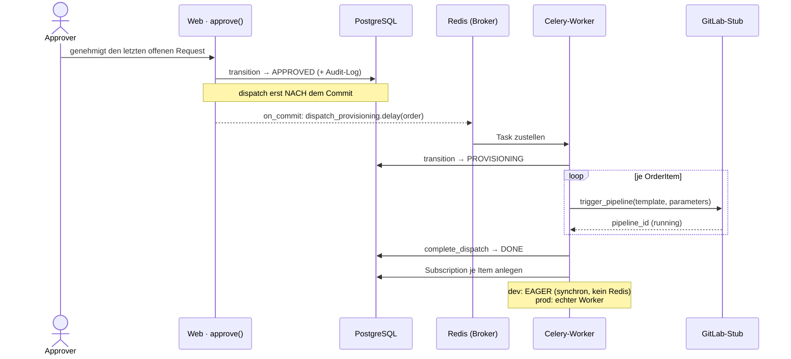

# 06 — Async & Provisioning

> **In diesem Kapitel:** Sobald eine Bestellung genehmigt ist, muss sie *bereitgestellt*
> werden — und das dauert. Niemand soll dafür im Browser warten. Dieses Kapitel zeigt dir,
> wie CMP diese Arbeit in den Hintergrund auslagert, mit **Celery**.
>
> **Das lernst du:**
> - Warum `dispatch_provisioning` als Celery-Task läuft und nicht direkt im View
> - Was `transaction.on_commit` bedeutet — und warum das kein Zufall ist
> - Wie der (aktuell simulierte) Provisioning-Ablauf Schritt für Schritt abläuft
> - Was hier **noch nicht** existiert — und was nur geplant ist
>
> **Voraussetzung:** [06 — Architektur](06-architektur.md)

---

## Warum überhaupt asynchron?

Stell dir vor, Ben klickt im Portal auf „Genehmigen". Wenn das Portal jetzt *synchron*
warten würde, bis die komplette VM bereitgestellt ist, säße Ben minutenlang vor einer
lädenden Seite — und im schlimmsten Fall würde der Browser-Request einfach abbrechen.

Deshalb trennt CMP zwei Dinge, die zeitlich völlig unterschiedlich sind:

- **Die Entscheidung** („genehmigt") — das ist in Millisekunden erledigt.
- **Die Bereitstellung** — das kann dauern, hängt von externen Systemen ab und soll
  nicht den Web-Request blockieren.

Für den zweiten Teil gibt es **Celery**: einen Hintergrund-Worker, der Aufgaben
("Tasks") aus einer Warteschlange abarbeitet, während der Web-Prozess längst wieder
frei ist für die nächste Anfrage.

💡 **Merke:** Der View gibt sofort eine Antwort zurück. Die eigentliche Arbeit passiert
*danach*, in einem separaten Prozess.

In Produktion kommt noch ein zweiter Puffer dazu: **nginx** steht vor Gunicorn und nimmt
eingehende Verbindungen entgegen, bevor sie an einen der wenigen synchronen
Gunicorn-Worker weitergereicht werden. Würde ein View minutenlang auf eine externe
Pipeline warten, wäre genau dieser Worker die ganze Zeit blockiert — bei nur einer
Handvoll Worker-Prozessen reicht das, um das ganze Portal für alle anderen Nutzer
lahmzulegen. Deshalb legt der Service die Aufgabe stattdessen in Redis ab, der View
antwortet sofort, und der Celery-Worker erledigt die eigentliche Arbeit im Hintergrund.

⚠️ **Achtung:** In CMP läuft **alles** Asynchrone über Celery. Es gibt (noch) **keine**
WebSockets — Django Channels ist zwar im Architektur-Vokabular des Projekts erwähnt und
für später geplant (Arbeitspaket AP-12), aber es existieren keine `consumers.py`, keine
`routing.py` und `channels` steht in keiner `requirements`-Datei. Wenn du im Portal siehst,
dass sich etwas „live" aktualisiert, ist das HTMX-Polling oder ein Reload — keine Push-Verbindung.
Das ist kein übersehener Punkt und kein neuer Befund dieses Kapitels: Die
Channels-Anbindung ist als eigenes, bekanntes Arbeitspaket (AP-12) bereits eingeplant und
bewusst noch offen — nicht vergessen.

---

## Der Ablauf im Überblick



Zwei Prozesse (Web und Worker), verbunden über eine Warteschlange (Redis). Der Web-Prozess
*plant* die Arbeit ein, der Worker *erledigt* sie — komplett getrennt voneinander.

---

## Schritt für Schritt: Von „genehmigt" bis „done"

### 1. Der letzte Approver stimmt zu

In `ApprovalService.approve()` ([`cmp/apps/approvals/services.py`](../../cmp/apps/approvals/services.py))
prüft der Code nach jeder Zustimmung, ob **alle** `ApprovalRequest`s einer Bestellung
entschieden sind (kein `pending`, kein `rejected` mehr). Ist das der Fall:

```python
transition(order, OrderStatus.APPROVED, approver)
transaction.on_commit(
    lambda: dispatch_provisioning.delay(order.pk)
)
```

Zwei Zeilen, aber die Reihenfolge ist entscheidend — dazu gleich mehr.

### 2. `transaction.on_commit` — warum erst NACH dem Commit?

Django-Views laufen typischerweise in einer Datenbank-Transaktion. Würdest du den Task
*direkt* mit `.delay()` starten (also noch *innerhalb* der Transaktion), könnte Folgendes
passieren:

1. Web-Prozess plant den Task ein → Celery liefert ihn **sofort** an einen freien Worker.
2. Der Worker fragt in der Datenbank nach der Bestellung — doch die Transaktion des
   Web-Prozesses ist noch gar nicht committet. Der Worker sieht entweder den **alten**
   Status (`PENDING_APPROVAL` statt `APPROVED`) oder — je nach Isolation Level —
   überhaupt keine Zeile.

`transaction.on_commit(...)` registriert die Funktion so, dass Django sie erst ausführt,
**nachdem** die Transaktion erfolgreich committet wurde. Der Worker sieht garantiert den
Stand, den `approve()` gerade geschrieben hat.

💡 **Merke:** `on_commit` ist kein Extra-Feature, sondern die einzig korrekte Art, aus
einer Transaktion heraus einen Task zu starten, der auf die soeben geschriebenen Daten
zugreift.

### 3. Der Task landet beim Worker

`dispatch_provisioning.delay(order.pk)` schreibt eine Nachricht in die Warteschlange —
in CMP übernimmt **Redis** dafür gleich zwei Rollen, beide über dieselbe URL
`redis://localhost:6379/0` (siehe [`cmp/config/settings/base.py`](../../cmp/config/settings/base.py):
`CELERY_BROKER_URL` und `CELERY_RESULT_BACKEND`):

- **Broker** — die Warteschlange selbst. Hier landet die Aufgabenstellung (welcher Task,
  mit welchen Argumenten), bis ein freier Worker sie abholt.
- **Result-Backend** — die Ablage für das Ergebnis. Hier hinterlegt der Worker, was der
  Task zurückgegeben hat oder ob er fehlgeschlagen ist.

Ein oder mehrere Celery-Worker-Prozesse hören auf diese Warteschlange und holen sich den
nächsten Task, sobald sie frei sind.

### 4. `dispatch_order()` — die Bestellung geht in Bereitstellung

Der Task ([`cmp/apps/provisioning/tasks.py`](../../cmp/apps/provisioning/tasks.py))
ruft `ProvisioningService.dispatch_order(order_id)` auf
([`cmp/apps/provisioning/services.py`](../../cmp/apps/provisioning/services.py)):

- Erst ein **Guard**: Ist die Order wirklich noch `APPROVED`? Wenn nicht → `ConflictError`.
- Dann `transition(order, PROVISIONING, None)` — beachte: `actor=None`, weil hier kein
  Mensch handelt, sondern das System selbst.
- Für **jedes** `OrderItem` ruft der Service `GitLabStubClient.trigger_pipeline(...)`
  auf und legt dafür einen `DispatchLog` mit Status `running` an.

### 5. Die Pipeline — aktuell ein Stub

`GitLabStubClient` ([`cmp/apps/provisioning/clients.py`](../../cmp/apps/provisioning/clients.py))
simuliert eine GitLab-CI-Pipeline **komplett in-memory** — es gibt (noch) keine echte
Anbindung an ein GitLab und kein Polling auf einen echten Pipeline-Status. Das ist
bewusst als Platzhalter gebaut, damit der restliche Ablauf (Order-Status, Benachrichtigungen,
Abos) schon vollständig getestet werden kann, ohne eine externe CI zu brauchen.

Die Stub-API im Überblick — drei Methoden, alle arbeiten nur gegen ein internes Dict
(`self._pipelines`), ganz ohne Redis oder Netzwerk-Aufruf:

| Methode | Rückgabe |
|---|---|
| `trigger_pipeline(template_name, parameters)` | `{"pipeline_id": ..., "status": "running"}` — legt den Eintrag neu im internen Dict an |
| `get_pipeline_status(pipeline_id)` | Der aktuelle Status-String, oder `None`, falls die ID unbekannt ist |
| `complete_pipeline(pipeline_id, success=True)` | Setzt den Status auf `"success"` oder `"failed"` (kein Rückgabewert) |

Weil alles In-Memory im selben Prozess passiert, braucht der Stub auch im EAGER-Modus
(dev/test, siehe Abschnitt 7) keinen laufenden Redis.

⚠️ **Achtung:** Weil es ein Stub ist, „gelingt" im aktuellen Code-Stand **jede** Pipeline
sofort. `dispatch_provisioning` (der Task, nicht der Service!) ruft direkt im Anschluss an
`dispatch_order()` für **alle** offenen `DispatchLog`s `complete_dispatch(..., success=True)`
auf — im selben Task-Lauf. Echtes Polling auf einen laufenden Pipeline-Status ist als
Arbeitspaket AP-20 vorgesehen.

### 6. `complete_dispatch()` — Ergebnis eintragen und aggregieren

`complete_dispatch(dispatch_log_id, success)` setzt den einzelnen `DispatchLog` auf
`success` oder `failed` und prüft danach das **Aggregat** über alle Logs derselben Order:

| Aggregat-Zustand | Ergebnis |
|---|---|
| Mindestens ein Log noch `running` | Nichts tun — es warten noch andere Items. |
| Mindestens ein Log `failed` (keiner mehr `running`) | Order → `FAILED`, Fehler-Notification. |
| Alle Logs `success` | Order → `DONE`, `SubscriptionService.create_from_order()`, Erfolgs-Notification. |

Erst wenn **alle** Items einer Bestellung fertig sind, bekommt die Order ihren finalen
Status — eine Bestellung mit drei VMs wartet also auf das langsamste Item.

### 7. dev/test vs. prod — EAGER

In [`cmp/config/settings/development.py`](../../cmp/config/settings/development.py) und
`testing.py` steht:

```python
CELERY_TASK_ALWAYS_EAGER = True
CELERY_TASK_EAGER_PROPAGATES = True
```

`EAGER` bedeutet: `.delay(...)` startet den Task **synchron, im selben Prozess**, ohne
Redis, ohne separaten Worker. Für dich als Entwickler heißt das: Lokal und in Tests
brauchst du keinen laufenden Redis- oder Celery-Prozess — `approve()` ruft in Wahrheit
den kompletten Ablauf bis `DONE`/`FAILED` direkt durch, bevor die Zeile
`transaction.on_commit(...)` überhaupt fertig ist.

In [`cmp/config/settings/production.py`](../../cmp/config/settings/production.py) ist
`CELERY_TASK_ALWAYS_EAGER = False` — dort läuft wirklich ein separater Worker-Prozess,
verbunden über Redis, so wie im Diagramm oben gezeichnet.

🔍 **Im Code nachsehen** (schon mal ein Vorgriff — Details unten): Genau dieser
Unterschied zwischen EAGER und echtem Worker ist der Grund, warum manche Probleme lokal
nie sichtbar werden.

---

## Vertiefung für Entwickler

Alles bis hier reicht, um den Ablauf zu *verstehen*. Wer an Provisioning oder Approvals
Code ändert, sollte zusätzlich wissen, wo die Nebenläufigkeit ehrlich betrachtet noch
Lücken hat. Die Punkte sind am Code (aktueller Stand) geprüft — die mit **⚑ Befund**
markierten sind echte offene Stellen, keine erfundenen Beispiele.

<details>
<summary><b>Idempotenz — Celery liefert „at least once" ⚑ Befund</b></summary>

Celery garantiert *at least once*: Ein Task kann für dieselbe Nachricht **mehrfach**
ausgeliefert werden (Redelivery nach Worker-Neustart, Timeout, Netzwerkproblem …).
`complete_dispatch()` ([`cmp/apps/provisioning/services.py`](../../cmp/apps/provisioning/services.py))
hat **keinen** Idempotenz-Guard — die Methode setzt `log.status` unbedingt und prüft
danach das Aggregat, egal ob sie zum ersten oder zweiten Mal für diesen Log läuft.

Ist die Order beim zweiten Durchlauf schon terminal (`done` oder `failed`), wirft der
erneute `transition(...)`-Aufruf einen `ValueError` (ein Übergang wie `DONE → DONE` ist
laut Zustandsdiagramm aus [Kapitel 05](05-bestell-lebenszyklus.md) nicht erlaubt).
Zusätzlich könnte `SubscriptionService.create_from_order()` ein **zweites** Abo für
dieselbe Order anlegen, falls die Methode selbst nicht idempotent ist. Dieser Guard geht
dabei über das eigentliche Ziel von AP-20 hinaus — AP-20 bringt einen echten Client mit
echtem Polling, die Idempotenz-Absicherung selbst müsste zusätzlich und unabhängig davon
ergänzt werden.

**Kontrast:** `dispatch_order()` macht es an dieser Stelle richtig — es hat einen
Status-Guard am Anfang:

```python
if order.status != OrderStatus.APPROVED:
    raise ConflictError(f"Cannot dispatch order in status '{order.status}'.")
```

`complete_dispatch()` bräuchte einen vergleichbaren Früh-Ausstieg, wenn der betroffene
`DispatchLog` bereits terminal ist. Im aktuellen Stub-Betrieb (alles läuft synchron durch,
ein Redelivery-Fall ist praktisch ausgeschlossen) bleibt das unsichtbar — sobald AP-20
echtes Polling gegen ein reales Backend einführt, wird es relevant.
</details>

<details>
<summary><b>EAGER verdeckt die Realität</b></summary>

Weil `CELERY_TASK_ALWAYS_EAGER = True` in `development.py` und `testing.py` gesetzt ist,
läuft `dispatch_provisioning` lokal und in jedem Test **synchron im selben Prozess** —
noch bevor die Zeile nach `transaction.on_commit(...)` erreicht ist. Genau dadurch siehst
du lokal **nie**, was in Produktion passieren kann:

- Zwei Worker, die denselben Task gleichzeitig verarbeiten (echte Nebenläufigkeit).
- Verzögerungen zwischen `on_commit` und Task-Start, in denen sich der Datenbestand
  weiter ändert.
- Redelivery-Situationen, die den Idempotenz-Punkt oben erst zum Problem machen.

Ein Test, der grün ist, weil er im EAGER-Modus lief, beweist also nicht, dass derselbe
Code mit einem echten Worker unter Last genauso sauber funktioniert. Das ist kein Fehler
im Projekt, sondern eine bewusste Abwägung (schnelle, deterministische Tests) — du solltest
sie nur kennen, bevor du daraus „läuft ja lokal" ableitest.
</details>

<details>
<summary><b>on_commit ist korrekt</b></summary>

Ein kurzer positiver Punkt, damit die Vertiefung nicht nur aus offenen Stellen besteht:
Das Muster in `ApprovalService.approve()` — erst `transition(...)`, **dann**
`transaction.on_commit(lambda: dispatch_provisioning.delay(order.pk))` — ist genau
richtig gelöst. Der Task wird garantiert erst geplant, wenn die Datenbank-Transaktion
erfolgreich durch ist. Ein Worker, der den Task abholt, sieht also niemals einen
halb geschriebenen Zustand. Das ist ein Standardmuster für „Task nach DB-Änderung
auslösen" in Django+Celery-Projekten, und CMP wendet es sauber an.
</details>

---

## 🔍 Im Code nachsehen

| Was | Wo |
|-----|-----|
| Celery-App-Definition (Broker, Backend, Autodiscover) | `cmp/config/celery.py` |
| Die beiden Provisioning-Tasks | `cmp/apps/provisioning/tasks.py` |
| Dispatch- und Complete-Logik | `cmp/apps/provisioning/services.py` |
| Der simulierte GitLab-Client | `cmp/apps/provisioning/clients.py` |
| `on_commit` + `.delay()` beim Genehmigen | `cmp/apps/approvals/services.py` (`approve()`) |
| EAGER-Konfiguration für dev/test | `cmp/config/settings/development.py`, `cmp/config/settings/testing.py` |
| Echter Worker-Betrieb (kein EAGER) | `cmp/config/settings/production.py` |

Starte einen Task lokal per Debugger oder `print()` in `dispatch_order()` — weil EAGER
aktiv ist, siehst du den kompletten Ablauf synchron in deinem eigenen Request-Log,
ganz ohne separaten Worker-Prozess starten zu müssen.

---

## Selbstcheck

Bevor du weiterliest, kannst du diese Fragen beantworten?

1. Warum wird `dispatch_provisioning.delay(order.pk)` in `transaction.on_commit(...)`
   eingepackt, statt direkt aufgerufen zu werden?
2. Was macht `CELERY_TASK_ALWAYS_EAGER = True` konkret anders, und wo ist es gesetzt?
3. Ist Django Channels in CMP bereits im Einsatz? Wenn nein — wofür ist Async dann
   ausschließlich zuständig?

<details>
<summary>Antworten anzeigen</summary>

1. Damit der Celery-Worker erst dann auf die Bestellung zugreift, wenn die
   Datenbank-Transaktion des Web-Prozesses wirklich committet ist. Sonst könnte der
   Worker einen veralteten oder gar nicht sichtbaren Zustand lesen.
2. Der Task läuft synchron im selben Prozess statt über Redis an einen separaten
   Worker — kein Redis, kein Worker-Prozess nötig. Gesetzt in
   `cmp/config/settings/development.py` und `cmp/config/settings/testing.py`.
3. Nein — es gibt keine `consumers.py`/`routing.py`, und `channels` ist in keiner
   Requirements-Datei. Channels ist nur geplant (AP-12). Aller asynchroner Ablauf in
   CMP läuft ausschließlich über Celery.
</details>

---

⟵ [06 — Architektur](06-architektur.md) · [📖 Übersicht](README.md) · [08 — Frontend: HTMX & DaisyUI](08-frontend-htmx-daisyui.md) ⟶
