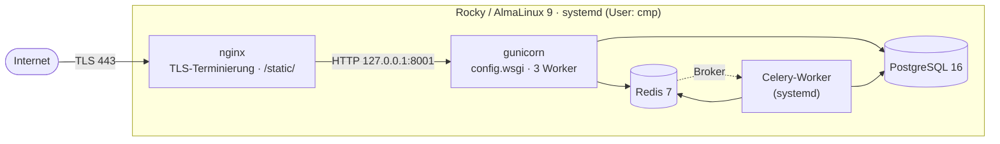
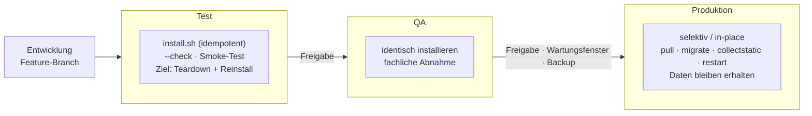

# 11 — Wie es in Produktion läuft

> **In diesem Kapitel:** Bisher hast du CMP lokal laufen lassen — `manage.py
> runserver`, eine lokale PostgreSQL, alles auf einer Maschine. In
> Produktion sieht das anders aus: mehrere Prozesse, ein Reverse-Proxy, strikte
> Sicherheits-Regeln. Dieses Kapitel zeigt dir das Zielbild.
>
> **Das lernst du:**
> - Welche Prozesse in Produktion laufen und wie sie zusammenspielen
> - Warum es `config.settings.production` gibt und was dort anders ist als lokal
> - Welche Umgebungsvariablen zwingend gesetzt sein müssen — und warum ein
>   Fehlstart hier gewollt ist
> - Wie ein Update im laufenden Betrieb abläuft
>
> **Voraussetzung:** [11 — Dein erster Beitrag](11-dein-erster-beitrag.md)

---

## Warum das überhaupt wissen?

Du wirst den Produktions-Server wahrscheinlich nicht selbst aufsetzen. Aber
du solltest verstehen, **wohin** dein Code am Ende läuft — sonst bleiben
Begriffe wie „DEBUG darf nicht an sein" oder „das läuft hinter nginx"
abstrakte Warnungen ohne Bild dahinter. Dieses Kapitel gibt dir das Bild.

💡 **Merke:** CMP läuft **nicht** in Containern. Es gibt (Stand heute) kein
Docker-Setup und keine GitHub-Actions-Pipeline — die Installation erfolgt
**nativ** auf einer Linux-VM, gesteuert über systemd. Ein Container-Setup ist
für später vorgesehen (Arbeitspaket AP-11), aber noch nicht gebaut.

Das ist keine Verlegenheitslösung, sondern eine bewusste Entscheidung —
festgehalten in [ADR-0001](../../cmp-docs/docs/decisions/0001-deployment-native-vs-container.md).
Kurz zusammengefasst: CMP zielt auf **eine einzelne, oft air-gapped VM**.
Dockers eigentliche Stärken — Skalierung, Multi-Host-Orchestrierung,
Dev-Prod-Parität über viele Umgebungen hinweg — greifen dort kaum, während
der native Pfad (`deploy/install.sh` + Offline-Wheelhouse) bereits fertig
gebaut ist und air-gapped funktioniert. Container würden sich erst lohnen,
wenn mindestens eines zutrifft:

- mehrere Umgebungen/Hosts (Dev/Test/Prod oder mehrere Kunden),
- der Wunsch nach unveränderlichen Artefakten, 1-Klick-Rollback und
  Dev-Prod-Parität,
- die Ziel-VM erlaubt eine Container-Engine und ist nicht streng air-gapped.

Und falls doch containerisiert wird: **Podman + Quadlets**, nicht Docker-CE.
AlmaLinux/Rocky liefern Podman (daemonless, rootless, systemd-integriert) als
RHEL-native Wahl — Docker-CE würde gegen dieses OS-Modell arbeiten.

---

## Die Topologie auf einen Blick



Alles läuft auf **einer** VM (Rocky Linux 9 oder AlmaLinux 9), als
**systemd-Units**, unter einem eigenen, unprivilegierten Service-User `cmp`
(ohne Login-Shell — niemand kann sich als `cmp` einloggen, nur Prozesse laufen
unter diesem Namen).

| Prozess | systemd-Unit | Aufgabe |
|---|---|---|
| nginx | (System-Paket) | TLS-Terminierung (Zertifikat + Key unter `/etc/pki/cmp/`), Reverse-Proxy, liefert `/static/` direkt aus `staticfiles/` |
| gunicorn | `cmp-web.service` | Startet `config.wsgi:application`, gebunden an `127.0.0.1:8001`, 3 Worker, Timeout 60 |
| Celery-Worker | `cmp-celery.service` | `celery -A config worker --concurrency=2`, verarbeitet Provisioning-Tasks aus Redis |
| PostgreSQL 16 | `postgresql-16.service` | Persistenz, nur auf `127.0.0.1` erreichbar |
| Redis 7 | `redis.service` | Celery-Broker & Result-Backend, nur auf `127.0.0.1` erreichbar |

🔍 **Im Code nachsehen:** Die Tabelle vereinfacht an einer Stelle: Welcher
PostgreSQL-Servicename tatsächlich läuft, ist **paketabhängig**, nicht fest
verdrahtet. Mit dem PGDG-Repo heißt die Unit `postgresql-16.service`, mit dem
AppStream-Modul von RHEL nur `postgresql.service`. `deploy/install.sh`
erkennt das zur Laufzeit (`cmp_pg_flavor()` in `deploy/lib.sh`) und trägt den
jeweils richtigen Namen als `Requires=` in die generierten
`cmp-web.service`/`cmp-celery.service` ein.

Diese beiden CMP-eigenen Units sind außerdem gehärtet: `NoNewPrivileges=true`,
`PrivateTmp=true`, `ProtectSystem=full` und `Restart=on-failure` (5 Sekunden
Wartezeit vor dem Neustart). Damit kann der Prozess z. B. keine neuen
Rechte erwerben und sieht nur ein eigenes, privates `/tmp`.

🔍 **Im Code nachsehen:** `config.wsgi` bringt das reine WSGI-Interface für
gunicorn. Es gibt zwar auch ein `config.asgi`, aber das wird **noch nicht**
genutzt — Django Channels (WebSockets, [Kapitel 07](07-async-und-provisioning.md)
erwähnt es) ist erst für AP-12 vorgesehen. In Produktion läuft heute reines
WSGI, kein uvicorn, kein daphne.

⚠️ **Achtung:** Es gibt **keinen** `celery-beat`-Prozess. CMP braucht (noch)
keinen zeitgesteuerten Scheduler — alle Celery-Tasks werden direkt aus dem
Code heraus ausgelöst (z. B. `dispatch_provisioning.delay(order.pk)`), nicht
periodisch.

---

## Warum gunicorn nicht direkt am Internet hängt

gunicorn bindet nur an `127.0.0.1:8001` — von außen unerreichbar. Davor sitzt
**nginx**, das drei Jobs übernimmt:

1. **TLS-Terminierung** — HTTPS kommt bei nginx an, die Verbindung zu
   gunicorn läuft unverschlüsselt über Loopback.
2. **Static Files** — `/static/` wird direkt aus `staticfiles/`
   (`collectstatic`-Ergebnis) ausgeliefert, ohne dass Django dafür überhaupt
   angefragt wird.
3. **Header-Weitergabe** — nginx setzt `X-Forwarded-Proto: https`, damit
   Django weiß, dass die ursprüngliche Verbindung sicher war (siehe nächster
   Abschnitt).

💡 **Merke:** Diese Aufteilung ist der Grund, warum du in Produktion nie
`ALLOWED_HOSTS` vergessen darfst — kommt eine Anfrage mit falschem Host-Header
bei gunicorn an, weist Django sie mit `DisallowedHost` ab, egal was nginx
davor tut.

---

## Die echte TLS-Story

> ⚠️ **Achtung:** Falls du woanders gelesen oder gehört hast, der Installer
> würde sich ein **self-signed Zertifikat** erzeugen — das stimmt nicht (mehr).
> `deploy/install.sh` macht bewusst **beides nicht**: kein self-signed
> Zertifikat und kein `certbot`/Let's-Encrypt-Aufruf. Stattdessen erwartet der
> Installer, dass ein Admin `cmp.crt` + `cmp.key` selbst unter
> `/etc/pki/cmp/` ablegt — woher das Zertifikat stammt (interne CA, gekauftes
> Zertifikat, …), ist Sache des Betriebs, nicht des Installers.

Der Installer prüft vor dem nginx-Schritt, ob unter `/etc/pki/cmp/cmp.crt`
ein Zertifikat liegt, das den FQDN als SAN führt (`cmp_cert_matches_fqdn()`
in `deploy/lib.sh`):

- **Passt das Zertifikat zum FQDN** → das Portal läuft über HTTPS, nginx
  terminiert TLS auf Port 443, Port 80 leitet dauerhaft dorthin um.
- **Fehlt ein passendes Zertifikat** → das Portal läuft über
  **unverschlüsseltes HTTP**. Port 443 wird dann gar nicht erst geöffnet (auch
  nicht in `firewalld`), nginx hört nur auf Port 80 und reicht direkt an
  gunicorn durch — ohne Redirect auf 443, denn ein Redirect ins Leere (ohne
  TLS-Zertifikat dahinter) wäre nur ein kaputter Login-Versuch.

💡 **Merke:** Das ist kein Fallback, den du „reparieren" musst, bevor überhaupt
etwas läuft — das Portal ist im HTTP-Modus voll funktionsfähig, nur eben ohne
Transportverschlüsselung. Für den Produktivbetrieb legst du das passende
Zertifikatspaar unter `/etc/pki/cmp/` ab und führst `install.sh` erneut aus
(idempotent) — danach läuft automatisch HTTPS.

---

## Die Settings: `config.settings.production`

Lokal läufst du mit `config.settings.development` (oder ähnlich) — in
Produktion mit `config.settings.production`. Der entscheidende Unterschied:
**alle sicherheitsrelevanten Werte kommen aus der Umgebung**, nicht aus dem
Code (via `django-environ`).

Drei Variablen sind **Pflicht**, ohne Default:

| Variable | Bedeutung |
|---|---|
| `SECRET_KEY` | Django-Signierschlüssel — zufällig erzeugt, nie der Beispielwert |
| `ALLOWED_HOSTS` | Kommagetrennte Liste erlaubter Hostnamen (z. B. `cmp.example.com`) |
| `DATABASE_URL` | PostgreSQL-Verbindung, Format `postgres://user:pw@host:5432/db` |

⚠️ **Achtung:** `ALLOWED_HOSTS` und `CSRF_TRUSTED_ORIGINS` landen beide in
`/etc/cmp/cmp.env`, sehen ähnlich aus — haben aber ein unterschiedliches
Format:

| Variable | Format | Beispiel |
|---|---|---|
| `ALLOWED_HOSTS` | **ohne** Schema | `cmp.internal.example.com` |
| `CSRF_TRUSTED_ORIGINS` | **mit** Schema (`https://` bzw. `http://`) | `https://cmp.internal.example.com` |

Fehlt eine der beiden, merkst du das auf unterschiedliche Art:

- Rufst du das Portal über die **IP-Adresse** statt über den FQDN auf, weist
  Django jede Anfrage mit `DisallowedHost` (HTTP 400) ab — das ist
  `ALLOWED_HOSTS` bei der Arbeit.
- Vergisst du dagegen die `CSRF_TRUSTED_ORIGINS`-Zeile, lädt die Seite ganz
  normal — aber **jedes** Formular, inklusive des Login-Formulars, scheitert
  beim Abschicken mit einem CSRF-Fehler. Das macht diesen Fehler tückisch: er
  zeigt sich erst beim Absenden, nicht schon beim Aufruf der Seite.

Dazu kommt eingebautes **Security-Hardening**, das in `production.py` fest
verankert ist:

| Einstellung | Wert | Zweck |
|---|---|---|
| `SECURE_SSL_REDIRECT` | `True` | HTTP wird auf HTTPS umgeleitet |
| `SECURE_HSTS_SECONDS` | `31536000` (1 Jahr) | Browser erzwingen künftig selbst HTTPS |
| `SESSION_COOKIE_SECURE` / `CSRF_COOKIE_SECURE` | `True` | Cookies nur über HTTPS |
| `SECURE_PROXY_SSL_HEADER` | `("HTTP_X_FORWARDED_PROTO", "https")` | Django vertraut nginx' Weiterleitungs-Header |
| `X_FRAME_OPTIONS` | `"DENY"` | Kein Einbetten der Seite in fremde `<iframe>`s |

Secrets landen nicht direkt in der Shell, sondern in einer Datei
`/etc/cmp/cmp.env` (Rechte `640`, nur `root` und Gruppe `cmp` lesbar), die
systemd über `EnvironmentFile=` an `cmp-web` und `cmp-celery` durchreicht.

> ⚠️ **Achtung:** `DEBUG=True` in Produktion ist **FATAL** — das darf **nie**
> passieren. Mit `DEBUG=True` zeigt Django bei jedem Fehler eine vollständige
> Stacktrace-Seite inklusive Ausschnitten aus deinen Settings (SECRET_KEY,
> Datenbank-Zugang, installierte Apps). Der Default in `production.py` ist
> `False` — das musst du aktiv falsch konfigurieren, um es zu brechen. Pflicht
> vor jedem Go-Live: `manage.py check --deploy` muss **ohne Warnungen**
> durchlaufen.

---

## Ein Update ausrollen

Es gibt keine automatisierte Pipeline (kein CI/CD, kein `.github/`-Workflow)
— ein Re-Deploy ist ein manueller, aber fest eingeübter Ablauf als
Service-User `cmp`:

```bash
git pull --ff-only
pip install -r requirements/production.txt
python manage.py migrate
python manage.py collectstatic --noinput
systemctl restart cmp-web cmp-celery
```

Der Reihe nach: Code holen, neue Abhängigkeiten installieren, Datenbank auf
den neuesten Stand bringen, Static Files neu einsammeln, dann **beide**
Prozesse neu starten — gunicorn und Celery-Worker, damit auch Task-Code neu
geladen wird. nginx selbst braucht bei reinem App-Update keinen Restart.

💡 **Merke:** `--ff-only` ist Absicht. Ein Merge-Commit soll auf dem
Produktions-Server nicht heimlich entstehen — Konflikte gehören ins normale
Git-Review, nicht in einen Deploy-Schritt.

🔍 **Zusatzweg für Offline-Umgebungen:** Hat die VM keinen Internetzugang, gibt
es einen Installer `deploy/install.sh`, der Pakete aus einer vorbereiteten
„Wheelhouse" installiert statt aus dem Internet nachzuladen. Das betrifft nur
die **Installation der App** — die Doku selbst liegt separat auf gh-pages und
hat mit dem Produktionsbetrieb der App nichts zu tun.

---

## Weitere Härtung der VM

Neben den Django-eigenen Security-Settings sichert die VM selbst zusätzlich ab:

- **SELinux** läuft *enforcing* (nicht nur *permissive*) — blockiert z. B.
  Zugriffe, die nicht explizit erlaubt sind.
- **firewalld** lässt nur 80, 443 und SSH durch — alles andere ist von außen
  unerreichbar.
- **PostgreSQL und Redis** binden nur an `127.0.0.1` — selbst wenn jemand
  einen offenen Port fände, kämen fremde Hosts nicht an die Datenbank oder den
  Broker heran.

⚠️ **Achtung — bewusst offen:** Nicht jede Härtung ist schon gebaut. Zwei
Lücken sind dem Projekt bekannt und stehen offen als Arbeitspakete, statt
totgeschwiegen zu werden:

- **Keine Content-Security-Policy, keine Bremse gegen Login-Brute-Force**
  (AP-19) — gegen `/accounts/login/` kann heute ein Bot beliebig oft ein
  Passwort durchprobieren, ohne dass CMP selbst eingreift.
- **Keine `LOGGING`-Konfiguration, kein einziger Logger-Aufruf im gesamten
  Projekt** (AP-14) — was in Produktion schiefgeht, siehst du aktuell nur über
  `journalctl -u cmp-web` (die Standardausgabe von gunicorn/Django) oder eine
  Django-Fehlerseite, falls `DEBUG` versehentlich an wäre — nicht über
  strukturierte, durchsuchbare Logs.

---

## Vertiefung für Entwickler

<details>
<summary><b>Warum DEBUG=True fatal ist &amp; das check --deploy-Gate</b></summary>

**Was `DEBUG=True` in Produktion preisgibt:** Wirft eine Anfrage einen
unbehandelten Fehler, zeigt Django standardmäßig eine ausführliche
Debug-Seite — nicht nur die Stacktrace, sondern auch die aktuellen
**Settings-Werte**, lokale Variablen jedes Frames, die SQL-Queries des
Requests und die installierten Middlewares/Apps. Für dich beim lokalen
Debuggen ist das Gold wert. Öffentlich erreichbar ist es ein offenes Scheunentor:
Angreifer sehen mit einem einzigen provozierten 500er potenziell
Datenbank-Zugangsdaten, den `SECRET_KEY`-Ausschnitt in der Traceback-Umgebung
und die interne Code-Struktur — genug, um gezielt weiterzugreifen.

**Wie das Projekt einen Fehlstart erzwingt statt eines stillen Fallbacks:**
Zwei Mechanismen greifen ineinander:

1. `config.settings.production` deklariert `SECRET_KEY`, `ALLOWED_HOSTS` und
   `DATABASE_URL` bei `django-environ` **ohne Default**:
   ```python
   SECRET_KEY = env("SECRET_KEY")  # ohne default -> Fehlstart, wenn nicht gesetzt
   ```
   Fehlt eine dieser Variablen in `/etc/cmp/cmp.env`, wirft `environ` beim
   Prozessstart eine `ImproperlyConfigured`-Exception — `cmp-web` kommt gar
   nicht erst hoch, statt mit unsicheren Platzhalterwerten weiterzulaufen.
   `DEBUG` dagegen hat sehr bewusst einen Default (`False`): Es soll niemals
   *versehentlich* fehlen und dadurch auf `True` zurückfallen können.

2. `manage.py check --deploy` ist das zweite, unabhängige Gate — ein
   expliziter Schritt vor jedem Go-Live (Schritt 9 der
   [VM-Installationsanleitung](../deployment/vm-installation.md)), der u. a.
   prüft, ob `DEBUG` aus ist, HSTS/Secure-Cookies aktiv sind und
   `ALLOWED_HOSTS` gesetzt ist. Der Befehl meldet Warnungen, verhindert den
   Start aber nicht selbst — er ist als **manuelles Pflicht-Gate** in den
   Deployment-Ablauf eingebettet, nicht als automatischer Blocker im Code.
   Die eigentliche Durchsetzung liegt also bei den fehlenden Defaults, `check
   --deploy` ist die Kontrolle davor, die dich auf verbleibende
   Konfigurationslücken hinweist, bevor der Verkehr live geht.

Zusammen bedeutet das: ein fehlkonfigurierter Server startet im Idealfall gar
nicht erst (fehlende Pflichtvariable) oder wird vor dem Go-Live durch die
Checkliste aufgehalten — der stille „läuft halt mit DEBUG=True weiter"-Fall
ist so weit wie möglich ausgeschlossen.
</details>

---

## 🔍 Im Code nachsehen

| Was | Wo |
|---|---|
| Produktions-Settings, Security-Hardening | `cmp/config/settings/production.py` |
| Vorlage für die Umgebungsdatei | `.env.example` |
| Vollständige VM-Installationsanleitung | `docs/deployment/vm-installation.md` |
| Offline/air-gapped-Variante | `docs/deployment/vm-installation-offline.md`, `deploy/install.sh` |
| WSGI-Einstiegspunkt | `cmp/config/wsgi.py` |

Wirf einen Blick in `production.py` und vergleiche die dort deklarierten
`env(...)`-Aufrufe mit der Tabelle oben — jede Pflichtvariable ohne
`default=...` ist eine, die beim Fehlen den Start verhindert.

---

## Umgebungen: Test, QA, Produktion

> **Soll-Zustand vorab:** Dieser Abschnitt beschreibt die angestrebte Strategie
> für die drei Stufen. Wo der Code heute noch nicht so weit ist, steht das
> explizit als Ist-Stand dabei.

CMP kennt (Ziel-Bild) drei Umgebungen mit unterschiedlichem Umgang mit Zustand:



**Test**

`deploy/install.sh` ist bereits **idempotent**: Ein zweiter Lauf erkennt eine
bestehende Installation, übernimmt den vorhandenen `SECRET_KEY` (`cmp_secret_key()`
in `deploy/lib.sh`) sowie die Daten, spielt aber den aktuellen Code neu ein und
startet die Dienste neu. Mit `--check` lässt sich das prüfen, **ohne** etwas zu
verändern — `aktion_pruefen()` in `install.sh` sammelt nur Status und ändert
nichts am System.

Ziel für die Teststufe ist zusätzlich ein **rückstandsloses Deinstallieren**
und ein **vollständig reproduzierbares Neu-Aufsetzen** — also ein „von Null"
ohne Reste aus vorherigen Läufen.

⚠️ **Achtung — Ist-Stand:** Ein Uninstall-/Teardown-Kommando ist **nicht
gebaut**. `deploy/install.sh` kennt nur die Aktionen `--install`, `--check` und
`--restart` — keine Option, die eine Installation rückgängig macht. Das ist als
Arbeitspaket vorgesehen (Richtung AP-16), aber heute schlicht nicht vorhanden.

**QA**

Dieselbe idempotente Mechanik wie in Test — hier geht es darum, vor dem
Produktivgang fachlich und technisch abzunehmen, nicht darum, neue
Installationswege auszuprobieren.

**Produktion**

In Produktion gilt bewusst **nicht** „alles wegreißen und neu aufsetzen". Hier
läuft ein **selektiver, in-place Update-Prozess**: Code ziehen, Abhängigkeiten
aktualisieren, Migrationen fahren, Static Files neu einsammeln, Dienste neu
starten (siehe [„Ein Update ausrollen"](#ein-update-ausrollen) oben) — die
**Datenbank bleibt dabei unangetastet**.

> ⚠️ **Achtung:** Teardown/Reinstall ist in Produktion bewusst **nicht** der
> vorgesehene Weg. Das Ziel-Werkzeug für Produktion ist der oben beschriebene
> selektive Update-Prozess, kein Neuaufsetzen samt Datenverlust.

---

## Überführung Test → QA → Produktion (Checkliste)

Es gibt (Stand heute) **keine automatisierte CI/CD-Pipeline** — kein
`.github/`-Workflow, kein Runner, der diese Schritte selbst abarbeitet. Der
Ablauf ist manuell, aber eingeübt. Die folgende Checkliste ist das Soll für
einen sauberen Übergang; der selektive Produktions-Ablauf am Ende ist dabei die
**Ziel-Vorgabe**, kein bereits automatisierter Prozess.

**Vor jeder Stufe:**

- [ ] Alle Tests grün (`pytest`)
- [ ] `ruff` meldet keine Verstöße
- [ ] `manage.py check --deploy` läuft ohne Warnungen durch
- [ ] Migrationen sind reviewt (keine überraschenden Datenverluste, Reihenfolge passt)

**Stufe Test:**

- [ ] `deploy/install.sh` ausführen (idempotent, auch im Re-Run sicher)
- [ ] `deploy/install.sh --check` läuft grün durch
- [ ] Smoke-Test (Login, eine Bestellung anlegen, ein Genehmigungs-Workflow durchspielen)
- [ ] Deinstall-/Reinstall-Probe — **Ziel**, siehe Hinweis oben zum fehlenden Uninstall

**Stufe QA:**

- [ ] Identisch installieren/prüfen wie in Test
- [ ] Fachliche Abnahme durch QA/Fachseite
- [ ] Freigabe dokumentiert

**Stufe Produktion:**

- [ ] Wartungsfenster ankündigen
- [ ] Datenbank-Backup ziehen
- [ ] `git pull --ff-only`
- [ ] `pip install -r requirements/production.txt`
- [ ] `python manage.py migrate`
- [ ] `python manage.py collectstatic --noinput`
- [ ] `systemctl restart cmp-web cmp-celery`
- [ ] `deploy/install.sh --check` bzw. Smoke-Test gegen die laufende Instanz
- [ ] Rollback-Plan bereithalten (vorheriger Commit + Backup griffbereit)

---

## Logging, Monitoring & Audit

Auch hier gilt: Soll und Ist sauber trennen.

**Audit — gebaut.** Jede Statusänderung einer Bestellung läuft über
`transition()` und schreibt einen Eintrag ins Audit-Log (`AuditService`, siehe
[05 — Der Bestell-Lebenszyklus](05-bestell-lebenszyklus.md)). Das ist
revisionssicher im Sinne von: wer wann was ausgelöst hat, steht fest —
unabhängig davon, ob es strukturiertes Logging oder Monitoring gibt.

**Strukturiertes Logging — noch nicht gebaut** (AP-14). Es gibt keine
`LOGGING`-Konfiguration in den Settings und keinen einzigen `logger`-Aufruf im
gesamten Projekt-Code. Was heute an Prozess-Ausgaben anfällt, läuft über
**systemd/journald**:

```bash
journalctl -u cmp-web
journalctl -u cmp-celery
```

Das sind die Standardausgaben von gunicorn/Celery — keine durchsuchbaren,
strukturierten Log-Einträge mit Log-Level, Request-ID oder Ähnlichem.

**Monitoring — nicht vorhanden.** Es gibt kein Prometheus, keine
Health-Metriken-Endpunkte, kein Grafana-Board. Als einfachster Health-Check
dient `deploy/install.sh --check`: Es prüft System, PostgreSQL, Redis, nginx
sowie die installierten Dienste und liefert Exit-Code 1, sobald irgendein Teil
`fail`/`warn`/`unknown` meldet — geeignet für Cron oder ein einfaches
Monitoring-Skript, aber kein Ersatz für echtes Application Monitoring.

---

## Backup & Recovery

> **Ehrlicher Ist-Stand:** Es gibt eine dokumentierte, **manuelle** Backup-Empfehlung
> — aber **kein** automatisiertes Backup und **keine** geprüfte Restore-Prozedur. Der
> Installer legt vor einer Migration **kein** Backup an.

Empfohlen wird (in `docs/deployment/vm-installation.md`) ein `pg_dump` der
PostgreSQL-Datenbank, z. B. täglich per Cron oder systemd-Timer:

```bash
sudo -u postgres pg_dump -Fc cmp_prod > /var/backups/cmp_prod_$(date +%F).dump
```

⚠️ **Achtung:** Diese Zeile ist ein **Vorschlag**, kein eingerichteter Job — es gibt
kein Skript, keinen Cron-Eintrag und keinen Timer im Repo. Für den Betrieb heißt das:

- Den `pg_dump` selbst per Cron/systemd-Timer einrichten.
- Das Backup auf ein **von der VM getrenntes** Ziel replizieren (ein Backup auf
  derselben Platte schützt nicht vor einem VM-Totalausfall).
- Einen **Restore** mindestens einmal echt durchspielen — zum `pg_dump` gibt es keine
  dokumentierte Schritt-für-Schritt-Anleitung, nur den allgemeinen PostgreSQL-Weg
  (`pg_restore -Fc`).

💡 **Merke:** Vor allem **vor einer Produktions-Migration** gehört ein DB-Backup in die
Promotions-Checkliste weiter oben — gerade weil der Installer es nicht automatisch tut.

---

## Selbstcheck

Bevor du weiterliest, kannst du diese Fragen beantworten?

1. Warum hängt gunicorn nicht direkt am Internet, sondern nur an
   `127.0.0.1:8001`?
2. Welche drei Umgebungsvariablen sind in `config.settings.production`
   Pflicht, ohne Default?
3. Was ist der Unterschied zwischen dem Fehlen einer Pflichtvariable und
   einer Warnung von `manage.py check --deploy`?

<details>
<summary>Antworten anzeigen</summary>

1. Weil nginx davor die TLS-Terminierung, die Auslieferung von `/static/` und
   das Setzen von `X-Forwarded-Proto` übernimmt — gunicorn muss dafür nicht
   selbst am Internet hängen und bleibt so besser abgeschottet.
2. `SECRET_KEY`, `ALLOWED_HOSTS`, `DATABASE_URL`.
3. Fehlt eine Pflichtvariable, startet der Prozess gar nicht erst
   (`ImproperlyConfigured`). Eine Warnung von `check --deploy` stoppt den
   Start nicht automatisch — sie ist ein manuelles Gate, das vor dem Go-Live
   geprüft und abgearbeitet werden muss.
</details>

---

⟵ [11 — Dein erster Beitrag](11-dein-erster-beitrag.md) · [📖 Übersicht](README.md) · [13 — Rundgang](13-rundgang.md) ⟶
