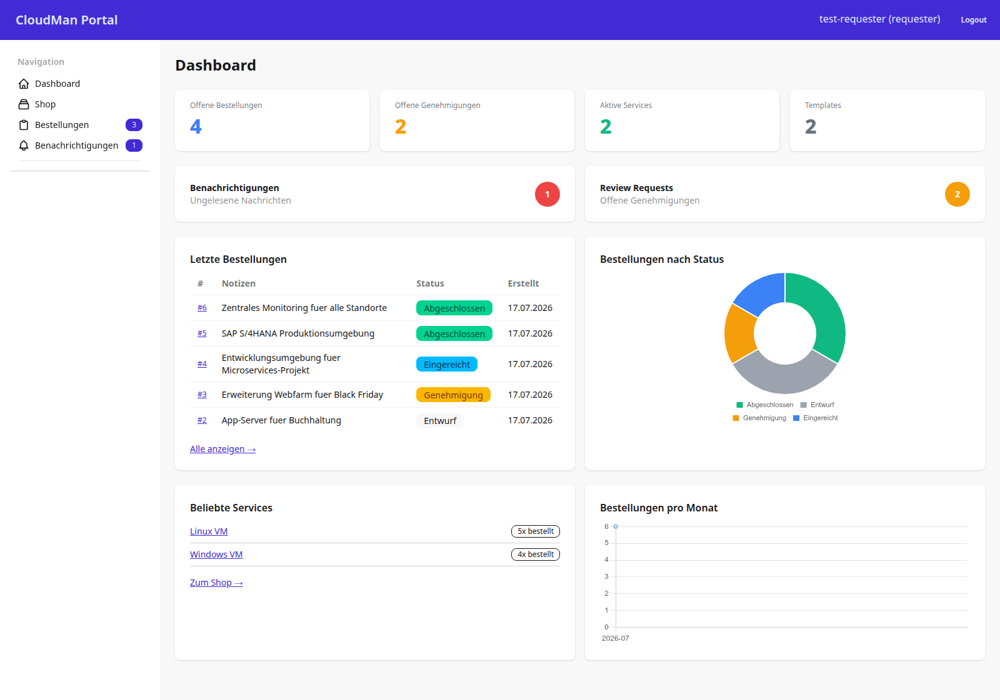
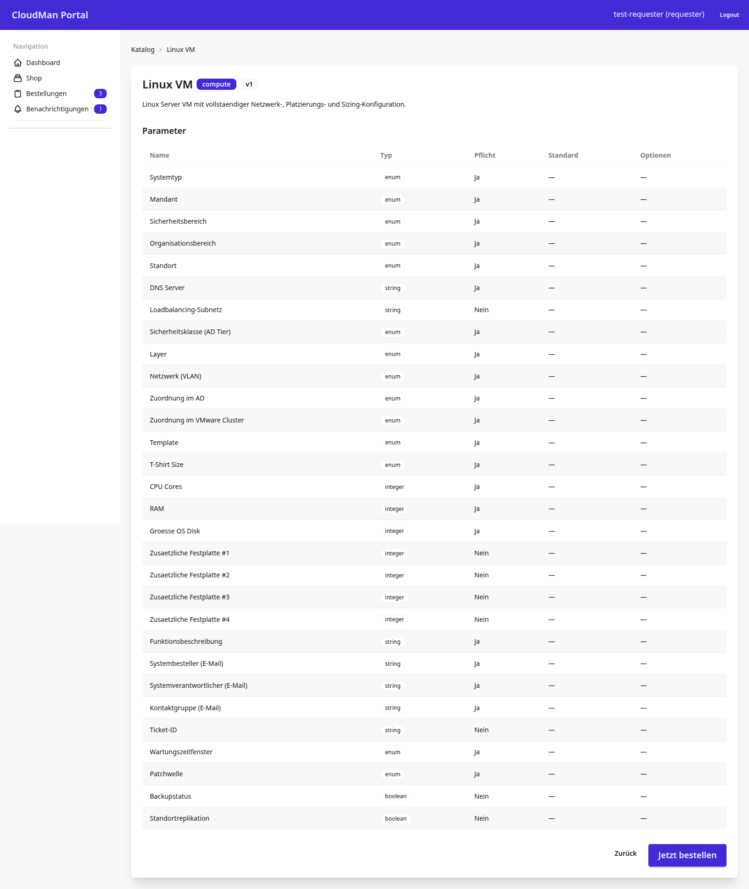
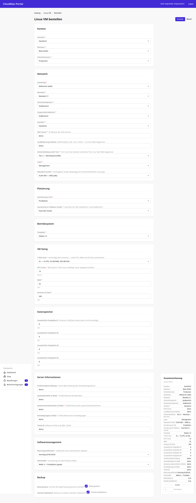
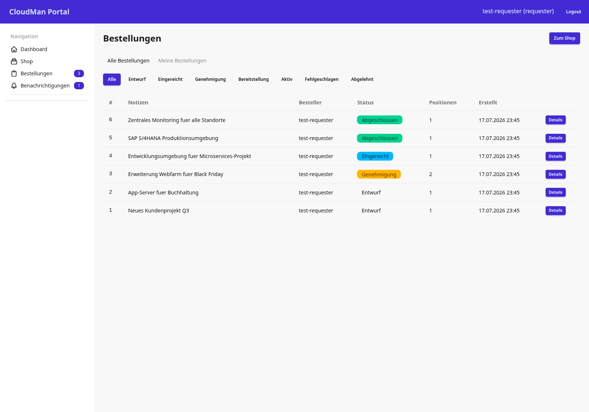
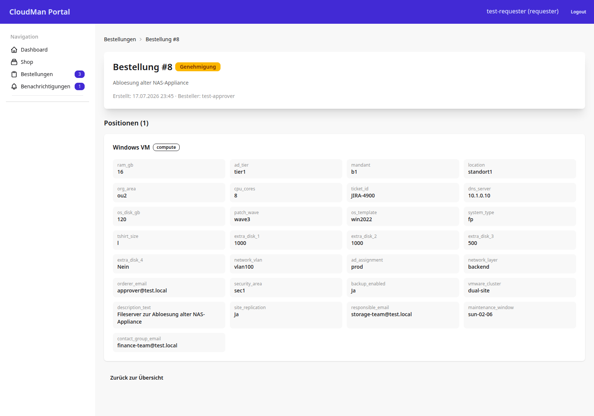
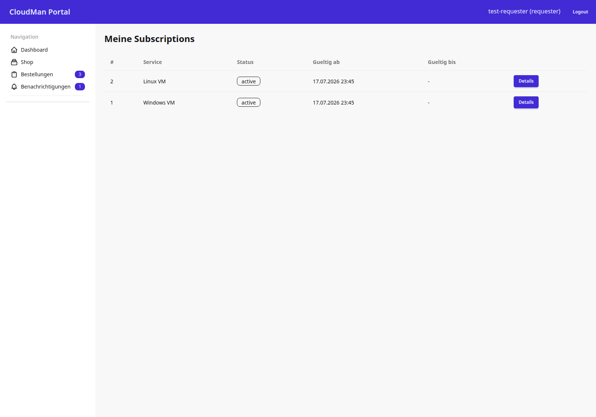
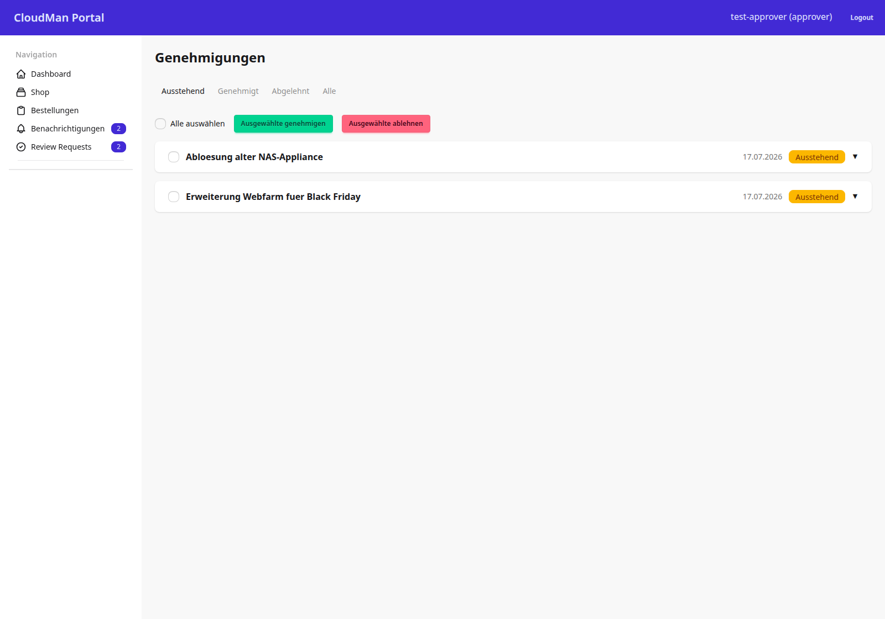
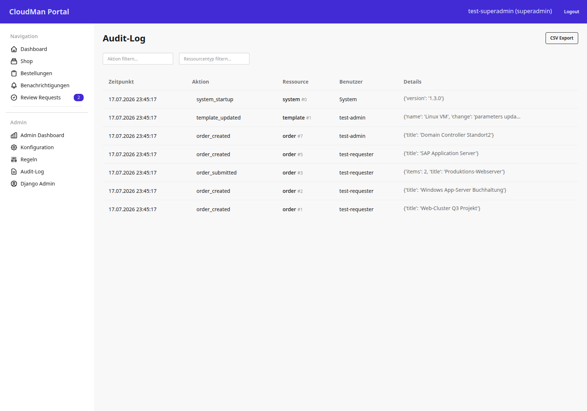
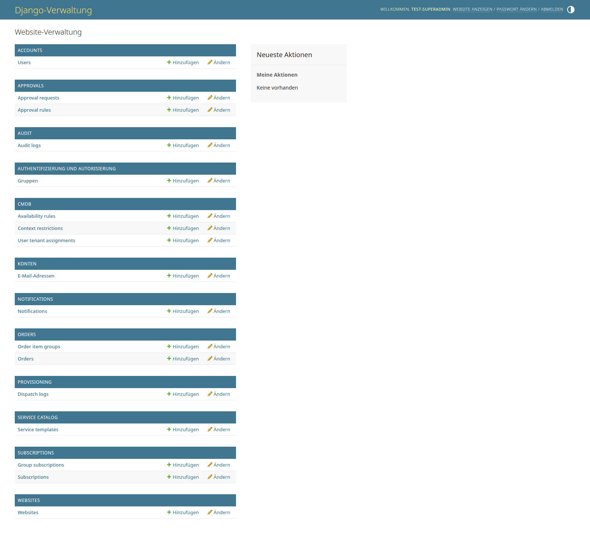

# 12 — Rundgang durch die Oberfläche

> **In diesem Kapitel:** Du kennst inzwischen die Fachdomäne, die Rollen, den
> Bestell-Lebenszyklus und die Architektur — aber wie sieht das eigentlich
> **aus**? Dieses Kapitel führt dich Screen für Screen durch das Portal, in
> der Reihenfolge, in der ein Requester (und später ein Approver, dann ein
> Admin) tatsächlich hindurchklickt.
>
> **Das lernst du:**
> - Welche 13 Masken das CMP hat, wer sie sieht und was man dort tut
> - Wo HTMX statt eines vollen Seiten-Reloads greift
> - Welche Sicherheitsregel verhindert, dass du fremde Bestellungen erraten kannst
> - Welche Funktionen (noch) nicht gebaut sind, obwohl sie im Screen auftauchen könnten
>
> **Voraussetzung:** [12 — Wie es in Produktion läuft](12-wie-es-in-produktion-laeuft.md)

---

## Warum ein Rundgang?

Diagramme und Codeausschnitte sagen dir, *wie* das CMP funktioniert. Sie
sagen dir aber nicht, *wie es sich anfühlt*, das Portal tatsächlich zu
benutzen. Dieses Kapitel schließt die Lücke: 13 Masken, in der Reihenfolge,
in der du sie als Requester nach und nach entdeckst — und ganz am Ende die
Masken, die erst mit einer höheren Rolle sichtbar werden.

💡 **Merke:** Jede Rollenstufe schließt die niedrigeren ein. Ein Superadmin
sieht also auch jede Requester- und Approver-Maske aus diesem Kapitel — nur
eben zusätzlich noch mehr.

> ⚠️ **Achtung:** Die Screenshots in diesem Kapitel sind **Momentaufnahmen** eines
> festen Stands. Die echte Oberfläche kann in Details (Farben, Beschriftungen,
> Anordnung) leicht abweichen — verlass dich im Zweifel auf den Code, nicht aufs Bild.

---

## 1. Anmeldung

Der Einstieg für alle: eine Login-Seite mit Feldern für **Benutzername** und
Passwort. Angemeldet wird sich klassisch session-basiert über
[django-allauth](https://docs.allauth.org/) — kein Token, kein API-Login.

Zwei Dinge sind hier bewusst anders als bei vielen Webportalen:

- **Kein Self-Signup.** `ACCOUNT_SIGNUP_ENABLED=False` — es gibt keinen
  „Registrieren"-Link. Jeder Account entsteht über den Django-Admin.
- **Login per Benutzername, nicht per E-Mail.** `ACCOUNT_LOGIN_METHODS =
  {"username"}` — du meldest dich mit deinem Benutzernamen an, nicht mit
  einer E-Mail-Adresse.

Nach erfolgreichem Login leitet `LOGIN_REDIRECT_URL = "/"` dich direkt aufs
Dashboard weiter.

⚠️ **Achtung:** Das Login-Template (`cmp/templates/account/login.html`) ist
ein projekteigenes Template, das allauths Standard-Template überschreibt —
die View selbst kommt weiterhin aus allauth (`allauth.account.views.LoginView`).

---

## 2. Dashboard

Die Startseite nach dem Login und der zentrale Überblick. Oben stehen vier
KPI-Kacheln:

| Kachel | Zeigt |
|---|---|
| Offene Bestellungen | Bestellungen, die noch nicht abgeschlossen sind |
| Offene Genehmigungen | Anträge mit Status `pending` |
| Aktive Services | Laufende Subscriptions |
| Templates | Anzahl bestellbarer Service-Templates im Katalog |

Darunter folgen die letzten Bestellungen mit Status-Badges, ein
Donut-Diagramm „Bestellungen nach Status", eine Liste der beliebtesten
Services und ein Liniendiagramm „Bestellungen pro Monat".

🔍 **Im Code nachsehen:** Es gibt nur **eine** View (`DashboardView`) für
alle Rollen — der Unterschied zwischen der Requester-Ansicht (eigene Zahlen)
und der Admin-Ansicht (systemweite Zahlen) entsteht ausschließlich in
`get_context_data`, je nachdem ob `AccountService.is_at_least_role(user.role,
UserRole.ADMIN)` zutrifft.

💡 **Merke:** Die Diagramme laufen mit lokal gebündeltem Chart.js — es gibt
keine Abhängigkeit zu einem CDN. Damit funktioniert das Dashboard auch ohne
Internetzugang der VM.

---

## 3. Service-Katalog

Der Katalog ist der Einstiegspunkt für jede neue Bestellung. Er listet alle
bestellbaren Service-Templates als Karten — jede Karte zeigt Kategorie,
Kurzbeschreibung, Parameter-Anzahl und Version (z. B. „30 Parameter · v1").

Ein Suchfeld und ein Kategorie-Filter grenzen die Auswahl **live** ein, ohne
die Seite neu zu laden: Bei einer HTMX-Anfrage liefert die View nur das
Karten-Grid als Fragment zurück (`get_template_names` prüft `request.htmx`
und schaltet auf ein Partial-Template um), statt die komplette Seite
inklusive Navigation neu zu senden.

🔍 **Im Code nachsehen:** Suche und Filter laufen über die Query-Parameter
`q` und `category`, ausgewertet von `CatalogService.search_templates` bzw.
`list_active_templates` — die eigentliche Such-/Filterlogik liegt im
Service, nicht in der View (Thin-Views-Prinzip aus
[Kapitel 06](06-architektur.md)).

---

## 4. Katalog-Detail

Von einer Katalog-Karte aus führt „Details" zur Detailseite eines einzelnen
Templates. Dort steht die vollständige Parameter-Spezifikation als Tabelle:

| Spalte | Bedeutung |
|---|---|
| Name | Technischer Parametername (z. B. `cpu_cores`) |
| Typ | `enum`, `string`, `integer` oder `boolean` |
| Pflicht | Ob der Parameter beim Bestellen zwingend gesetzt werden muss |
| Standard | Vorbelegter Wert, falls vorhanden |
| Optionen | Erlaubte Werte bei `enum`-Parametern |

Beim Template „Linux VM" sind das beispielsweise 30 Parameter über Kontext,
Netzwerk, Sizing und Betrieb hinweg. Unten führt der Button „Jetzt bestellen"
weiter zum Bestellformular.

💡 **Merke:** Diese Tabelle ist reine Anzeige des JSON-Felds
`ServiceTemplate.parameters` — sie validiert nichts. Die eigentliche Prüfung
der Eingaben passiert erst einen Schritt weiter, im Bestellformular.

---

## 5. Bestellformular

Das All-in-One-Formular fasst Kontext, alle Template-Parameter und die
Bestellmenge auf **einer** Seite zusammen — gruppiert nach Abschnitten:
Kontext, Netzwerk, Platzierung, Betriebssystem, VM Sizing, Datenspeicher,
Server-Informationen, Softwaremanagement und Backup.

Rechts läuft eine **Live-Zusammenfassung** der gewählten Werte mit, die sich
mit jeder Eingabe aktualisiert. Im leeren Zustand sind Pflichtfelder rot
umrandet und die Zusammenfassung zeigt „Noch keine Werte ausgewählt"; sobald
ein Pflichtfeld befüllt ist, verschwindet der rote Rahmen, und der Wert taucht
rechts in der Zusammenfassung auf. Oben rechts erlaubt ein Umschalter den
Wechsel zwischen dieser Formular-Variante und einem schrittweisen Wizard für
denselben Bestellvorgang — beide teilen sich Modelle und Service-Layer.

⚠️ **Achtung:** Validierung passiert **zweistufig**:

1. **Django-Form** prüft Feldtypen und Pflichtangaben (clientnah, schnell).
2. **Service-Layer** — der `TemplateValidator` prüft die Werte zusätzlich
   gegen das Parameter-Schema des Templates selbst.

Erst wenn beide Stufen grün sind, legt die View in einem Schritt `Order` und
`OrderItem` an.

---

## 6. Bestellliste

Die Übersicht aller Bestellungen. Zwei Tabs stehen oben: „Meine
Bestellungen" und — **erst ab der Rolle Approver** — zusätzlich „Alle
Bestellungen". Ein Requester sieht also ausschließlich seine eigenen
Bestellungen; erst wer mindestens Approver ist, kann umschalten.

Darunter grenzen Status-Filterchips weiter ein (Entwurf, Eingereicht,
Genehmigung, Bereitstellung, Aktiv, Fehlgeschlagen, Abgelehnt). Die Tabelle
selbst zeigt je Zeile:

| Spalte | Inhalt |
|---|---|
| Nummer | Fortlaufende Bestellnummer |
| Notiz | Freitext-Notiz des Bestellers |
| Besteller | Wer die Bestellung angelegt hat |
| Status | Farbcodierter Status-Badge |
| Positionen | Anzahl der Positionen (`OrderItem`s) |
| Erstellt | Zeitpunkt der Anlage |

🔍 **Im Code nachsehen:** Die Sichtbarkeitsregel „eigene vs. alle
Bestellungen" sitzt direkt in der View (`OrderListView._can_see_all`), nicht
in einem eigenen Service — für eine reine Lese-/Filteroperation ohne
Nebenwirkungen ist das im Rahmen der Thin-Views-Konvention vertretbar.

---

## 7. Bestelldetail

Von „Details" aus gelangst du zur Einzelansicht einer Bestellung. Oben
stehen Kopfdaten (Status, Notiz, Besteller), darunter jede Position mit
Template-Name und **allen aufgelösten Parameterwerten** im Raster —
also nicht nur „Linux VM", sondern konkret `cpu_cores 8`, `ram_gb 16`,
`location standort2`, `os_template ubuntu2204` und so weiter.

⚠️ **Achtung — die wichtigste Sicherheitsregel dieses Kapitels:** Wer eine
Bestellung sehen darf, entscheidet **nicht** die View allein, sondern
`OrderService.get_order_for_user(order_id, user)`:

- Der **Besitzer** der Bestellung sieht sie immer.
- Rollen **ab Approver** sehen jede Bestellung.
- Jeder andere Fall wirft `NotFoundError` — die View übersetzt das in ein
  **404**, nicht in ein 403.

Der Grund für das 404 statt 403: Ein 403 würde verraten „diese Bestellung
existiert, du darfst sie nur nicht sehen". Ein 404 lässt eine fremde
Bestellung von einer schlicht nicht existierenden ID ununterscheidbar
aussehen — wer IDs durchprobiert, lernt daraus nichts.

💡 **Merke:** Steht die Bestellung noch auf `draft`, liefert der Kontext
zusätzlich die Liste aktiver Templates mit — nur dann ergibt ein „weitere
Position hinzufügen" überhaupt Sinn.

---

## 8. Benachrichtigungen

Das Notification-Center bündelt System-Events des angemeldeten Benutzers —
etwa „Bereitstellung abgeschlossen" oder „Bestellung eingereicht". Zwei Tabs
trennen „Alle" von „Ungelesen"; jede Karte zeigt Typ-Badge, Titel, Text und
Zeitstempel, ungelesene Einträge zusätzlich einen Punkt-Indikator. Ein Klick
auf „Alle als gelesen markieren" räumt die gesamte Liste auf einmal auf.

⚠️ **Achtung:** Die Liste aktualisiert sich nur beim Seitenaufruf, nicht in
Echtzeit. Eine Live-Auslieferung neuer Benachrichtigungen über Django
Channels (WebSocket) ist als **AP-12 geplant, aber noch nicht gebaut** — du
musst die Seite also neu laden (oder erneut aufrufen), um brandneue Einträge
zu sehen.

---

## 9. Abonnements

Die Subscriptions-Seite listet die **aktiven Service-Abonnements** des
angemeldeten Benutzers — pro Zeile Nummer, Service, Status-Badge,
Gültig-ab-/Gültig-bis-Zeitraum und einen Detail-Link. Ein Button erlaubt das
Kündigen einer Subscription.

💡 **Merke:** Ein Abonnement **entsteht** nicht bei der Bestellung selbst,
sondern erst danach — nämlich sobald eine Bestellung **erfolgreich
bereitgestellt** wurde (Status `done` im Lebenszyklus aus
[Kapitel 05](05-bestell-lebenszyklus.md)). Eine abgelehnte oder fehlgeschlagene
Bestellung erzeugt kein Abo.

---

## 10. Profil

Die einfachste Maske des ganzen Rundgangs: eine reine Anzeigekarte mit
Benutzername, E-Mail, Rolle (als Badge) und „Mitglied seit"-Datum. Es gibt
hier **keine** Bearbeitungsfunktion — keine Möglichkeit, das eigene Passwort,
die E-Mail oder gar die eigene Rolle zu ändern.

💡 **Merke:** Nutzer und Rollen werden ausschließlich über den Django-Admin
gepflegt (siehe [Abschnitt 13](#13-django-admin)). Das Profil ist reine
Selbstauskunft, keine Selbstverwaltung.

---

## 11. Genehmigungen (Approver)

Die erste Maske dieses Kapitels, die nicht mehr allen Rollen offensteht — sie
erscheint erst **ab der Rolle Approver**. Angemeldet als Approver taucht in
der linken Navigation zusätzlich der Menüpunkt „Review Requests" auf.

Die Queue zeigt Filter-Tabs (Ausstehend, Genehmigt, Abgelehnt, Alle) sowie
Checkboxen an jeder Zeile, mit denen sich mehrere Anträge auf einmal
auswählen lassen — darüber die Buttons „Ausgewählte genehmigen" und
„Ausgewählte ablehnen" für die Mehrfachauswahl (Bulk-Aktion). Wer keine
mindestens Approver-Rolle hat, bekommt beim Versuch, die URL direkt
aufzurufen, ein `PermissionDenied` (HTTP 403) — anders als beim Bestelldetail
also bewusst ein 403, nicht ein 404, weil die Existenz der Queue an sich kein
Geheimnis ist.

---

## 12. Audit-Log (Admin)

Ab der Rolle Admin erscheint links ein zusätzlicher Admin-Navigationsblock
(Admin Dashboard, Konfiguration, Regeln, Audit-Log, Django-Admin). Das
Audit-Log selbst protokolliert revisionssicher alle relevanten Aktionen —
Zeitpunkt, Aktion, betroffene Ressource, handelnder Benutzer und eine
Detail-Payload als JSON. Zwei Filterfelder grenzen nach Aktion bzw.
Ressourcentyp ein, ein Button exportiert die (gefilterte) Liste als CSV.

Typische Aktionen, die du hier findest:

- `order_created` — eine neue Bestellung wurde angelegt
- `order_submitted` — eine Bestellung wurde abgeschickt
- `template_updated` — ein Service-Template wurde geändert

💡 **Merke:** Der CSV-Export läuft ohne Paginierung über das komplette
Audit-Log, während die normale Listenansicht paginiert (50 Einträge pro
Seite) — bei einem sehr großen Log kann der Export entsprechend länger
dauern als das bloße Durchblättern.

---

## 13. Django-Admin

Die letzte und mächtigste Maske: der **eingebaute** Django-Admin
(`django.contrib.admin`), keine eigene CMP-App. Er ist das **primäre
Administrationswerkzeug** des Portals — hier legt eine Admin-Person
insbesondere **alle Benutzerkonten** an, da die Selbstregistrierung
deaktiviert ist.

Die Startseite gliedert sich in Abschnitte je registrierter Django-App:

| Abschnitt | Enthält u. a. |
|---|---|
| Accounts | Users |
| Approvals | Approval requests, Approval rules |
| Audit | Audit logs |
| CMDB | Availability rules, Context restrictions, User tenant assignments |
| Notifications | Notifications |
| Orders | Orders, Order item groups |
| Provisioning | Dispatch logs |
| Service Catalog | Service templates |
| Subscriptions | Subscriptions, Group subscriptions |

⚠️ **Achtung:** Der Django-Admin prüft **nicht** dieselben Rollen-Mixins wie
der Rest des Portals (`RequesterRequiredMixin` & Co. aus
[Kapitel 04](04-rollen-und-rechte.md)). Er verwendet Djangos eigene
Standardfelder `is_staff` und `is_superuser` auf dem User-Modell. Beim
Stub-Seeding werden diese passend zur Rolle gesetzt — wird ein Konto aber
manuell im Admin angelegt und bekommt dort die Rolle `admin`, öffnet das
allein den Zugang zum Django-Admin **nicht**; `is_staff` muss separat gesetzt
werden. Rolle und Admin-Zugriff sind zwei technisch getrennte Schalter.

---

## 🔍 Im Code nachsehen

| Was | Wo |
|---|---|
| Alle URL-Präfixe im Überblick | `cmp/config/urls.py` |
| Login-View (allauth) + projekteigenes Template | `cmp/templates/account/login.html` |
| Dashboard, rollenabhängiger Kontext | `cmp/apps/dashboard/views.py` |
| Katalog-Liste inkl. HTMX-Partial | `cmp/apps/catalog/views.py` |
| Bestellformular (`OrderFormView`) und Wizard (`OrderCreateView`) | `cmp/apps/orders/views.py` |
| Sichtbarkeitsregel für Bestelldetails | `cmp/apps/orders/services.py` (`get_order_for_user`) |
| Benachrichtigungen | `cmp/apps/notifications/views.py` |
| Abonnements | `cmp/apps/subscriptions/views.py` |
| Profil | `cmp/apps/accounts/views.py` |
| Genehmigungs-Queue | `cmp/apps/approvals/views.py` |
| Audit-Log inkl. CSV-Export | `cmp/apps/audit/views.py` |
| Admin-Navigationsblock (Dashboard, Konfiguration, Regeln) | `cmp/apps/dashboard/admin_views.py` |
| Vier Rollen-Mixins | `cmp/core/mixins.py` |
| Django-Admin-Einbindung + `UserAdmin` | `cmp/config/urls.py`, `cmp/apps/accounts/admin.py` |

Die Screenshots dieses Kapitels liegen im Repo unter
`cmp-docs/docs/images/screenshots/` (`Screenshot_01_cmp.png` bis
`Screenshot_13_cmp.png`, plus `Screenshot_05b_cmp.png` fürs ausgefüllte
Bestellformular). Sie sind Momentaufnahmen — die echte Oberfläche kann in
Details abweichen.

---

## Selbstcheck

Bevor du weiterliest, kannst du diese Fragen beantworten?

1. Warum liefert der Service-Katalog bei einer HTMX-Anfrage ein anderes
   Template als bei einem normalen Seitenaufruf?
2. Ein Requester ruft `/orders/42/` auf — die Bestellung gehört aber jemand
   anderem und er ist kein Approver. Welchen HTTP-Status bekommt er, und
   warum genau diesen und nicht einen anderen?
3. Ab welcher Rolle taucht der Menüpunkt „Review Requests" überhaupt auf?
4. Warum siehst du im Benachrichtigungs-Center nicht sofort eine neue
   Benachrichtigung, ohne die Seite neu zu laden?
5. Ein Admin hat im Django-Admin gerade einem neuen Benutzer die Rolle
   `admin` gegeben. Kann sich diese Person jetzt automatisch im Django-Admin
   anmelden?

Antworten anzeigen

1. Weil `TemplateListView.get_template_names` prüft, ob `request.htmx`
   gesetzt ist — bei HTMX-Requests liefert sie nur das Karten-Grid als
   Fragment zurück, damit Live-Suche und Filter ohne vollen Seiten-Reload
   funktionieren.
2. Ein **404**, kein 403. `get_order_for_user()` wirft in diesem Fall
   bewusst `NotFoundError` statt `ForbiddenError`, damit eine fremde
   Bestellung nicht von einer schlicht nicht existierenden ID
   unterscheidbar ist.
3. Ab der Rolle **Approver** (und für alle höheren Rollen darüber).
4. Weil die Live-Auslieferung über Django Channels (WebSocket) als AP-12
   erst geplant, aber noch nicht gebaut ist — die Liste aktualisiert sich
   nur beim (erneuten) Seitenaufruf.
5. Nicht automatisch. Der Django-Admin prüft nur `is_staff`/`is_superuser`,
   nicht `User.role`. Bei manuell angelegten Accounts muss `is_staff`
   separat gesetzt werden — nur das Stub-Seeding setzt beides automatisch
   zusammen.

---

⟵ [12 — Wie es in Produktion läuft](12-wie-es-in-produktion-laeuft.md) · [📖 Übersicht](README.md) · [A — Glossar](A-glossar.md) ⟶
