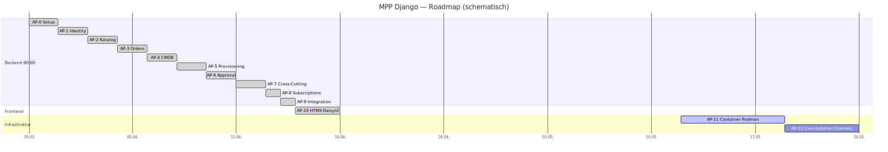

# Arbeitspakete & Roadmap

Arbeitspaket-Quelle: `todo.md` (offen) / `todo-erledigt.md` (fertig) im Repo-Root.
Status: **AP-0 … AP-10 fertig** (Backend B0–B9 + HTMX-Frontend, 230 Tests grün), **AP-11 Docker offen**.

## AP-Überblick

## Roadmap-Gantt

> Spannen **schematisch**: Die Git-Historie wurde zu v1.0.0 (2026-03-29) gestaucht — die
> AP-**Reihenfolge** ist real, die Tagesspannen illustrieren nur den Ablauf. AP-11 (Docker) offen.

